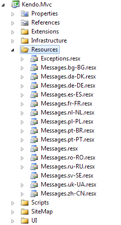

# Localization

[Localization](https://en.wikipedia.org/wiki/Internationalization_and_localization) is the process of adapting software to meet the requirements of local markets and different languages.

You can change the messages that are displayed in the {{ site.product }} helpers by including an additional script file in the document.

## Setting the Current Language


By default, all Telerik UI for ASP.NET Core helpers display their messages in US English. To replace the default text messages, include a language specific `kendo.messages.<language>.js` file in the document.

> Include the localization script before the helpers are initialized. The best place to include it is right after the Kendo UI JavaScript files.

The following example demonstrates how to register the localization script in the `_Layout.cshtml` file.

    <script src="~/lib/jquery/dist/jquery.js"></script>
    <script src="~/lib/kendo-ui/js/kendo.all.min.js"></script>
    <script src="~/lib/kendo-ui/js/kendo.aspnetmvc.min.js"></script>
    <script src="~/lib/kendo-ui/js/cultures/kendo.messages.es-ES.min.js"></script>

The following example demonstrates how to register the localization script in the`_Layout.cshtml` file by using CDN.    

    <script src="https://kendo.cdn.telerik.com/<version>/js/jquery.min.js"></script>
    <script src="https://kendo.cdn.telerik.com/<version>/js/kendo.all.min.js"></script>
    <script src="https://kendo.cdn.telerik.com/<version>/js/kendo.aspnetmvc.min.js"></script>
    <script src="https://kendo.cdn.telerik.com/<version>/js/messages/kendo.messages.es-ES.min.js"></script>

> Currently, translations are not available for every language and some of the localization files may be incomplete. For more information on the full list of available translations, refer to the [section on contributing](#contribution).

## Creating New Localization Files

The localization script replaces the default messages in the helper prototype with their equivalent translations. The file has to be named by following the `kendo.messages.<language>.js` convention. A [language code identifier list](http://msdn.microsoft.com/en-us/library/cc233965.aspx) is available for free download from the Microsoft developer network website.

The following example demonstrates how to create a new localization file. The `kendo.messages.en-US.js` contains all messages and may be used as a reference when you create the new localization file&mdash;copy the file, rename it, and translate the messages.

    /* <Helper-name> messages */

    if (kendo.ui.<Helper-name>) {
    kendo.ui.<Helper-name>.prototype.options.messages =
    $.extend(true, kendo.ui.<Helper-name>.prototype.options.messages,{
      "<message-name>": "<translation",
      //...
    });
    }

<!--*-->

The culture that is used for the localization messages in Telerik UI for ASP.NET MVC is determined by the `CurrentUICulture`, not by the `CurrentCulture` property. By default, if `CurrentUICulture` is not supported, the Telerik UI for ASP.NET MVC helpers will display their messages in American English (en-US). If `CurrentUICulture` is set from code or from the `web.config` file, Telerik UI for ASP.NET MVC will use localized user interface messages.

The following table lists the localized messages for the cultures which are supported by Telerik UI for ASP.NET MVC.

| Culture   | Language  | Country
|:---       |:---       |:---
|`ar-AE`    |Arabic     |U.A.E.
|`bg-BG`    |Bulgarian  |Bulgaria
|`cs-CZ`    |Czech      |Czech Republic
|`da-DK`    |Danish     |Denmark
|`de-DE`    |German     |Germany
|`el-GR`    |Greek      |Greece
|`en-US`    |English    |United States of America
|`es-ES`    |Spanish    |Spain
|`fr-CA`    |French     |Canada
|`fr-FR`    |French     |France
|`he-IL`    |Hebrew     |Israel
|`it-IT`    |Italian    |Italy
|`nl-NL`    |Dutch      |The Netherlands
|`pl-PL`    |Polish     |Poland
|`pt-BR`    |Portuguese |Brazil
|`pt-PT`    |Portuguese |Portugal
|`ro-RO`    |Romanian   |Romania
|`ru-RU`    |Russian    |Russia
|`sk-SK`    |Slovak     |Slovakia
|`sv-SE`    |Swedish    |Sweden
|`tr-TR`    |Turkish    |Turkish
|`uk-UA`    |Ukrainian  |Ukraine
|`zh-CN`    |Chinese    |People's Republic of China

## Customizing the Localized Messages

Telerik UI for ASP.NET MVC uses [satellite assemblies](https://docs.microsoft.com/en-us/dotnet/framework/resources/creating-satellite-assemblies-for-desktop-apps) to support localization (user interface messages localized for a set of cultures). To change the provided localization messages, you have to build a custom `Kendo.Mvc.dll` version because `Kendo.Mvc.dll` is a strongly named assembly and its private key is not shipped as part of the distribution.

To update the provided localization messages in Telerik UI for ASP.NET MVC:

1. Open the `\src\Kendo.Mvc\Kendo.Mvc.csproj` Visual Studio project. The `\src` directory is available only with the commercial version of Telerik UI for ASP.NET MVC.
1. Locate the `Resources` directory in the solution explorer. It contains the resource files for the supported cultures.

    

1. Open the resource file which corresponds to the target culture, for example, `Messages.es-ES.resx`.
1. Edit the resource file and save it.
1. Change the solution configuration to `Release`.
1. Build the project.
1. Copy `\src\Kendo.Mvc\bin\Release\Kendo.Mvc.dll` and `\src\Kendo.Mvc\bin\Release\es-ES\Kendo.Mvc.resources.dll` to your ASP.NET MVC application.
1. Update the `Kendo.Mvc.dll` assembly reference to the newly copied one.

Apart from building a custom version of `Kendo.Mvc.dll`, you can also specify a new value for the corresponding message in the MVC HtmlHelper configuration.

The following example demonstrates how to change the default message for the `Create` toolbar command of the Grid.

```Razor
    @(Html.Kendo().Grid<Product>()
        .Toolbar(toolbar =>
        {
            toolbar.Create().Text("Add new product");
        })
    )
```

## Creating New Localization Files

To add a localization file for a new language, you have to build a custom `Kendo.Mvc.dll` version because `Kendo.Mvc.dll` is a strongly named assembly and its private key is not shipped as part of the distribution.

To add new localization files in Telerik UI for ASP.NET MVC:

1. Open the `\src\Kendo.Mvc\Kendo.Mvc.csproj` Visual Studio project. The `\src` directory is available only with the commercial version of Telerik UI for ASP.NET MVC.
1. Locate the `Resources` directory in the solution explorer. It contains the resource files for the supported cultures.

    

1. Copy `Messages.resx` and paste it. Rename the copy to `Messages.culture-code.resx`, for example, `Messages.es-MX.resx`.
1. Open the newly created resource file.
1. Edit the resource file and save it. The `Messagex.resx` file contains the English messages.
1. Change the solution configuration to `Release`.
1. Build the project.
1. Copy `\src\Kendo.Mvc\bin\Release\Kendo.Mvc.dll` and `\src\Kendo.Mvc\bin\Release\es-MX\Kendo.Mvc.resources.dll` to your ASP.NET MVC application.
1. Update the `Kendo.Mvc.dll` assembly reference to the newly copied one.


## Contribution

Currently, translations are not available for every language and some of the localization files may be incomplete. The full list of currently available translations is available in the [Kendo UI Core repository](https://github.com/telerik/kendo-ui-core/tree/master/src/messages).

If you notice any missing messages in the localization files or would like to add localization files for your language, do not hesitate to:

1. Fork the repository.
1. Apply the respective changes.
1. [Submit a pull request](https://github.com/telerik/kendo-ui-core/blob/master/CONTRIBUTING.md#3-submit-a-pull-request).

## See Also

* [Overview of Globalization by {{ site.product }}]()
