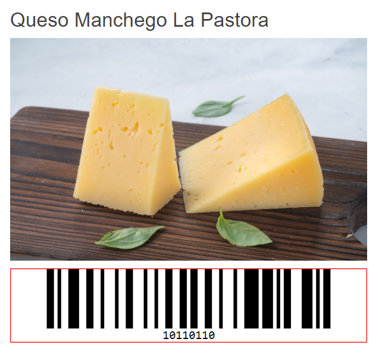

# Getting Started with the Barcode

This tutorial explains how to set up a basic Telerik UI for {{ site.framework }} Barcode and highlights the major steps in the configuration of the component.

You will initialize a Barcode control and configure the encoding `type`, `value` and `appearance`. Finally, you can run the sample code in [Telerik REPL](https://netcorerepl.telerik.com/) and continue exploring the components.

 

@[template](/_contentTemplates/core/getting-started-prerequisites.md#repl-component-gs-prerequisites)

## 1. Prepare the CSHTML File

@[template](/_contentTemplates/core/getting-started-directives.md#gs-adding-directives)

Optionally, you can structure the document by adding the desired HTML elements like headings, divs, paragraphs, and apply some basic styles.

## 2. Initialize the Barcode

Use the Barcode HtmlHelper or TagHelper to add the component to a page:

* The `Name()` configuration method is mandatory as its value is used for the `id` and the `name` attributes of the Barcode element.

* The `Value()` configuration method sets the value of the Component.

* The `Encoding()` configuration property determines the symbology used by the Component.

```HtmlHelper
@using Kendo.Mvc.UI

@(Html.Kendo().Barcode()
    .Name("barcode")
    .Value("10110110")
    .Encoding(BarcodeSymbology.Code128)
)
```

```TagHelper
@addTagHelper *, Kendo.Mvc

<kendo-barcode name="barcode" value="10110110" type="BarcodeSymbology.Code128">
</kendo-barcode>

```


## 3. Configure the Appearance of the Barcode

The configuration methods `Width`, `Height`, `Color`, `Border`, etc. allow you to control the appearance of the Barcode Component.

```HtmlHelper
@using Kendo.Mvc.UI

@(Html.Kendo().Barcode()
    .Name("barcode")
    .Value("10110110")
    .Encoding(BarcodeSymbology.Code128)
    .Width(480)
    .Height(100)
    .Border(border => border.Color("red").Width(1))
)

```

```TagHelper
@addTagHelper *, Kendo.Mvc

<kendo-barcode name="barcode" value="10110110" width="480" height="100" type="BarcodeSymbology.Code128">
    <border color="red" width="1"/>
</kendo-barcode>

```



## 4. (Optional) Reference Existing Barcode Instances

To use the [client-side API of the Barcode](https://docs.telerik.com/kendo-ui/api/javascript/dataviz/ui/barcode) and build on top of its initial configuration, you need a reference to the Barcode instance. Once you get a valid reference, you can call the respective API methods:

1. Use the `.Name()` (`id` attribute) of the component instance to get a reference.

    ```script
        <script>
            var barcodeReference = $("#barcode").data("kendoBarcode"); // barcodeReference is a reference to the existing instance of the helper.
        </script>
    ```

1. Use the [client-side API of the Barcode](https://docs.telerik.com/kendo-ui/api/javascript/dataviz/ui/barcode) to control the behavior of the widget. In this example, you will use the [`redraw`](https://docs.telerik.com/kendo-ui/api/javascript/dataviz/ui/barcode/methods/redraw) method to disable the Barcode.

    ```script
        <script>
            $(document).ready(function () {
                var barcode = $("#barcode").data("kendoBarcode");

                barcode.redraw();
            })
        </script>
    ```
For more examples, refer to the [Demo of the Barcode client API](https://demos.telerik.com/{{ site.platform }}/barcode/api).



## Explore this Tutorial in REPL

You can continue experimenting with the code sample above by running it in the Telerik REPL server playground:

* [Sample code with the Barcode HtmlHelper](https://netcorerepl.telerik.com/mnvkHFvo02JdyL0303)

* [Sample code with the Barcode TagHelper](https://netcorerepl.telerik.com/QxFYRlFI19SIKgkO21)


## Next Steps

* [Choosing the Right Barcode Encoding]()

## See Also

* [Client-Side API of the Barcode](https://docs.telerik.com/kendo-ui/api/javascript/dataviz/ui/barcode)
* [Server-Side API of the Barcode](/api/barcode)
* [Knowledge Base Section](/knowledge-base)
