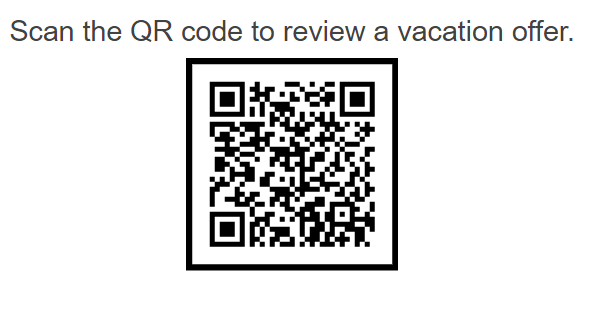

# Getting Started with the QRCode

This tutorial explains how to set up a basic Telerik UI for {{ site.framework }} QRCode and highlights the major steps in the configuration of the component.

You will initialize a QRCode component that will display a [Card](https://demos.telerik.com/aspnet-core/cards) with a vacation offer when the QR code is scanned. Next, you will dynamically update the QRCode value through a single button click. Finally, you can run the sample code in [Telerik REPL](https://netcorerepl.telerik.com/) and continue exploring the components.

 

@[template](/_contentTemplates/core/getting-started-prerequisites.md#component-gs-prerequisites)

## 1. Prepare the CSHTML File

@[template](/_contentTemplates/core/getting-started-directives.md#gs-adding-directives)

Optionally, you can structure the View content by adding the desired HTML elements like headings, divs, paragraphs, and others.

```HtmlHelper
    @using Kendo.Mvc.UI
    <div id="qr-wrap" style="text-align: center;">
        <h4>Scan the QR code to review a vacation offer.</h4>
    </div>
```

```TagHelper
    @addTagHelper *, Kendo.Mvc
    <div id="qr-wrap" style="text-align: center;">
        <h4>Scan the QR code to review a vacation offer.</h4>
    </div>
```


## 2. Initialize the QRCode

Use the QRCode HtmlHelper or TagHelper to add the component to a page:

* The `Name()` configuration method is mandatory as its value is used for the `id` and the `name` attributes of the QRCode element.
* The `Value()` options specifies the QRCode value.
* Customize the component appearance by using the `Size()`, `Color()`, and `Border()` methods. 

```HtmlHelper
    @using Kendo.Mvc.UI

    @(Html.Kendo().QRCode()
        .Name("vacationQrCode")
        .Value("https://demos.telerik.com/kendo-ui/qrcode/index")
        .Size(170)
        .Color("#000000")
        .Border(border => border.Color("#000000").Width(5))
    )
```

```TagHelper
    @addTagHelper *, Kendo.Mvc

    <kendo-qrcode name="vacationQrCode" 
        value="https://demos.telerik.com/kendo-ui/qrcode/index" 
        size="170" 
        color="#000000">
        <border color="#000000" width="5" />
    </kendo-qrcode>
```


## 3. Configure the Card

The next step is to define the Card component with the vacation information that will be displayed when you scan the QR code.

```HTML
    <div class="card-container">
        <div class="k-card k-card-vertical">
            
            <div class="k-card-body">
                <h5 class="k-card-title">African Safari</h5>
                <p>Africa provides some of the most epic wildlife diversity on the planet. Not many vacations involve sleeping in close quarters with lions, leopards, elephants, buffaloes, rhinos, giraffes and hippos.</p>
            </div>
            <div class="k-card-actions k-card-actions-vertical k-card-actions-stretched">
                <span class="k-button k-button-flat-primary k-button-flat k-button-md k-rounded-md">Book now</span>
                <span class="k-button k-button-flat-primary k-button-flat k-button-md k-rounded-md">Check rates</span>
            </div>
        </div>
    </div>
```

Add the Card declaration in a Telerik REPL sample and insert its URL in the QRCode `Value()` method.

```HtmlHelper
    @using Kendo.Mvc.UI

    @(Html.Kendo().QRCode()
        .Name("vacationQrCode")
        .Value("https://netcorerepl.telerik.com/mnbmQncO07oE3ier03")
        ... // Other configuration.
    )
```

```TagHelper
    @addTagHelper *, Kendo.Mvc

    <kendo-qrcode name="vacationQrCode" value="https://netcorerepl.telerik.com/mnbmQncO07oE3ier03">
        <!-- Other configuration -->
    </kendo-qrcode>
```


## 4. (Optional) Reference Existing QRCode Instances

You can reference the QRCode instances that you have created and build on top of their existing configuration:

1. Use the `id` attribute of the component instance to get its reference.

    ```JS script
        <script>
            $(document).ready(function() {
                var qrCodeReference = $("#vacationQrCode").data("kendoQRCode"); // qrCodeReference is a reference to the existing QRCode instance of the helper.
            });
        </script>
    ```

1. Use the [QRCode client-side API](https://docs.telerik.com/kendo-ui/api/javascript/dataviz/ui/qrcode#methods) to control the behavior of the component. In this example, you will use the `value()` method to dynamically change the value of the QRCode (for example, when a button is clicked).

    ```HtmlHelper
        @(Html.Kendo().Button()
            .Name("updateQRCodeBtn")
            .Content("Update QRCode")
            .Events(ev => ev.Click("onBtnClick"))
        )
    ```
    
    ```TagHelper
        @addTagHelper *, Kendo.Mvc
        <kendo-button name="updateQRCodeBtn" on-click="onBtnClick">
            Update QRCode
        </kendo-button>
    ```
    
    ```JS Scripts
        <script>
            function onBtnClick() {
                var qrCodeReference = $("#vacationQrCode").data("kendoQRCode");
                qrCodeReference.value("mailto:clientservice@telerik.com");
            }
        </script>
    ```

For more information on referencing specific helper instances, see the [Methods and Events]() article.


## Explore this Tutorial in REPL

You can continue experimenting with the code sample above by running it in the Telerik REPL server playground:

* [Sample code with the QRCode HtmlHelper](https://netcorerepl.telerik.com/QxFmwxwu22AIHKrN25)
* [Sample code with the QRCode TagHelper](https://netcorerepl.telerik.com/QnlQcdQa25Fddbrd25)



## Next Steps

* [QRCode Encodings]()
* [Setting the overlay of the QRCode]()

## See Also

* [Using the API of the QRCode for {{ site.framework }} (Demo)](https://demos.telerik.com/{{ site.platform }}/qrcode/api)
* [Client-Side API of the QRCode](https://docs.telerik.com/kendo-ui/api/javascript/dataviz/ui/qrcode)
* [Server-Side API of the QRCode](/api/qrcode)

* [Server-Side API of the QRCode TagHelper](/api/taghelpers/qrcode)

* [Knowledge Base Section](/knowledge-base)