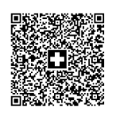

Kendo UI QR Code supports different types of overlay.

# Swiss QR Type

The QRCode component supports the [Swiss QR Code format](https://blog.xsuite.com/en/swiss-qr-code). Enabling the `Swiss` Type of the overlay will add a swiss cross in the QR Code. 

The following implementation demonstrates the code needed for the Swiss Type:


```View
    @(Html.Kendo().QRCode()
         .Name("qrSwiss")
         .Value("SPC  0200  1  CH4431999123000889012  S  Robert Schneider AG  Rue du Lac  1268  2501  Biel  CH  1949.75  CHF  S  Pia-Maria Rutschmann-Schnyder  Grosse Marktgasse  28  9400  Rorschach  CH  QRR  210000000003139471430009017 Order of 15 June 2020  EPD  //S1/10/10201409/11/200701/20/140.000-53/30/102673831/31/200615/32/7.7/33/7.7:139.40/40/0:30  Name AV1: UV;UltraPay005;12345  Name AV2: XY;XYService;54321")
         .Overlay(o => o.Type("swiss").Width(26).Height(26))
         .Size(173)
    )

```
Overview of the Swiss Type:



* [Demo showing Swiss QR Code format](https://demos.telerik.com/{{ site.platform }}/qrcode/swiss)

# QRCode Image Type

The image type of the overlay is adding an image in the QR Code.

The following implementation demonstrates the code needed for the Image Type:

```View
    @(Html.Kendo().QRCode()
            .Name("qrImage")
            .Value("SPC  0200  1  CH4431999123000889012  S  Robert Schneider AG  Rue du Lac  1268  2501  Biel  CH  1949.75  CHF  S  Pia-Maria Rutschmann-Schnyder  Grosse Marktgasse  28  9400  Rorschach  CH  QRR  210000000003139471430009017 Order of 15 June 2020  EPD  //S1/10/10201409/11/200701/20/140.000-53/30/102673831/31/200615/32/7.7/33/7.7:139.40/40/0:30  Name AV1: UV;UltraPay005;12345  Name AV2: XY;XYService;54321")
            .Overlay(o => o.ImageUrl("https://demos.telerik.com/kendo-ui/content/shared/images/site/kendoka-cta.svg").Height(50).Width(50))
            .Size(173)
    )

```
Overview of the Image Type:


* [Demo of QRCode with image](https://demos.telerik.com/{{ site.platform }}/qrcode/image)


## See Also

* [Basic Usage of the QRCode HtmlHelper for {{ site.framework }} (Demo)](https://demos.telerik.com/{{ site.platform }}/qrcode/index)
* [Using the API of the QRCode HtmlHelper for {{ site.framework }} (Demo)](https://demos.telerik.com/{{ site.platform }}/qrcode/api)
* [Server-Side API](/api/qrcode)
