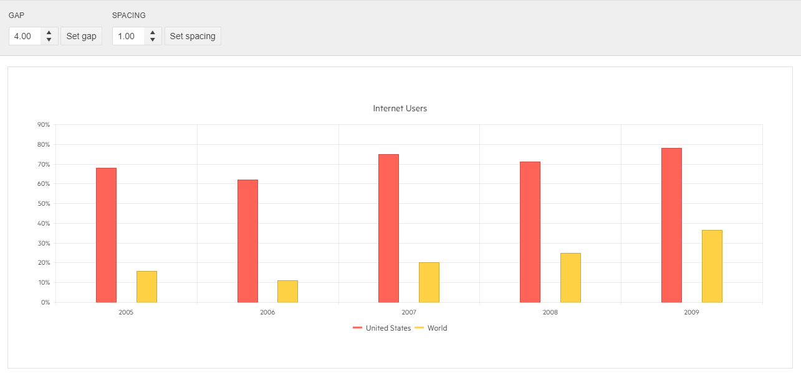

# Gap and Spacing

The Bar Chart component allows you to control the distance between its categories as well as between series points within a category. This can be done through the series.gap and series.spacing client-side settings of the Chart.

The following implementation demonstrates the code needed for setting Gap and Spacing for Bar Chart:

```HtmlHelper
<div class="configurator">
    <div class="header">Configurator</div>
    <div class="box-col">
        <h4>Gap</h4>
        <ul class="options">
            <li>
                <input id="gap" type="number" value="1.5" step="0.1" style="width: 80px;" />
                <button id="getGap" class="k-button">Set gap</button>
            </li>
        </ul>
    </div>
    <div class="box-col">
        <h4>Spacing</h4>
        <ul class="options">
            <li>
                <input id="spacing" type="number" value="0.4" step="0.1" style="width: 80px;" />
                <button id="getSpacing" class="k-button">Set spacing</button>
            </li>
        </ul>
    </div>
</div>

<div class="demo-section k-content wide">
    @(Html.Kendo().Chart()
        .Name("chart")
        .Title("Internet Users")
        .Legend(legend => legend.Position(ChartLegendPosition.Bottom))
        .Series(series =>
        {
            series.Column(new double[] { 67.96, 61.93, 75, 71, 78 }).Name("United States");
            series.Column(new double[] { 15.7, 11, 20, 25, 36.6 }).Name("World");
        })
        .CategoryAxis(axis => axis
            .Categories("2005", "2006", "2007", "2008", "2009")
        )
        .ValueAxis(axis => axis
            .Numeric().Labels(labels => labels.Format("{0}%"))
        )
        .Tooltip(tooltip => tooltip
            .Visible(true)
            .Format("{0}%")
        )
    )
</div>

<script>
    $(document).ready( function () {
        var chart = $("#chart").data("kendoChart"),
            firstSeries = chart.options.series;

        $("#getGap").click(function () {
            firstSeries[0].gap = parseFloat($("#gap").val(), 10);
            chart.redraw();
        });

        $("#getSpacing").click(function () {
            firstSeries[0].spacing = parseFloat($("#spacing").val(), 10);
            chart.redraw();
        });

        if (kendo.ui.NumericTextBox) {
            $("#gap").kendoNumericTextBox();
            $("#spacing").kendoNumericTextBox();
        }
    });
</script>
```

```TagHelper
    @addTagHelper *,Kendo.Mvc
    @{
        var dataUS = new double[] { 67.96, 61.93, 75, 71, 78 };
        var dataWorld = new double[] { 15.7, 11, 20, 25, 36.6 };
        var categories = new string[] { "2005", "2006", "2007", "2008", "2009" };
    }
    <div class="configurator">
        <div class="header">Configurator</div>
        <div class="box-col">
            <h4>Gap</h4>
            <ul class="options">
                <li>
                    <input id="gap" type="number" value="1.5" step="0.1" style="width: 80px;" />
                    <button id="getGap">Set gap</button>
                </li>
            </ul>
        </div>
        <div class="box-col">
            <h4>Spacing</h4>
            <ul class="options">
                <li>
                    <input id="spacing" type="number" value="0.4" step="0.1" style="width: 80px;" />
                    <button id="getSpacing">Set spacing</button>
                </li>
            </ul>
        </div>
    </div>

    <div class="demo-section wide">
        <kendo-chart name="chart">
            <series>
                <series-item type="ChartSeriesType.Column"
                            name="United States"
                            data="dataUS">
                </series-item>
                <series-item type="ChartSeriesType.Column"
                            name="World"
                            data="dataWorld">
                </series-item>
            </series>
            <category-axis>
                <category-axis-item categories="categories">
                </category-axis-item>
            </category-axis>
            <value-axis>
                <value-axis-item name="" type="numeric">
                    <labels format="{0}%">
                    </labels>
                </value-axis-item>
            </value-axis>
            <chart-legend position="ChartLegendPosition.Bottom">
            </chart-legend>
            <chart-title text="Internet Users">
            </chart-title>
            <tooltip format="{0}%" visible="true">
            </tooltip>
        </kendo-chart>
    </div>


    <script>
        $(document).on("kendoReady", function () {
            var chart = $("#chart").data("kendoChart"),
                firstSeries = chart.options.series;
            $("#getGap").click(function () {
                firstSeries[0].gap = parseFloat($("#gap").val(), 10);
                chart.redraw();
            });
            $("#getSpacing").click(function () {
                firstSeries[0].spacing = parseFloat($("#spacing").val(), 10);
                chart.redraw();
            });
            if (kendo.ui.NumericTextBox) {
                $("#gap").kendoNumericTextBox();
                $("#spacing").kendoNumericTextBox();
            }
        });
    </script>

```


Overview of Gap and Spacing implementation for Bar Chart:



* [Demo page of the Gap and Spacing for Bar Chart](https://demos.telerik.com/{{ site.platform }}/bar-charts/gap-spacing)

## See Also
* [Basic Usage of Bar Charts for {{ site.framework }} (Demo)](https://demos.telerik.com/{{ site.platform }}/bar-charts)
* [Stacked and Grouped Charts for {{ site.framework }} (Demo)](https://demos.telerik.com/{{ site.platform }}/bar-charts/grouped-stacked-bar)
