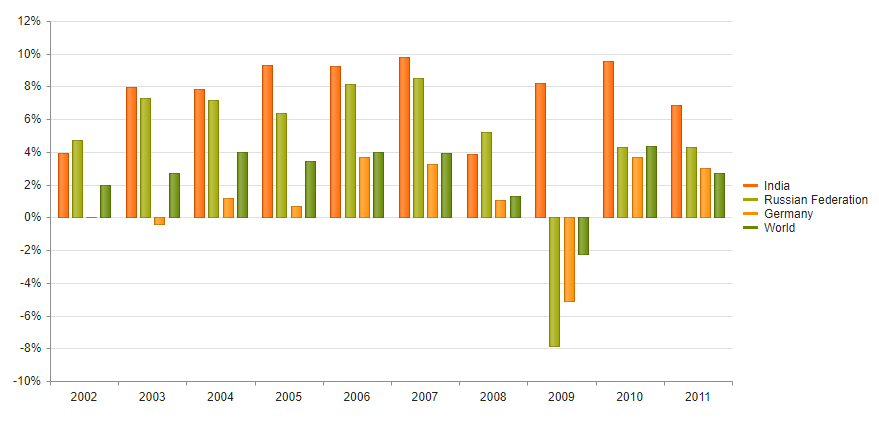

# Getting Started with the Bar Chart

This tutorial explains how to set up a basic Telerik UI for {{ site.framework }} Bar Chart and highlights the major steps in the configuration of the component.

You will initialize a Bar Chart control and configure the chart series, category axis, and value axis. Next, you will handle some of the Bar Chart events. Finally, you can run the sample code in [Telerik REPL](https://netcorerepl.telerik.com/) and continue exploring the components.

 

@[template](/_contentTemplates/core/getting-started-prerequisites.md#repl-component-gs-prerequisites)

## 1. Prepare the CSHTML File

@[template](/_contentTemplates/core/getting-started-directives.md#gs-adding-directives)

Optionally, you can structure the document by adding the desired HTML elements like headings, divs, paragraphs, and apply some basic styles.

## 2. Initialize the Bar Chart

Use the Bar Chart HtmlHelper or TagHelper to add the component to a page:

* The `Name()` configuration method is mandatory as its value is used for the `id` and the `name` attributes of the Bar Chart element.

* The `Series()` configuration method specifies the configuration of the chart series. The series type is determined by the value of the type field. If a type value is missing, the Chart component uses the one specified in `seriesDefaults`.

```HtmlHelper
@using Kendo.Mvc.UI

@(Html.Kendo().Chart()
        .Name("chart")
        .Series(series =>
        {
            series.Column(new double[] { 3.907, 7.943, 7.848, 9.284, 9.263, 9.801, 3.890, 8.238, 9.552, 6.855 }).Name("India");
            series.Column(new double[] { 4.743, 7.295, 7.175, 6.376, 8.153, 8.535, 5.247, -7.832, 4.3, 4.3 }).Name("Russian Federation");
            series.Column(new double[] { 0.010, -0.375, 1.161, 0.684, 3.7, 3.269, 1.083, -5.127, 3.690, 2.995 }).Name("Germany");
            series.Column(new double[] { 1.988, 2.733, 3.994, 3.464, 4.001, 3.939, 1.333, -2.245, 4.339, 2.727 }).Name("World");
        })
    )
```

```TagHelper
@addTagHelper *, Kendo.Mvc

@{
    var india = new double[] { 3.907, 7.943, 7.848, 9.284, 9.263, 9.801, 3.890, 8.238, 9.552, 6.855 };
    var russia = new double[] { 4.743, 7.295, 7.175, 6.376, 8.153, 8.535, 5.247, -7.832, 4.3, 4.3 };
    var germany = new double[] { 0.010, -0.375, 1.161, 0.684, 3.7, 3.269, 1.083, -5.127, 3.690, 2.995 };
    var world = new double[] { 1.988, 2.733, 3.994, 3.464, 4.001, 3.939, 1.333, -2.245, 4.339, 2.727 };
}

    <kendo-chart name="chart">
        <series>
            <series-item type="ChartSeriesType.Column" name="India" data="india">
            </series-item>
            <series-item type="ChartSeriesType.Column" name="Russian Federation" data="russia">
            </series-item>
            <series-item type="ChartSeriesType.Column" name="Germany" data="germany">
            </series-item>
            <series-item type="ChartSeriesType.Column" name="World" data="world">
            </series-item>
        </series>
    </kendo-chart>

```


## 3. Add a CategoryAxis to the Chart

The `CategoryAxis` configuration method specifies the category axis configuration options.

```HtmlHelper
@using Kendo.Mvc.UI

@(Html.Kendo().Chart()
        .Name("chart")
        .Series(series =>
        {
            series.Column(new double[] { 3.907, 7.943, 7.848, 9.284, 9.263, 9.801, 3.890, 8.238, 9.552, 6.855 }).Name("India");
            series.Column(new double[] { 4.743, 7.295, 7.175, 6.376, 8.153, 8.535, 5.247, -7.832, 4.3, 4.3 }).Name("Russian Federation");
            series.Column(new double[] { 0.010, -0.375, 1.161, 0.684, 3.7, 3.269, 1.083, -5.127, 3.690, 2.995 }).Name("Germany");
            series.Column(new double[] { 1.988, 2.733, 3.994, 3.464, 4.001, 3.939, 1.333, -2.245, 4.339, 2.727 }).Name("World");
        })
        .CategoryAxis(axis => axis
            .Name("series-axis")
            .Line(line => line.Visible(false))
        )
        .CategoryAxis(axis => axis
            .Name("label-axis")
            .Categories("2002", "2003", "2004", "2005", "2006", "2007", "2008", "2009", "2010", "2011")
        )
    )
```

```TagHelper
@addTagHelper *, Kendo.Mvc

@{
    var india = new double[] { 3.907, 7.943, 7.848, 9.284, 9.263, 9.801, 3.890, 8.238, 9.552, 6.855 };
    var russia = new double[] { 4.743, 7.295, 7.175, 6.376, 8.153, 8.535, 5.247, -7.832, 4.3, 4.3 };
    var germany = new double[] { 0.010, -0.375, 1.161, 0.684, 3.7, 3.269, 1.083, -5.127, 3.690, 2.995 };
    var world = new double[] { 1.988, 2.733, 3.994, 3.464, 4.001, 3.939, 1.333, -2.245, 4.339, 2.727 };
}

<kendo-chart name="chart">
    <category-axis>
        <category-axis-item name="series-axis">
            <line visible="false" />
        </category-axis-item>
        <category-axis-item name="label-axis">
        </category-axis-item>
    </category-axis>
    <series>
        <series-item type="ChartSeriesType.Column" name="India" data="india">
        </series-item>
        <series-item type="ChartSeriesType.Column" name="Russian Federation" data="russia">
        </series-item>
        <series-item type="ChartSeriesType.Column" name="Germany" data="germany">
        </series-item>
        <series-item type="ChartSeriesType.Column" name="World" data="world">
        </series-item>
    </series>
</kendo-chart>
```


## 4. Add a ValueAxis to the Chart

The `ValueAxis` configuration method specifies the value axis configuration options.

```HtmlHelper
@using Kendo.Mvc.UI

@(Html.Kendo().Chart()
        .Name("chart")
        .Series(series =>
        {
            series.Column(new double[] { 3.907, 7.943, 7.848, 9.284, 9.263, 9.801, 3.890, 8.238, 9.552, 6.855 }).Name("India");
            series.Column(new double[] { 4.743, 7.295, 7.175, 6.376, 8.153, 8.535, 5.247, -7.832, 4.3, 4.3 }).Name("Russian Federation");
            series.Column(new double[] { 0.010, -0.375, 1.161, 0.684, 3.7, 3.269, 1.083, -5.127, 3.690, 2.995 }).Name("Germany");
            series.Column(new double[] { 1.988, 2.733, 3.994, 3.464, 4.001, 3.939, 1.333, -2.245, 4.339, 2.727 }).Name("World");
        })
        .CategoryAxis(axis => axis
            .Name("series-axis")
            .Line(line => line.Visible(false))
        )
        .CategoryAxis(axis => axis
            .Name("label-axis")
            .Categories("2002", "2003", "2004", "2005", "2006", "2007", "2008", "2009", "2010", "2011")
        )
        .ValueAxis(axis => axis
            .Numeric()
                .Labels(labels => labels.Format("{0}%"))

                // Move the label-axis all the way down the value axis
                .AxisCrossingValue(0, int.MinValue)
        )
    )
```

```TagHelper
@addTagHelper *, Kendo.Mvc

@{
    var india = new double[] { 3.907, 7.943, 7.848, 9.284, 9.263, 9.801, 3.890, 8.238, 9.552, 6.855 };
    var russia = new double[] { 4.743, 7.295, 7.175, 6.376, 8.153, 8.535, 5.247, -7.832, 4.3, 4.3 };
    var germany = new double[] { 0.010, -0.375, 1.161, 0.684, 3.7, 3.269, 1.083, -5.127, 3.690, 2.995 };
    var world = new double[] { 1.988, 2.733, 3.994, 3.464, 4.001, 3.939, 1.333, -2.245, 4.339, 2.727 };
}

<kendo-chart name="chart">
    <category-axis>
        <category-axis-item name="series-axis">
            <line visible="false" />
        </category-axis-item>
        <category-axis-item name="label-axis">
        </category-axis-item>
    </category-axis>
    <series>
        <series-item type="ChartSeriesType.Column" name="India" data="india">
        </series-item>
        <series-item type="ChartSeriesType.Column" name="Russian Federation" data="russia">
        </series-item>
        <series-item type="ChartSeriesType.Column" name="Germany" data="germany">
        </series-item>
        <series-item type="ChartSeriesType.Column" name="World" data="world">
        </series-item>
    </series>
    <value-axis>
        <value-axis-item name="" type="numeric">
            <labels format="{0}%">
            </labels>
        </value-axis-item>
    </value-axis>
</kendo-chart>
```


## 5. Handle the Bar Chart Events

The Bar Chart [exposes various events](/api/kendo.mvc.ui.fluent/charteventbuilder) that you can handle and further customize the functionality of the component. In this tutorial, you will use the `SeriesHover`, `Close`, and `Zoom` events of the Bar Chart to log a message in the Browser's console.

```HtmlHelper
@using Kendo.Mvc.UI

    @(Html.Kendo().Chart()
        .Name("chart")
        .Series(series =>
        {
            series.Column(new double[] { 3.907, 7.943, 7.848, 9.284, 9.263, 9.801, 3.890, 8.238, 9.552, 6.855 }).Name("India");
            series.Column(new double[] { 4.743, 7.295, 7.175, 6.376, 8.153, 8.535, 5.247, -7.832, 4.3, 4.3 }).Name("Russian Federation");
            series.Column(new double[] { 0.010, -0.375, 1.161, 0.684, 3.7, 3.269, 1.083, -5.127, 3.690, 2.995 }).Name("Germany");
            series.Column(new double[] { 1.988, 2.733, 3.994, 3.464, 4.001, 3.939, 1.333, -2.245, 4.339, 2.727 }).Name("World");
        })
        .CategoryAxis(axis => axis
            .Name("series-axis")
            .Line(line => line.Visible(false))
        )
        .CategoryAxis(axis => axis
            .Name("label-axis")
            .Categories("2002", "2003", "2004", "2005", "2006", "2007", "2008", "2009", "2010", "2011")
        )
        .ValueAxis(axis => axis
            .Numeric()
                .Labels(labels => labels.Format("{0}%"))

                // Move the label-axis all the way down the value axis
                .AxisCrossingValue(0, int.MinValue)
        )
        .Events(e => e
            .SeriesHover("onSeriesHover")
            .Render("onRender")
            .Zoom("onZoom")
        )
    )  

<script>
    function onSeriesHover(e) {
        console.log(e.value);
    }

    function onRender(e) {
        console.log("render");
    }

    function onZoom() {
        console.log("zoom");
    }
</script>
```

```TagHelper

@addTagHelper *, Kendo.Mvc

@{
    var india = new double[] { 3.907, 7.943, 7.848, 9.284, 9.263, 9.801, 3.890, 8.238, 9.552, 6.855 };
    var russia = new double[] { 4.743, 7.295, 7.175, 6.376, 8.153, 8.535, 5.247, -7.832, 4.3, 4.3 };
    var germany = new double[] { 0.010, -0.375, 1.161, 0.684, 3.7, 3.269, 1.083, -5.127, 3.690, 2.995 };
    var world = new double[] { 1.988, 2.733, 3.994, 3.464, 4.001, 3.939, 1.333, -2.245, 4.339, 2.727 };
}

    <kendo-chart name="chart" on-series-hover="onSeriesHover" on-render="onRender" on-zoom="onZoom">
        <category-axis>
            <category-axis-item name="series-axis">
                <line visible="false" />
            </category-axis-item>
            <category-axis-item name="label-axis">
            </category-axis-item>
        </category-axis>
        <series>
            <series-item type="ChartSeriesType.Column" name="India" data="india">
            </series-item>
            <series-item type="ChartSeriesType.Column" name="Russian Federation" data="russia">
            </series-item>
            <series-item type="ChartSeriesType.Column" name="Germany" data="germany">
            </series-item>
            <series-item type="ChartSeriesType.Column" name="World" data="world">
            </series-item>
        </series>
        <value-axis>
            <value-axis-item name="" type="numeric">
                <labels format="{0}%">
                </labels>
            </value-axis-item>
        </value-axis>
    </kendo-chart>

<script>
    function onSeriesHover(e) {
        console.log(e.value);
    }

    function onRender(e) {
        console.log("render");
    }

    function onZoom() {
        console.log("zoom");
    }
</script>
```


For more examples, refer to the [documentation of the Bar Chart client API Events](https://docs.telerik.com/kendo-ui/api/javascript/dataviz/ui/chart#events).

## 6. (Optional) Reference Existing Bar Chart Instances

To use the [client-side API of the Bar Chart](https://docs.telerik.com/kendo-ui/api/javascript/ui/chart) and build on top of its initial configuration, you need a reference to the Bar Chart instance. Once you get a valid reference, you can call the respective API methods:

1. Use the `.Name()` (`id` attribute) of the component instance to get a reference.

    ```JS
        <script>
            var chartReference = $("#chart").data("kendoChart"); // chartReference is a reference to the existing instance of the helper.
        </script>
    ```

1. Use the [client-side API of the Bar Chart](https://docs.telerik.com/kendo-ui/api/javascript/ui/chart) to control the behavior of the widget. In this example, you will use the [`redraw`](https://docs.telerik.com/kendo-ui/api/javascript/dataviz/ui/chart/methods/redraw) method to disable the Bar Chart.

    ```JS
        <script>
            $(document).ready(function () {
                var chart= $("#chart").data("kendoChart");

                chart.redraw();
            })
        </script>
    ```

For more information on referencing specific helper instances, see the [Methods and Events]() article.



## Explore this Tutorial in REPL

You can continue experimenting with the code sample above by running it in the Telerik REPL server playground:

* [Sample code with the Bar Chart HtmlHelper](https://netcorerepl.telerik.com/QHOzPVbe13iIgPJg07)

* [Sample code with the Bar Chart TagHelper](https://netcorerepl.telerik.com/cdazlLvS12FPbpTw10)


## Next Steps

* [Configuring the Bar Chart Data Binding]()
* [Changing the Appearance of the Bar Chart]()

## See Also

* [Client-Side API of the Chart](https://docs.telerik.com/kendo-ui/api/javascript/dataviz/ui/chart)
* [Server-Side API of the Chart](/api/chart)
* [Knowledge Base Section](/knowledge-base)
