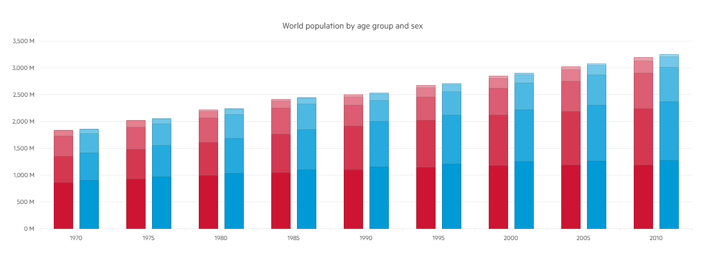

# Stacked And Grouped Bar Charts

Usually, the data series in a stacked column or bar chart have one stack per category. There are scenarios in which you might want to arrange your data so that the chart appears to have more than one stack per category.

A stacked and grouped bar chart is possible only when each series is defined.

In this demo, you can see how to group stacked columns to display the World population compared by age and sex in a specific period of time by setting the Stack() method, which sets the name of the stack that the series belong to:

series.Column(new int[] { 1100941, 1139797, 1172929, 1184435, 1184654 }).Name("0-19").Stack("Female");

* [Demo page for Stacked and Grouped Bar Chart](https://demos.telerik.com/{{ site.platform }}/bar-charts/grouped-stacked-bar)

The following implementation demonstrates the code needed for setting the Stacked and Grouped Bar Chart:

```HtmlHelper
 @(Html.Kendo().Chart()
        .Name("chart")
        .Title("World population by age group and sex")
        .Legend(legend => legend
            .Visible(false)
        )
        .Series(series =>
        {
            series
                .Column(new int[] { 854622, 925844, 984930, 1044982, 1100941, 1139797, 1172929, 1184435, 1184654 })
                .Name("0-19").Stack("Female");

            series
                .Column(new int[] { 490550, 555695, 627763, 718568, 810169, 883051, 942151, 1001395, 1058439 })
                .Name("20-39").Stack("Female");

            series
                .Column(new int[] { 379788, 411217, 447201, 484739, 395533, 435485, 499861, 569114, 655066 })
                .Name("40-64").Stack("Female");

            series
                .Column(new int[] { 97894, 113287, 128808, 137459, 152171, 170262, 191015, 210767, 226956 })
                .Name("65-79").Stack("Female");

            series
                .Column(new int[] { 16358, 18576, 24586, 30352, 36724, 42939, 46413, 54984, 66029 })
                .Name("80+").Stack("Female");

            series
                .Column(new int[] { 900268, 972205, 1031421, 1094547, 1155600, 1202766, 1244870, 1263637, 1268165 })
                .Name("0-19").Stack("Male");

            series
                .Column(new int[] { 509133, 579487, 655494, 749511, 844496, 916479, 973694, 1036548, 1099507 })
                .Name("20-39").Stack("Male");

            series
                .Column(new int[] { 364179, 401396, 440844, 479798, 390590, 430666, 495030, 564169, 646563 })
                .Name("40-64").Stack("Male");

            series
                .Column(new int[] { 74208, 86516, 98956, 107352, 120614, 138868, 158387, 177078, 192156 })
                .Name("65-79").Stack("Male");

            series
                .Column(new int[] { 9187, 10752, 13007, 15983, 19442, 23020, 25868, 31462, 39223 })
                .Name("80+").Stack("Male");
        })
        .SeriesColors(
            "#cd1533", "#d43851", "#dc5c71", "#e47f8f", "#eba1ad",
             "#009bd7", "#26aadd", "#4db9e3", "#73c8e9", "#99d7ef"
        )
        .CategoryAxis(axis => axis
            .Categories("1970", "1975", "1980", "1985", "1990", "1995", "2000", "2005", "2010")
            .MajorGridLines(lines => lines.Visible(false))
        )
        .ValueAxis(axis => axis
            .Numeric()
            .Labels(labels =>
                labels.Template("#= kendo.format('{0:N0}', value / 1000) # M")
            )
            .Line(line => line.Visible(false))
        )
        .Tooltip(tooltip => tooltip
            .Visible(true)
            .Template("#= series.stack.group #s, age #= series.name #")
        )
    )
```

```TagHelper
    @addTagHelper *, Kendo.Mvc
    @{
        var seriesColors = new string[] { "#cd1533", "#d43851", "#dc5c71", "#e47f8f", "#eba1ad", "#009bd7", "#26aadd", "#4db9e3", "#73c8e9", "#99d7ef" };
        var categories = new string[] { "1970", "1975", "1980", "1985", "1990", "1995", "2000", "2005", "2010" };
    }

    <kendo-chart name="chart"
                series-colors="seriesColors">
        <category-axis>
            <category-axis-item categories="categories">
                <major-grid-lines visible="false" />
            </category-axis-item>
        </category-axis>
        <series>
            <series-item type="ChartSeriesType.Column"
                        name="0-19"
                        data="new int[] { 854622, 925844, 984930, 1044982, 1100941, 1139797, 1172929, 1184435, 1184654 }">
                <stack group="Female" />
            </series-item>
            <series-item type="ChartSeriesType.Column"
                        name="20-39"
                        data="new int[] { 490550, 555695, 627763, 718568, 810169, 883051, 942151, 1001395, 1058439 }">
                <stack group="Female" />
            </series-item>
            <series-item type="ChartSeriesType.Column"
                        name="40-64"
                        data="new int[] { 379788, 411217, 447201, 484739, 395533, 435485, 499861, 569114, 655066 }">
                <stack group="Female" />
            </series-item>
            <series-item type="ChartSeriesType.Column"
                        name="65-79"
                        data="new int[] { 97894, 113287, 128808, 137459, 152171, 170262, 191015, 210767, 226956 }">
                <stack group="Female" />
            </series-item>
            <series-item type="ChartSeriesType.Column"
                        name="80+"
                        data="new int[] { 16358, 18576, 24586, 30352, 36724, 42939, 46413, 54984, 66029 }">
                <stack group="Female" />
            </series-item>
            <series-item type="ChartSeriesType.Column"
                        name="0-19"
                        data="new int[] { 900268, 972205, 1031421, 1094547, 1155600, 1202766, 1244870, 1263637, 1268165 }">
                <stack group="Male" />
            </series-item>
            <series-item type="ChartSeriesType.Column"
                        name="20-39"
                        data="new int[] { 509133, 579487, 655494, 749511, 844496, 916479, 973694, 1036548, 1099507 }">
                <stack group="Male" />
            </series-item>
            <series-item type="ChartSeriesType.Column"
                        name="40-64"
                        data="new int[] { 364179, 401396, 440844, 479798, 390590, 430666, 495030, 564169, 646563 }">
                <stack group="Male" />
            </series-item>
            <series-item type="ChartSeriesType.Column"
                        name="65-79"
                        data="new int[] { 74208, 86516, 98956, 107352, 120614, 138868, 158387, 177078, 192156 }">
                <stack group="Male" />
            </series-item>
            <series-item type="ChartSeriesType.Column"
                        name="80+"
                        data="new int[] { 9187, 10752, 13007, 15983, 19442, 23020, 25868, 31462, 39223 }">
                <stack group="Male" />
            </series-item>
        </series>
        <value-axis>
            <value-axis-item name="" type="numeric">
                <labels template="#= kendo.format('{0:N0}', value / 1000) # M">
                </labels>
                <line visible="false" />
            </value-axis-item>
        </value-axis>
        <chart-legend visible="false">
        </chart-legend>
        <chart-title text="World population by age group and sex">
        </chart-title>
        <tooltip template="#= series.stack.group #s, age #= series.name #" visible="true">
        </tooltip>
    </kendo-chart> 
```


Overview of the Stacked and Grouped Bars:



## See Also
* [Basic Usage of Bar Charts {{ site.framework }} (Demo)](https://demos.telerik.com/{{ site.platform }}/bar-charts)
* [Stacked Bar Charts for {{ site.framework }} (Demo)](https://demos.telerik.com/{{ site.platform }}/bar-charts/stacked-bar)
