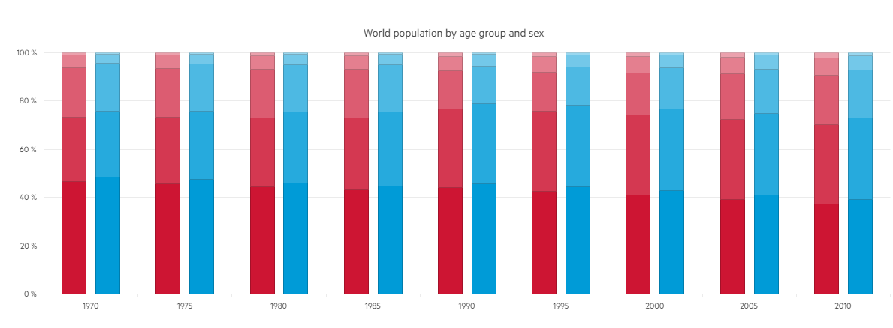

# 100% Stacked and Grouped Bars

The Kendo UI Bar Chart supports 100% stacking that could be grouped in the same time. This implementation provides the opportunity to represent 100% stacked Bar Charts divided by groups of categories.

You can enable the 100% stack feature by setting the first ChartStackType.Stack100 argument of the Series -> Column -> Stack() method, i.e.

series.Column(new int[] { 1100941, 1139797, 1172929, 1184435, 1184654 }).Name("0-19").Stack(ChartStackType.Stack100, "Female");

* [Demo page for the 100% Stacked and Grouped Bar Chart](https://demos.telerik.com/{{ site.platform }}/bar-charts/grouped-stacked100-bar)

The following implementation demonstrates the code needed for setting the 100% Stacked and Grouped Bar Chart:

```HtmlHelper
  @(Html.Kendo().Chart()
        .Name("chart")
        .Title("World population by age group and sex")
        .Legend(legend => legend
            .Visible(false)
        )
        .Series(series => {
            series
                .Column(new int[] { 854622, 925844, 984930, 1044982, 1100941, 1139797, 1172929, 1184435, 1184654 })
                .Name("0-19").Stack(ChartStackType.Stack100, "Female");
            
            series
                .Column(new int[] { 490550, 555695, 627763, 718568, 810169, 883051, 942151, 1001395, 1058439 })
                .Name("20-39").Stack(ChartStackType.Stack100, "Female");
            
            series
                .Column(new int[] { 379788, 411217, 447201, 484739, 395533, 435485, 499861, 569114, 655066 })
                .Name("40-64").Stack(ChartStackType.Stack100, "Female");
            
            series
                .Column(new int[] { 97894, 113287, 128808, 137459, 152171, 170262, 191015, 210767, 226956 })
                .Name("65-79").Stack(ChartStackType.Stack100, "Female");
            
            series
                .Column(new int[] { 16358, 18576, 24586, 30352, 36724, 42939, 46413, 54984, 66029 })
                .Name("80+").Stack(ChartStackType.Stack100, "Female");

            series
                .Column(new int[] { 900268, 972205, 1031421, 1094547, 1155600, 1202766, 1244870, 1263637, 1268165 })
                .Name("0-19").Stack(ChartStackType.Stack100, "Male");
            
            series
                .Column(new int[] { 509133, 579487, 655494, 749511, 844496, 916479, 973694, 1036548, 1099507 })
                .Name("20-39").Stack(ChartStackType.Stack100, "Male");
            
            series
                .Column(new int[] { 364179, 401396, 440844, 479798, 390590, 430666, 495030, 564169, 646563 })
                .Name("40-64").Stack(ChartStackType.Stack100, "Male");
            
            series
                .Column(new int[] { 74208, 86516, 98956, 107352, 120614, 138868, 158387, 177078, 192156 })
                .Name("65-79").Stack(ChartStackType.Stack100, "Male");
            
            series
                .Column(new int[] { 9187, 10752, 13007, 15983, 19442, 23020, 25868, 31462, 39223 })
                .Name("80+").Stack(ChartStackType.Stack100, "Male");
        })
        .SeriesColors(
            "#cd1533", "#d43851", "#dc5c71", "#e47f8f", "#eba1ad",
            "#009bd7", "#26aadd", "#4db9e3", "#73c8e9", "#99d7ef"
        )
        .CategoryAxis(axis => axis
            .Categories("1970", "1975", "1980", "1985", "1990", "1995", "2000", "2005", "2010")
            .MajorGridLines(lines => lines.Visible(false))
        )
        .ValueAxis(axis => axis
            .Numeric()
            .Line(line => line.Visible(false))
        )
        .Tooltip(tooltip => tooltip
            .Visible(true)
            .Template("#= series.stack.group #s, age #= series.name #")
        )
    ) 
```

```TagHelper
@addTagHelper *, Kendo.Mvc
@{
    var seriesColors = new string[] { "#cd1533", "#d43851", "#dc5c71", "#e47f8f", "#eba1ad", "#009bd7", "#26aadd", "#4db9e3", "#73c8e9", "#99d7ef" };
    var categories = new string[] { "1970", "1975", "1980", "1985", "1990", "1995", "2000", "2005", "2010" };
}
    <kendo-chart name="chart"
                 series-colors="seriesColors">
        <category-axis>
            <category-axis-item categories="categories">
                <major-grid-lines visible="false" />
            </category-axis-item>
        </category-axis>
        <series>
            <series-item type="ChartSeriesType.Column"
                         name="0-19"
                         data="new int[] { 854622, 925844, 984930, 1044982, 1100941, 1139797, 1172929, 1184435, 1184654 }">
                <stack type="ChartStackType.Stack100" group="Female" />
            </series-item>
            <series-item type="ChartSeriesType.Column"
                         name="20-39"
                         data="new int[] { 490550, 555695, 627763, 718568, 810169, 883051, 942151, 1001395, 1058439 }">
                <stack type="ChartStackType.Stack100" group="Female" />
            </series-item>
            <series-item type="ChartSeriesType.Column"
                         name="40-64"
                         data="new int[] { 379788, 411217, 447201, 484739, 395533, 435485, 499861, 569114, 655066 }">
                <stack type="ChartStackType.Stack100" group="Female" />
            </series-item>
            <series-item type="ChartSeriesType.Column"
                         name="65-79"
                         data="new int[] { 97894, 113287, 128808, 137459, 152171, 170262, 191015, 210767, 226956 }">
                <stack type="ChartStackType.Stack100" group="Female" />
            </series-item>
            <series-item type="ChartSeriesType.Column"
                         name="80+"
                         data="new int[] { 16358, 18576, 24586, 30352, 36724, 42939, 46413, 54984, 66029 }">
                <stack type="ChartStackType.Stack100" group="Female" />
            </series-item>
            <series-item type="ChartSeriesType.Column"
                         name="0-19"
                         data="new int[] { 900268, 972205, 1031421, 1094547, 1155600, 1202766, 1244870, 1263637, 1268165 }">
                <stack type="ChartStackType.Stack100" group="Male" />
            </series-item>
            <series-item type="ChartSeriesType.Column"
                         name="20-39"
                         data="new int[] { 509133, 579487, 655494, 749511, 844496, 916479, 973694, 1036548, 1099507 }">
                <stack type="ChartStackType.Stack100" group="Male" />
            </series-item>
            <series-item type="ChartSeriesType.Column"
                         name="40-64"
                         data="new int[] { 364179, 401396, 440844, 479798, 390590, 430666, 495030, 564169, 646563 }">
                <stack type="ChartStackType.Stack100" group="Male" />
            </series-item>
            <series-item type="ChartSeriesType.Column"
                         name="65-79"
                         data="new int[] { 74208, 86516, 98956, 107352, 120614, 138868, 158387, 177078, 192156 }">
                <stack type="ChartStackType.Stack100" group="Male" />
            </series-item>
            <series-item type="ChartSeriesType.Column"
                         name="80+"
                         data="new int[] { 9187, 10752, 13007, 15983, 19442, 23020, 25868, 31462, 39223 }">
                <stack type="ChartStackType.Stack100" group="Male" />
            </series-item>
        </series>
        <value-axis>
            <value-axis-item name="" type="numeric">
                <labels template="#= kendo.format('{0:N0}', value / 1000) # M">
                </labels>
                <line visible="false" />
            </value-axis-item>
        </value-axis>
        <chart-legend visible="false">
        </chart-legend>
        <chart-title text="World population by age group and sex">
        </chart-title>
        <tooltip template="#= series.stack.group #s, age #= series.name #" visible="true">
        </tooltip>
    </kendo-chart>
```


Overview of the 100% Stacked and Grouped Bars:



## See Also
* [Basic Usage of Bar Charts {{ site.framework }} (Demo)](https://demos.telerik.com/{{ site.platform }}/bar-charts)
* [100% Stacked Charts for {{ site.framework }} (Demo)](https://demos.telerik.com/{{ site.platform }}/bar-charts/stacked100-bar)
