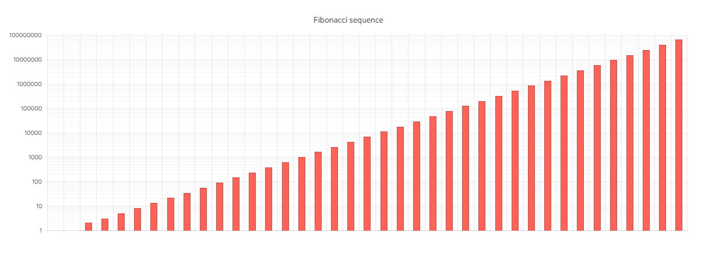

# Logarithmic Axis

A logarithmic axis is a special numeric axis that transforms the actual values by using a logarithmic function with a particular base. A logarithmic axis is useful for displaying values that cover different orders of magnitude because it lets large values display together with small values in a more condensed scale than the default linear axis.

This demo shows how you can use a logarithmic axis for the ASP.NET Core Column Chart by setting the ValueAxis -> Logarithmic() method.

The following implementation demonstrates the code needed for setting the Date Axis for Bar Chart:

```HtmlHelper
 @model IEnumerable<int>

<div class="demo-section k-content wide">
    @(Html.Kendo().Chart()
        .Name("chart")
        .Title("Fibonacci sequence")
        .Series(series => {
            series.Column(Model);
        })
        .ValueAxis(axis => axis.Logarithmic()
            .MinorGridLines(minorGridLines => minorGridLines.Visible(true))
        )
        .Tooltip(tooltip => tooltip
            .Visible(true)
        )
    ) 
</div>
```

```TagHelper
    @model IEnumerable<int>
    @addTagHelper *, Kendo.Mvc

    <div class="demo-section wide">
        <kendo-chart name="chart">
            <series>
                <series-item type="ChartSeriesType.Column"
                            data="@Model.ToArray()">
                </series-item>
            </series>
            <value-axis>
                <value-axis-item type="log">
                    <minor-grid-lines visible="true" />
                </value-axis-item>
            </value-axis>
            <chart-title text="Fibonacci sequence">
            </chart-title>
            <tooltip visible="true">
            </tooltip>
        </kendo-chart>
    </div> 
```

```Controller
 public partial class Bar_ChartsController : Controller
    {
        [Demo]
        public ActionResult Logarithmic_Axis()
        {
            return View(GetFibonacciSequence(39));
        }

        private List<int> GetFibonacciSequence(int n)
        {
            var sequence = new List<int>() { 1, 1 };
            for (var i = 2; i < n; i++)
            {
                sequence.Add(sequence[i - 1] + sequence[i - 2]);
            }

            return sequence;
        }
    }
```

Overview of setting the Logarithmic Axis representing the Fibonacci Sequence:



* [Demo page for the Logarithmic Axis for Bar Chart](https://demos.telerik.com/{{ site.platform }}/bar-charts/logarithmic-axis)

## See Also
* [Basic Usage of Bar Charts for {{ site.framework }} (Demo)](https://demos.telerik.com/{{ site.platform }}/bar-charts)
* [Stacked and Grouped Charts for {{ site.framework }} (Demo)](https://demos.telerik.com/{{ site.platform }}/bar-charts/grouped-stacked-bar)
