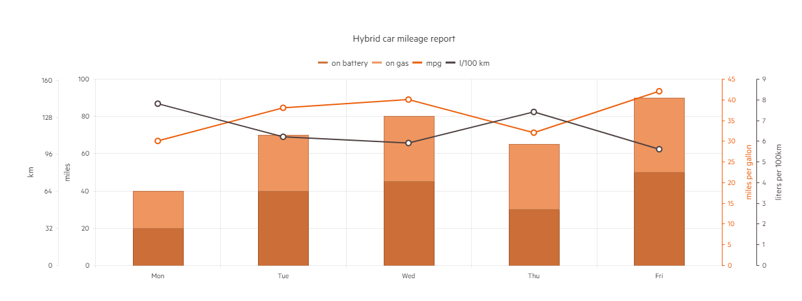

# Multi Axis

The Telerik ASP.NET Core Bar chart supports multiple axis. This helps you leverage the best charting performance and visualize data on any number axis to provide solid business reports for your users.

The example above shows a hybrid car range report visualized through four value axes: km, miles, miles per gallon and liters per 100km. Note that each of them has unique name which is set through the ValueAxis.Title method. You can also set the CategoryAxis.AxisCrossingValue method to specify the alignment of the value axes.

The following implementation demonstrates the code needed for setting the Multi Axis for Bar Chart:

```HtmlHelper
  @(Html.Kendo().Chart()
        .Name("chart")
        .Title("Hybrid car mileage report")
        .Legend(legend => legend
            .Position(ChartLegendPosition.Top)
        )
        .Series(series =>
        {
            series
                .Column(new int[] { 20, 40, 45, 30, 50 })
                .Stack(true)
                .Color("#cc6e38")
                .Name("on battery");
            series
                .Column(new int[] { 20, 30, 35, 35, 40 })
                .Stack(true)
                .Color("#ef955f")
                .Name("on gas");
            series
                .Line(new double[] { 30, 38, 40, 32, 42 })
                .Name("mpg")
                .Color("#ec5e0a")
                .Axis("mpg");
            series
                .Line(new double[] { 7.8, 6.2, 5.9, 7.4, 5.6 })
                .Name("l/100 km")
                .Color("#4e4141")
                .Axis("l100km");
        })
        .CategoryAxis(axis => axis
            .Categories("Mon", "Tue", "Wed", "Thu", "Fri")
            // Align the first two value axes to the left
            // and the last two to the right.
            //
            // Right alignment is done by specifying a
            // crossing value greater than or equal to
            // the number of categories.
            .AxisCrossingValue(0, 0, 10, 10)
        )
        .ValueAxis(axis => axis
            .Numeric()
                .Title("miles")
                .Min(0).Max(100)
        )
        .ValueAxis(axis => axis
            .Numeric("km")
                .Title("km")
                .Min(0).Max(161).MajorUnit(32)
        )
        .ValueAxis(axis => axis
            .Numeric("mpg")
                .Title("miles per gallon")
                .Color("#ec5e0a")
        )
        .ValueAxis(axis => axis
            .Numeric("l100km")
                .Title("liters per 100km")
                .Color("#4e4141")
        )
    )
```

Overview of the Multi Axis implementation for Bar Chart:



* [Demo page of the Multi Axis for Bar Chart](https://demos.telerik.com/{{ site.platform }}/bar-charts/multiple-axes)

## See Also
* [Basic Usage of Bar Charts for {{ site.framework }} (Demo)](https://demos.telerik.com/{{ site.platform }}/bar-charts)
* [Logarithmic Axis in Bar Chart for {{ site.framework }} (Demo)](https://demos.telerik.com/{{ site.platform }}/bar-charts/logarithmic-axis)
