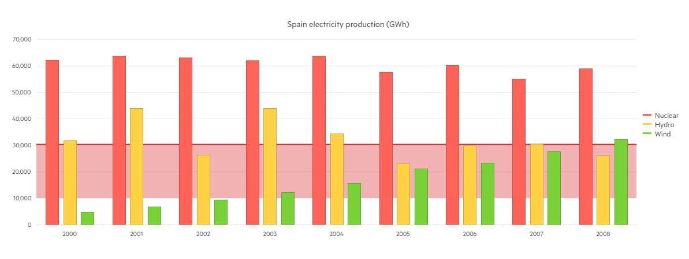

# Plotbands

Plot Bands are colored ranges, which are used to highlight certain areas in the ASP.NET Core Chart. You can create them by setting:

ValueAxis -> PlotBands -> bands.Add().From(10000).To(30000).Color("#c00").Opacity(0.3);

Each Plot Band could be configured independently by specifying the following properties:

* From — the start position of the plot band.
* To — the end position of the plot band.
* Opacity — the opacity of the plot band.
* Color — the color of the plot band.

The following implementation demonstrates the code needed for setting Plotbands for Bar Chart:

```HtmlHelper
 @(Html.Kendo().Chart<Kendo.Mvc.Examples.Models.ElectricityProduction>()
        .Name("chart")
        .Title("Spain electricity production (GWh)")
        .Legend(legend => legend
            .Position(ChartLegendPosition.Right)
        )
        .DataSource(ds => ds
            .Read(read => read.Action("_SpainElectricityProduction", "Bar_Charts"))
            .Sort(sort => sort.Add("Year").Ascending())
        )
        .Series(series =>
        {
            series.Column(model => model.Nuclear).Name("Nuclear").CategoryField("Year");
            series.Column(model => model.Hydro).Name("Hydro").CategoryField("Year");
            series.Column(model => model.Wind).Name("Wind").CategoryField("Year");
        })
        .CategoryAxis(axis => axis
            .MajorGridLines(lines => lines.Visible(false))
        )
        .ValueAxis(axis => axis.Numeric()
            .Labels(labels => labels.Format("{0:N0}"))
            .MajorUnit(10000)
            .Max(70000)
            .Line(line => line.Visible(false))
            .PlotBands(bands => {
                bands.Add().From(10000).To(30000).Color("#c00").Opacity(0.3);
                bands.Add().From(30000).To(30500).Color("#c00").Opacity(0.8);
            })
        )
        .Tooltip(tooltip => tooltip
            .Visible(true)
            .Format("{0:N0}")
        )
    ) 
```

Overview of Plotbands implementation for Bar Chart:



* [Demo page of the Plotbands for Bar Chart](https://demos.telerik.com/{{ site.platform }}/bar-charts/plotbands)

## See Also
* [Basic Usage of Bar Charts for {{ site.framework }} (Demo)](https://demos.telerik.com/{{ site.platform }}/bar-charts)
* [Stacked and Grouped Charts for {{ site.framework }} (Demo)](https://demos.telerik.com/{{ site.platform }}/bar-charts/grouped-stacked-bar)
