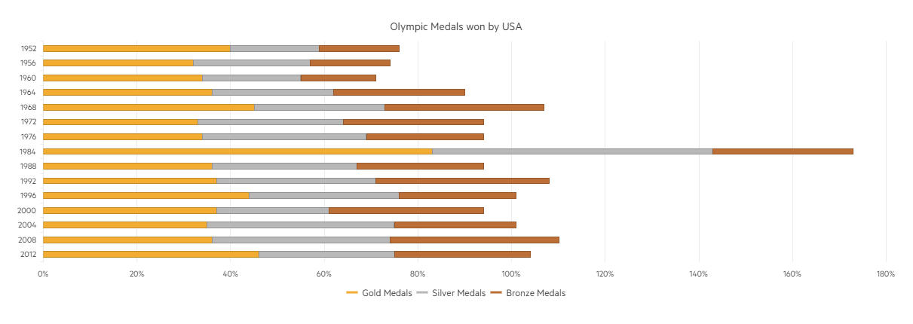

# Stacked Bar Chart

A Stacked bar is a bar divided into subparts to show cumulative effect, to display money distribution or production against time. This implementation provides the opportunity to represent the total value for a stack by given category. In the same time the subcategories are represented in the same stack. You can easily enable the stack feature through the SeriesDefaults -> Bar -> Stack(true) setting.

* [Demo page for the Stacked Bar Chart](https://demos.telerik.com/{{ site.platform }}/bar-charts/stacked-bar)

The following implementation demonstrates the code needed for setting the Stacked Bar Chart:

```HtmlHelper
 @(Html.Kendo().Chart()
        .Name("chart")
        .Title("Olympic Medals won by USA")
        .Legend(legend => legend
            .Position(ChartLegendPosition.Bottom)
        )
        .SeriesDefaults(seriesDefaults =>
            seriesDefaults.Bar().Stack(true)
        )
        .Series(series => {
            series.Bar(new double[] { 40, 32, 34, 36, 45, 33, 34, 83, 36, 37, 44, 37, 35, 36, 46 }).Name("Gold Medals").Color("#f3ac32");
            series.Bar(new double[] { 19, 25, 21, 26, 28, 31, 35, 60, 31, 34, 32, 24, 40, 38, 29 }).Name("Silver Medals").Color("#b8b8b8");
            series.Bar(new double[] { 17, 17, 16, 28, 34, 30, 25, 30, 27, 37, 25, 33, 26, 36, 29 }).Name("Bronze Medals").Color("#bb6e36");
        })
        .CategoryAxis(axis => axis
            .Categories("1952", "1956", "1960", "1964", "1968", "1972", "1976", "1984", "1988", "1992", "1996", "2000", "2004", "2008", "2012")
            .MajorGridLines(lines => lines.Visible(false))
        )
        .ValueAxis(axis => axis
            .Numeric()
            .Labels(labels => labels.Format("{0}%"))
            .Max(180)
            .Line(line => line.Visible(false))
            .MajorGridLines(lines => lines.Visible(true))
        )
        .Tooltip(tooltip => tooltip
            .Visible(true)
            .Template("#= series.name #: #= value #")
        )
    ) 
```

```TagHelper
    @addTagHelper *, Kendo.Mvc
    @{
        var categories = new string[] { "1952", "1956", "1960", "1964", "1968", "1972", "1976", "1984", "1988", "1992", "1996", "2000", "2004", "2008", "2012" };
    }
        <kendo-chart name="chart">
            <category-axis>
                <category-axis-item categories="categories">
                    <major-grid-lines visible="false" />
                </category-axis-item>
            </category-axis>
            <series>
                <series-item type="ChartSeriesType.Bar"
                            color="#f3ac32"
                            name="Gold Medals"
                            data="new double[] { 40, 32, 34, 36, 45, 33, 34, 83, 36, 37, 44, 37, 35, 36, 46 }">
                </series-item>
                <series-item type="ChartSeriesType.Bar"
                            color="#b8b8b8"
                            name="Silver Medals"
                            data="new double[] { 19, 25, 21, 26, 28, 31, 35, 60, 31, 34, 32, 24, 40, 38, 29 }">
                </series-item>
                <series-item type="ChartSeriesType.Bar"
                            color="#bb6e36"
                            name="Bronze Medals"
                            data="new double[] { 17, 17, 16, 28, 34, 30, 25, 30, 27, 37, 25, 33, 26, 36, 29 }">
                </series-item>
            </series>
            <value-axis>
                <value-axis-item max="180" name="" type="numeric">
                    <labels format="{0}%">
                    </labels>
                    <line visible="false" />
                    <major-grid-lines visible="true" />
                </value-axis-item>
            </value-axis>
            <series-defaults type="ChartSeriesType.Bar">
                <stack enabled="true" />
            </series-defaults>
            <chart-legend position="ChartLegendPosition.Bottom">
            </chart-legend>
            <chart-title text="Olympic Medals won by USA">
            </chart-title>
            <tooltip template="#= series.name #: #= value #" visible="true">
            </tooltip>
        </kendo-chart>
```


Overview of the Stacked Bars:



## See Also
* [Basic Usage of Bar Charts {{ site.framework }} (Demo)](https://demos.telerik.com/{{ site.platform }}/bar-charts)
* [Stacked and Grouped Charts for {{ site.framework }} (Demo)](https://demos.telerik.com/{{ site.platform }}/bar-charts/grouped-stacked-bar)
