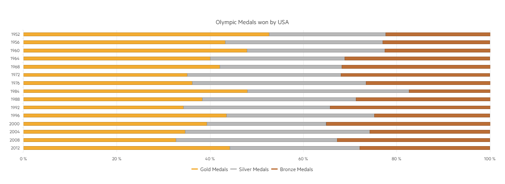

# 100% Stacked bars

The Bar chart type supports 100% stacking, where the stacked series values are rescaled in a way they add up to 100%. This implementation provides the opportunity to represent different categories per time and percentage in a custom stack whick total value is 100%.

You can enable the 100% stack feature through the seriesDefaults-> stack -> type chart attribute.

* [Demo page for the 100% Stacked Bar Chart](https://demos.telerik.com/{{ site.platform }}/bar-charts/stacked100-bar)

The following implementation demonstrates the code needed for setting the 100% Stacked Bar Chart:

```View
 @(Html.Kendo().Chart()
        .Name("chart")
        .Title("Olympic Medals won by USA")
        .Legend(legend => legend
            .Position(ChartLegendPosition.Bottom)
        )
        .SeriesDefaults(seriesDefaults =>
            seriesDefaults.Bar().Stack(ChartStackType.Stack100)
        )
        .Series(series => {
            series.Bar(new double[] { 40, 32, 34, 36, 45, 33, 34, 83, 36, 37, 44, 37, 35, 36, 46 }).Name("Gold Medals").Color("#f3ac32");
            series.Bar(new double[] { 19, 25, 21, 26, 28, 31, 35, 60, 31, 34, 32, 24, 40, 38, 29 }).Name("Silver Medals").Color("#b8b8b8");
            series.Bar(new double[] { 17, 17, 16, 28, 34, 30, 25, 30, 27, 37, 25, 33, 26, 36, 29 }).Name("Bronze Medals").Color("#bb6e36");
        })
        .CategoryAxis(axis => axis
            .Categories("1952", "1956", "1960", "1964", "1968", "1972", "1976", "1984", "1988", "1992", "1996", "2000", "2004", "2008", "2012")
            .MajorGridLines(lines => lines.Visible(false))
        )
        .ValueAxis(axis => axis
            .Numeric()
            .Line(line => line.Visible(false))
            .MajorGridLines(lines => lines.Visible(true))
        )
        .Tooltip(tooltip => tooltip
            .Visible(true)
            .Template("#= series.name #: #= value #")
        )
    ) 
```

Overview of the 100% Stacked Bars:



## See Also
* [Basic Usage of Bar Charts {{ site.framework }} (Demo)](https://demos.telerik.com/{{ site.platform }}/bar-charts)
* [100% Stacked and Grouped Charts for {{ site.framework }} (Demo)](https://demos.telerik.com/{{ site.platform }}/bar-charts/grouped-stacked100-bar)
