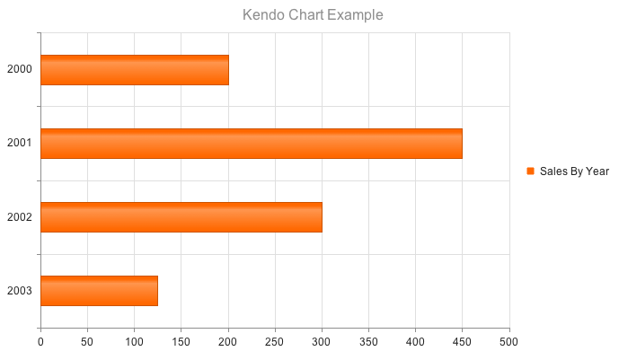

# Bar Charts

The Telerik UI Bar Chart HtmlHelper for {{ site.framework }} is a server-side wrapper for the Kendo UI Bar Chart widget.

Bar Charts display data through horizontal or vertical bars whose lengths vary according to their value.

* [Demo page for the Bar Chart](https://demos.telerik.com/{{ site.platform }}/area-charts/index)

## Getting Started

Bar Charts are suitable for displaying a comparison between sets of data&mdash;for example, a summary of unique and total site visitors over a certain period of time.

The [Telerik UI Bullet Chart HtmlHelper for {{ site.framework }}](https://demos.telerik.com/{{ site.platform }}/bullet-charts/index) is a variation of a Telerik UI Bar Chart. You can use it as a replacement for dashboard gauges and meters. The bullet graph compares a given quantitative measure, such as temperature, against qualitative ranges, such as warm, hot, mild, cool, chilly, cold, and so on, and a symbol marker that encodes the comparative measure, such as the max temperature a year ago.

The [Telerik UI Range Bar Chart HtmlHelper for {{ site.framework }}](https://demos.telerik.com/{{ site.platform }}/range-bar-charts/index) is yet another variation of the Telerik UI Bar Chart. It displays data as bars where each bar represents a value range that spans between its minimum and maximum levels. A Range Bar type has floating bars unlike the standard Telerik UI Bar Chart that has bars that are anchored to its `x`-axis.

To create a Bar series in the Chart HtmlHelper, use `Column` or `Bar` in the `Series` configuration.

* [Defining a Column Chart](#defining-the-column-chart)
* [Defining a Bar Chart](#defining-the-bar-chart)

## Defining the Column Chart

The [Telerik UI Column Chart for {{ site.framework }}](https://demos.telerik.com/{{ site.platform }}/bar-charts/column) is rendered when the `Series` is `Column`.

    @(Html.Kendo().Chart()
        .Name("chart")
        .Title("Kendo Chart Example")
        .Legend(legend => legend
            .Position(ChartLegendPosition.Bottom)
        )
        .Series(series =>
        {
            series.Column(new double[] { 200, 450, 300, 125 }).Name("Example Series");
        })
        .CategoryAxis(axis => axis
            .Categories(2000, 2001, 2002, 2003)
        )
    )

## Defining the Bar Chart

Setting the `Series` object to `"Bar"` renders horizontal bars.

    @(Html.Kendo().Chart()
       .Name("chart")
       .Title("Kendo Chart Example")
       .Legend(legend => legend
           .Position(ChartLegendPosition.Bottom)
       )
       .Series(series =>
       {
           series.Bar(new double[] { 200, 450, 300, 125 }).Name("Example Series");
       })
       .CategoryAxis(axis => axis
           .Categories(2000, 2001, 2002, 2003)
       )
    )

## See Also

* [Basic Usage of the Bar Chart HtmlHelper for {{ site.framework }} (Demo)](https://demos.telerik.com/{{ site.platform }}/bar-charts/index)
* [Basic Usage of the Range Bar Chart HtmlHelper for {{ site.framework }} (Demo)](https://demos.telerik.com/{{ site.platform }}/range-bar-charts/index)
* [Server-Side API](/api/chart)
