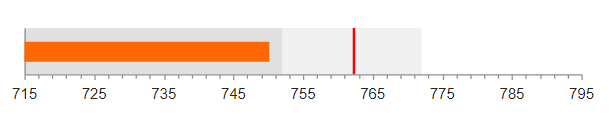
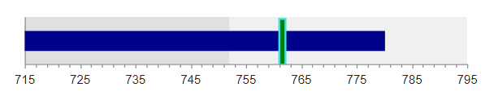

# Bullet Charts

The Telerik UI Bullet HtmlHelper for {{ site.framework }} is a server-side wrapper for the Kendo UI Bullet Chart widget.

Bullet Charts represent a variation of the [Bar Chart]().

* [Demo page for the Bullet Chart](https://demos.telerik.com/{{ site.platform }}/bullet-charts/index)

## Getting Started

You can use the Bullet Chart HtmlHelper to visualize a comparison between an expected (target) and actual (current) value&mdash;for example, company profit, employee performance, weather data, and so on.

To create a Bullet series in the Chart HtmlHelper, use `Bullet` and `VerticalBullet` in the `Series` configuration.

* [Configuring the axes](#configuring-the-axes)
* [Customizing the target value lines](#customizing-the-target-value-lines)

## Configuring the Axes

To configure the axes, use the `CategoryAxis` and `ValueAxis` settings. Multiple value axes are also supported.

      @(Html.Kendo().Chart()
            .Name("chart")
            .Legend(legend => legend
                .Visible(false)
            )
            .Series(series => {
                series.Bullet(new double[][] { new double[] { 750, 762.5 }});
            })
            .ChartArea(chartArea => chartArea.Margin(0))
            .CategoryAxis(axis => axis
                .MajorGridLines(lines => lines.Visible(false))
                .MajorTicks(lines => lines.Visible(false))
            )
            .ValueAxis(axis => axis
                .Numeric()
                .Min(715)
                .Max(795)
                .MinorTicks(lines => lines.Visible(true))
                .MajorGridLines(lines => lines.Visible(false))
                .PlotBands(bands => {
                    bands.Add().From(715).To(752).Color("#ccc").Opacity(0.6);
                    bands.Add().From(752).To(772).Color("#ccc").Opacity(0.3);
                })
            )
            .Tooltip(tooltip => tooltip
                .Visible(true)
                .Shared(true)
                .Template("Maximum: #= value.target # <br /> Average: #= value.current #")
            )
      )


The configuration from the previous example results in the following Bullet Chart.



## Customizing the Target Value Lines

You can customize the line that represents the target value through the `Target` series configuration. `Target` exposes the `Border`, `Color`, and `Line` main settings that control the line appearance.

The following example demonstrates how to use all three options to customize the target line.

```
              .Series(series =>
              {
                  series
                  .Bullet(new double[][] { new double[] { 780, 762.5 } })
                  .Color("darkblue")
                  .Target(target=>target
                    .Color("green")
                    .Border(b=>b
                        .Color("turquoise")
                        .Width(2)
                    )
                    .Line(l=>l.Width(6))
                  );
              })
```



## See Also

* [Basic Usage of the Bullet Chart HtmlHelper for {{ site.framework }} (Demo)](https://demos.telerik.com/{{ site.platform }}/bullet-charts/index)
* [Server-Side API](/api/chart)
