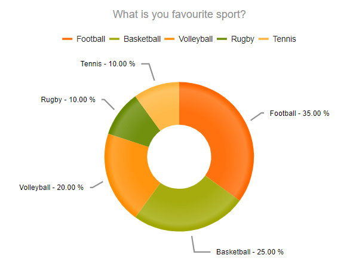
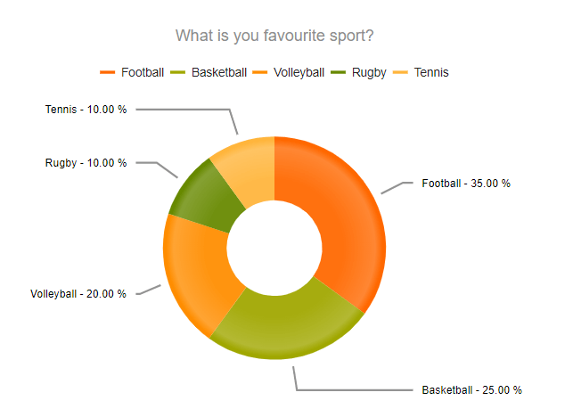
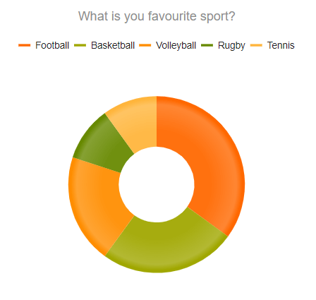
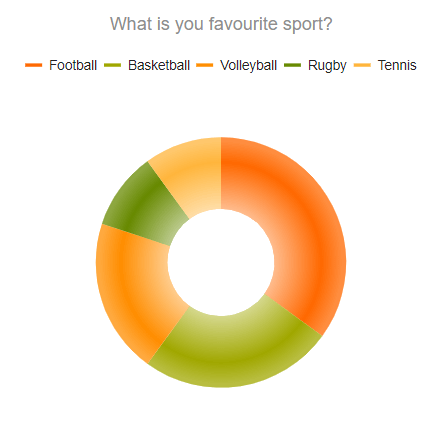
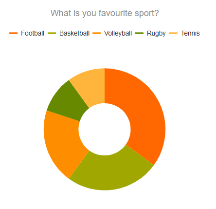

# Donut Charts


The Telerik UI Donut Chart TagHelper and HtmlHelper for {{ site.framework }} are server-side wrappers for the Kendo UI Donut Chart widget.

The Telerik UI Donut Chart HtmlHelper for {{ site.framework }} is a server-side wrapper for the Kendo UI Donut Chart widget.


The Donut Charts are a Pie chart variation with the ability to display data as single-series sectors from a two-dimensional circle.

* [Demo page for the Donut Chart HtmlHelper](https://demos.telerik.com/{{ site.platform }}/donut-charts/index)

* [Demo page for the Donut Chart TagHelper](https://demos.telerik.com/aspnet-core/donut-charts/tag-helper)


## Getting Started

Donut Charts are suitable for showing the proportions of categorical data, with the size of each piece representing the proportion of each category. In comparison to its [Pie Chart]() predecessor, it helps avoid confusion around the area parameter that often trips people up in a Pie Chart.

To create Donut series in the Chart component, use the `Donut` configuration method within the `Series` configuration.

* [Creating the Donut Chart](#creating-the-donut-chart)
* [Configuring the labels visibility](#configuring-the-labels-visibility)
* [Configuring the labels alignment](#configuring-the-labels-alignment)
* [Configuring the effects overlay](#configuring-the-effects-overlay)

Also, you can configure the Donut Chart for `Inline`, `Local`, and `Remote` data binding.

* [Charts Data Binding](https://docs.telerik.com/{{ site.platform }}/html-helpers/charts/data-binding)

## Creating the Donut Chart

The following example demonstrates how to define a Donut Chart with a single series.

```HtmlHelper
    @(Html.Kendo().Chart()
        .Name("chart")
        .Title("What is you favourite sport?")
        .Legend(legend => legend
            .Position(ChartLegendPosition.Top)
        )
        .Series(series => {
            series.Donut(new dynamic[] {
                new {category = "Football",value = 35},
                new {category = "Basketball",value = 25},
                new {category = "Volleyball",value = 20},
                new {category = "Rugby",value = 10},
                new {category = "Tennis",value = 10}
            })
            .Labels(labels => labels
                .Visible(true)
                .Position(ChartPieLabelsPosition.OutsideEnd)
                .Template("#= category # - #= kendo.format('{0:P}', percentage)#")
                .Background("transparent")
            );
        })
        .Tooltip(tooltip => tooltip
            .Visible(true)
            .Template("#= category # - #= kendo.format('{0:P}', percentage) #")
        )
    )
```

```TagHelper
     <kendo-chart name="chart">
        <chart-title text="What is you favourite sport?"></chart-title>
        <chart-legend position="ChartLegendPosition.Top"></chart-legend>
        <series-defaults type="ChartSeriesType.Donut"></series-defaults>
        <series>
            <series-item start-angle="150" name="2011" data='new dynamic[] {
                new {category = "Football",value = 35},
                new {category = "Basketball",value = 25},
                new {category = "Volleyball",value = 20},
                new {category = "Rugby",value = 10},
                new {category = "Tennis",value = 10}
             }'>
                <labels visible="true"
                        position="ChartSeriesLabelsPosition.OutsideEnd"
                        template="#= category # - #= kendo.format('{0:P}', percentage)#"
                        background="transparent">
                </labels>
            </series-item>
        </series>
        <tooltip visible="true" template="#= category # - #= kendo.format('{0:P}', percentage) #"></tooltip>
    </kendo-chart>
```




## Configuring the Labels Visibility

You can show or hide the Donut Chart labels through the `Visible()` configuration method for the given series.

```HtmlHelper
    .Series(series =>
    {
        series.Donut(new dynamic[] {})
    		.Labels(labels => labels
    			.Visible(true)
    	);
    })
```

```TagHelper
    <series-defaults type="ChartSeriesType.Donut"></series-defaults>
    <series>
        <series-item data='new dynamic[] {}'>
            <labels visible="true"></labels>
        </series-item>
    </series>
```


## Configuring the Labels Alignment

The Donut Chart allows you to configure the label alignment for the series through the `Align()` method.

```HtmlHelper
    .Series(series =>
    {
        series.Donut(new dynamic[] {})
    		.Labels(labels => labels
    			.Align(ChartSeriesLabelsAlign.Circle)
    		);
    })
```

```TagHelper
    <series-defaults type="ChartSeriesType.Donut"></series-defaults>
    <series>
        <series-item data='new dynamic[] {}'>
            <labels align="ChartSeriesLabelsAlign.Circle"></labels>
        </series-item>
    </series>
```


The Donut Chart supports two modes of label alignment:

* `Circle`(default)&mdash;The labels are positioned in a circle around the Chart.
        
    
* `Column`&mdash;The labels are positioned in columns to the left and right of the Chart.
        
    


## Configuring the Effects Overlay

Each segment has a transparent effect overlay that adds depth to the two-dimensional shape. The overlay transparent gradient is configurable through the `Overlay()` option.

```HtmlHelper
    .Series(series =>
    {
       series.Donut(new dynamic[] {})
       .Overlay(o => o.Gradient(ChartSeriesGradient.None));
    })
```

```TagHelper
    <series-defaults type="ChartSeriesType.Donut"></series-defaults>
    <series>
        <series-item data='new dynamic[] {}'>
            <overlay gradient="ChartSeriesGradient.None" />
        </series-item>
    </series>
```


The Donut Chart supports the following `ChartSeriesGradient` options:

* (Default) `RoundedBevel`

    

* `SharpBevel`

    

* `None`

    


## See Also

* [Basic Usage of the Donut Chart HtmlHelper for {{ site.framework }} (Demo)](https://demos.telerik.com/{{ site.platform }}/donut-charts/index)
* [Data Binding Options for the Telerik UI for {{ site.framework }} Charts]()
* [Server-Side API](/api/chart)