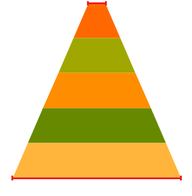
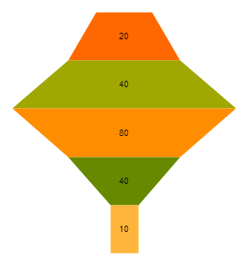

# Funnel Charts

The Telerik UI Funnel HtmlHelper for {{ site.framework }} is a server-side wrapper for the Kendo UI Funnel Chart widget.

Funnel Charts display a single series of data in progressively decreasing or increasing proportions, organized in segments, where each segment represents the value for the particular item from the series. The values of the items can also influence the height and the shape of the corresponding segments.

Funnel Charts are suitable for representing stages in a sales process and for showing the amount of the potential revenue from each stage. They are also useful when identifying potential problem areas in the sales processes of an organization. Funnel Charts are similar to the [Stacked Bar Charts](https://demos.telerik.com/{{ site.platform }}/bar-charts/stacked-bar) and are well suited for displaying several values.

* [Demo page for the Funnel Chart](https://demos.telerik.com/{{ site.platform }}/funnel-charts/index)

## Concepts

The basic conceptual options of a Telerik UI Funnel Chart are:

* `dynamicHeight`&mdah;When `equal` is set to `false`, `dynamicHeight` specifies whether the different elements will have equal height, or specifies whether the height of each element has to be based on its value.
* `dynamicSlope`&mdash;When disabled, the Chart takes the `neckRatio` option into account. When enabled, the Chart neglects the `neckRatio` option and each segment creates its form based on the ratio between the current value and the next value.
* `neckRatio`&mdash;Specifies the ratio between the top and the bottom bases of the whole Funnel series. For example, if set to `ten`, the top base will be ten times smaller than the bottom base.



## Getting Started

The following example demonstrates how to base the widths of the bases for each segment on the `currentValue/nextValue` ratio.

```
    @(Html.Kendo().Chart().Name("chart-oct")
        .Series(series =>
            series.Funnel(new dynamic[]{
                new {
                    value= 40
                },
                new {
                    value= 80
                },
                new {
                    value= 40,
                },
                new {
                    value= 10,
                }
            })
            .DynamicHeight(false)
            .DynamicSlope(true)
            .Labels(l=>l.Visible(true))
        )
    )
```



## See Also

* [Basic Usage of the Funnel Chart HtmlHelper for {{ site.framework }} (Demo)](https://demos.telerik.com/{{ site.platform }}/funnel-charts/index)
* [Server-Side API](/api/chart)
