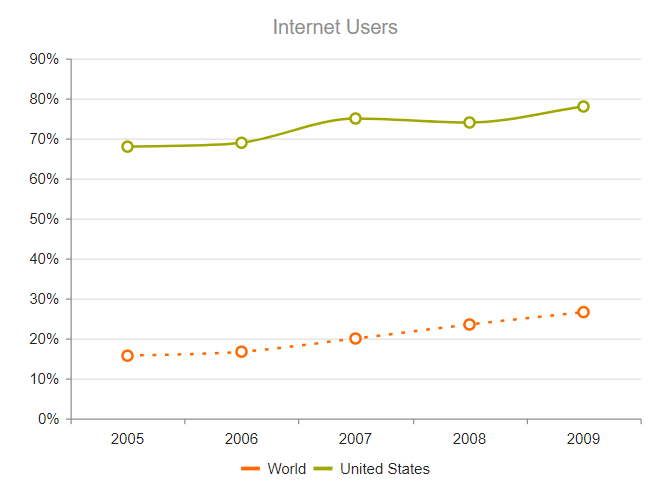

# Line Charts


The Telerik UI Line Chart TagHelper and HtmlHelper for {{ site.framework }} are server-side wrappers for the Kendo UI Line Chart widget.

The Telerik UI Line Chart HtmlHelper for {{ site.framework }} is a server-side wrapper for the Kendo UI Line Chart widget.


Line Charts are suitable for displaying quantitative data by using continuous lines passing through points defined by the values of their items.

* [Demo page for the Line Chart HtmlHelper](https://demos.telerik.com/{{ site.platform }}/line-charts/index)

* [Demo page for the Line Chart TagHelper](https://demos.telerik.com/{{ site.platform }}/line-charts/tag-helper)


## Getting Started

You can use the Line Chart component to render a trend over time and compare sets of similar data.

To create a Line series in the Chart, use `Line` and `VerticalLine` in the `Series` configuration.

* [Configuring the axes](#configuring-the-axes)
* [Configuring the line styles](#configuring-the-line-styles)
* [Setting the line type](#setting-the-line-type)
* [Customizing the markers](#customizing-the-markers)

## Configuring the Axes

To configure the axes, use the `CategoryAxis` and `ValueAxis` settings. 

```HtmlHelper
    @(Html.Kendo().Chart()
         .Name("chart")
         .Title("Internet Users")
         .Legend(legend => legend
             .Position(ChartLegendPosition.Bottom)
         )
         .Series(series =>
         {
             series.Line(new double[] { 15.7, 16.7, 20, 23.5, 26.6 }).Name("World");
             series.Line(new double[] { 67.96, 68.93, 75, 74, 78 }).Name("United States");
         })
         .CategoryAxis(axis => axis
             .Categories("2005", "2006", "2007", "2008", "2009")
             .MajorGridLines(lines => lines.Visible(false))
         )
         .ValueAxis(axis => axis
             .Numeric().Labels(labels => labels.Format("{0}%"))
         )
    )
```

```TagHelper
    <kendo-chart name="chart">
        <chart-title text="Internet Users"></chart-title>
        <chart-legend position="ChartLegendPosition.Bottom"></chart-legend>
        <series-defaults type="ChartSeriesType.Line" />
        <series>
            <series-item data='new double[] { 15.7, 16.7, 20, 23.5, 26.6 }' name="World">
            </series-item>
            <series-item data='new double[] { 67.96, 68.93, 75, 74, 78}' name="United States">
            </series-item>
        </series>
        <category-axis>
            <category-axis-item categories='new string[] { "2005", "2006", "2007", "2008", "2009" }'>
                <major-grid-lines visible="false" />
            </category-axis-item>
        </category-axis>
        <value-axis>
            <value-axis-item type="numeric">
                <labels format="{0}%">
                </labels>
            </value-axis-item>
        </value-axis>
    </kendo-chart>
```


The configuration from the previous example results in the following Line Chart.


Multiple value axes are also supported. For example, to define four value axes, follow the steps below:

1. Configure four `ValueAxis()` configurations with the desired options and set the name of each axis through the `Numeric()` method.
1. Within the `Series()` configuration, use the `Axis()`option to specify the name of the value axis for each of the defined series.
1. Set the alignment of the value axes by using the `AxisCrossingValue()` of the `CategoryAxis()`. This method accepts comma-separated indexes that correspond to the indices, at which the value axes cross the category axis.

```
    @(Html.Kendo().Chart()
        .Name("chart")
        .Title("March Weather Report")
        .Legend(legend => legend
            .Position(ChartLegendPosition.Bottom)
        )
        .Series(series =>
        {
            series
                .Line(new double[] { 6, 10, 10, 10, 10, 9, 5, 5, 10, 8, 8, 5, 8, 11, 9, 15, 20, 23, 24, 21, 21, 20, 22, 22, 20, 18, 16, 15, 20, 13.2, 18 })
                .Color("#ff1c1c")
                .Name("Humidity")
                .Axis("humid");
            series
                .Line(new double[] { -5, -6, 0, -4, -3, -5.2, -5, -1.7, -1, 0, -0.4, -2, -2, -5, 4, -2, -4, -1, -1, 2, 4, -1, 1, 1, 4, 0, -1, 1, -2, 5.7, 5 })
                .Color("#ffae00")
                .Name("Min. Temperature [°C]")
                .Axis("temp");
            series
                .Area(new double[] { 16.4, 21.7, 35.4, 19, 10.9, 13.6, 10.9, 10.9, 10.9, 16.4, 16.4, 13.6, 13.6, 29.9, 27.1, 16.4, 13.6, 10.9, 16.4, 10.9, 24.5, 10.9, 8.1, 19, 21.7, 27.1, 24.5, 16.4, 27.1, 29.9, 27.1 })
                .Color("#73c100")
                .Name("Wind Speed [km/h]")
                .Axis("wind");
            series
                .Area(new double[] { 5.4, 2, 5.4, 3, 2, 1, 3.2, 7.4, 0, 8.2, 0, 1.8, 0.3, 0, 0, 2.3, 0, 3.7, 5.2, 6.5, 0, 7.1, 0, 4.7, 0, 1.8, 0, 0, 0, 1.5, 0.8 })
                .Color("#007eff")
                .Name("Rainfall [mm]")
                .Axis("rain");
        })
        .CategoryAxis(axis => axis
            .Categories("1", "2", "3", "4", "5", "6", "7", "8", "9", "10", "11", "12", "13", "14", "15", "16", "17", "18", "19", "20", "21", "22", "23", "24", "25", "26", "27", "28", "29", "30", "31")
            // Align the first and the last value axes to the left
            // and the second and the third to the right.
            .AxisCrossingValue(0, 32, 32, 0)
        )
        .ValueAxis(axis => axis // First value axis.
            .Numeric("humid")
            .Color("#ff1c1c")
            .Min(0)
            .Max(60)
        )
        .ValueAxis(axis => axis // Second value axis.
            .Numeric("rain")
            .Color("#007eff")
            .Min(0)
            .Max(60)
        )
        .ValueAxis(axis => axis // Third value axis.
            .Numeric("wind")
            .Color("#73c100")
            .Min(0)
            .Max(60)
        )
        .ValueAxis(axis => axis // Fourth value axis.
            .Numeric("temp")
            .Color("#ffae00")
            .Min(-30)
            .Max(30)
        )
    )
```

## Configuring the Line Styles

You can render the lines between the points by setting different styles through the `Style` configuration in the `SeriesDefaults` common settings.

The supported line styles are:

* Normal&mdash;This is the default style. It produces a straight line between data points.
* Step&mdash;This style renders the connection between data points through vertical and horizontal lines. It is suitable for indicating that the value is constant between the changes.
* Smooth&mdash;This style causes the Line Chart to display a fitted curve through data points. It is suitable when the data requires to be displayed with a curve, or when you wish to connect the points with smooth instead of straight lines.

```HtmlHelper
   .SeriesDefaults(seriesDefaults =>
       seriesDefaults.Line().Style(ChartLineStyle.Smooth)
   )
```

```TagHelper
    <series-defaults type="ChartSeriesType.Line"></series-defaults>
    <series>
        <series-item style="ChartSeriesStyle.Smooth"></series-item>
    </series>
```


You can also set the line style for each Line series individually.

```HtmlHelper
   .Series(series =>
   {
       series.Line(new double[] { 15.7, 26.7, 20, 23.5, 26.6 }).Name("World").Style(ChartLineStyle.Smooth);
       series.Line(new double[] { 67.96, 68.93, 75, 54, 78 }).Name("United States").Style(ChartLineStyle.Smooth);
   })
```

```TagHelper
    <series>
        <series-item type="ChartSeriesType.Line"
                     data='new double[] { 15.7, 16.7, 20, 23.5, 26.6 }'
                     name="World" 
                     style="ChartSeriesStyle.Smooth">
        </series-item>
        <series-item type="ChartSeriesType.Line"
                     data='new double[] { 67.96, 68.93, 75, 74, 78}' 
                     name="United States"
                     style="ChartSeriesStyle.Smooth">
        </series-item>
    </series>
```



The following image displays a smooth-line Line Chart.


## Setting the Line Type

By default, the Chart draws its Line series as solid lines. You can configure the line to be drawn through different dash styles by setting `DashType`.

```HtmlHelper
     .Series(series =>
     {
         series.Line(new double[] { 15.7, 16.7, 20, 23.5, 26.6 }).Name("World").DashType(ChartDashType.Dot);
         series.Line(new double[] { 67.96, 68.93, 75, 74, 78 }).Name("United States");
     })
```

```TagHelper
    <series>
        <series-item type="ChartSeriesType.Line"
                     data='new double[] { 15.7, 16.7, 20, 23.5, 26.6 }'
                     name="World" 
                     dash-type="DashType.Dot">
        </series-item>
        <series-item type="ChartSeriesType.Line"
                     data='new double[] { 67.96, 68.93, 75, 74, 78}' 
                     name="United States">
        </series-item>
    </series>
```




## Customizing the Markers

The series markers are the visuals that represent the point value in the Line series. You can customize or hide them through the `Markers` configuration.

```HtmlHelper
   series.Line(new double[] { 15.7, 16.7, 20, 23.5, 26.6 }).Name("World")
      .Markers(m=>m
          .Type(ChartMarkerShape.Square)
          .Rotation(45)
          .Background("yellow")
      );
```

```TagHelper
    <series>
        <series-item type="ChartSeriesType.Line"
                     data='new double[] { 15.7, 16.7, 20, 23.5, 26.6 }' 
                     name="World">
            <markers type="ChartMarkerShape.Square" 
                     background="yellow" 
                     rotation="45">
            </markers>
        </series-item>
    </series>
```



You can also completely draw custom markers for the Line series through the `Visual` setting as shown in the [Custom Visuals](https://demos.telerik.com/{{ site.platform }}/line-charts/visuals) demo.

## See Also

* [Basic Usage of the Line Chart HtmlHelper for {{ site.framework }} (Demo)](https://demos.telerik.com/{{ site.platform }}/line-charts/index)
* [Basic Usage of the Line Chart TagHelper for {{ site.framework }} (Demo)](https://demos.telerik.com/{{ site.platform }}/line-charts/tag-helper)
* [Server-Side API](/api/chart)
* [Client-Side API](https://docs.telerik.com/kendo-ui/api/javascript/dataviz/ui/chart)
