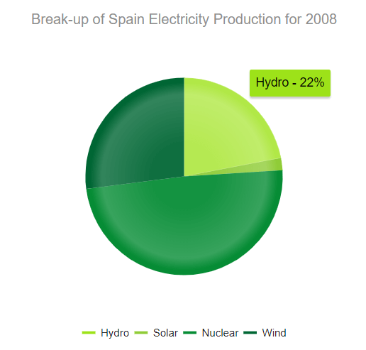
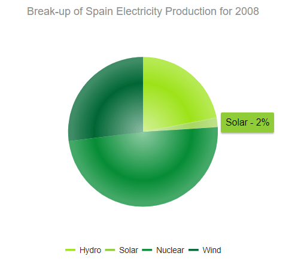
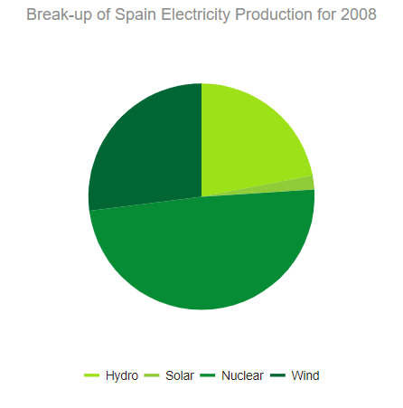

# Pie Charts

The Telerik UI Pie Chart HtmlHelper for {{ site.framework }} is a server-side wrapper for the Kendo UI Pie Chart widget.

Pie Charts display data as single-series sectors from a two-dimensional circle which is useful for rendering data as a part of the whole.

* [Demo page for the Pie Chart](https://demos.telerik.com/{{ site.platform }}/pie-charts/index)

## Getting Started

The [Telerik UI Donut Chart HtmlHelper for {{ site.framework }}](https://demos.telerik.com/{{ site.platform }}/donut-charts/index) is a Pie Chart variation with the same ability to display a single data series in a two-dimensional circle and is likewise useful for displaying data as a part of the whole.

To create a Pie series in the Chart HtmlHelper, use `Pie` in the `Series` configuration.

* [Creating the Pie Chart](#creating-the-pie-chart)
* [Configuring the effects overlay](#configuring-the-effects-overlay)

## Creating the Pie Chart

The following example demonstrates how to define a single series of type `"pie"`. Additional series are not supported and each data point is an object that specifies the point value, category label, and other properties.

        @(Html.Kendo().Chart()
           .Name("chart")
           .Title("Break-up of Spain Electricity Production for 2008")
           .Legend(legend => legend
               .Position(ChartLegendPosition.Bottom)
           )
           .SeriesColors(new string[] { "#03a9f4", "#ff9800", "#fad84a", "#4caf50" })
           .Series(series =>
           {
               series.Pie(new dynamic[] {
               new {category="Hydro",value=22,color="#9de219"},
               new {category="Solar",value=2,color="#90cc38"},
               new {category="Nuclear",value=49,color="#068c35"},
               new {category="Wind",value=27,color="#006634"}})
               .Overlay(o => o.Gradient(ChartSeriesGradient.RoundedBevel));
           })
           .Tooltip(tooltip => tooltip.
               Template("${ category } - ${ value }%").Visible(true)
           )
        )

## Configuring the Effects Overlay

Each segment has a transparent effect overlay that adds depth to the two-dimensional shape. The overlay transparent gradient is configurable.

    .Series(series =>
    {
       series.Pie(new dynamic[] {})
       .Overlay(o => o.Gradient(ChartSeriesGradient.None));
    })

The Pie Chart supports the following `ChartSeriesGradient` options:

* (Default) `RoundedBevel`

        

* `SharpBevel`

        

* `None`

        

## See Also

* [Basic Usage of the Pie Chart HtmlHelper for {{ site.framework }} (Demo)](https://demos.telerik.com/{{ site.platform }}/pie-charts/index)
* [Server-Side API](/api/chart)
