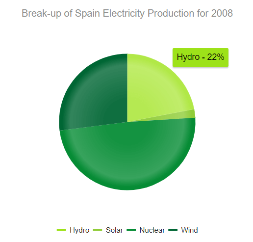
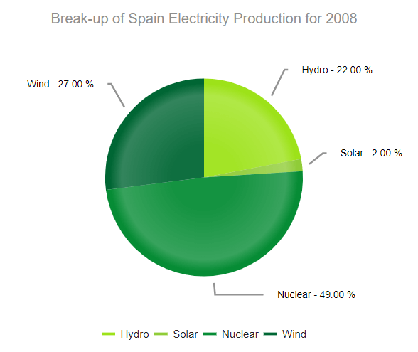
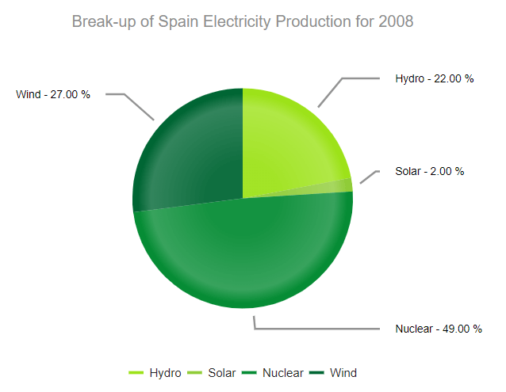

# Pie Charts


The Telerik UI Pie Chart TagHelper and HtmlHelper for {{ site.framework }} are server-side wrappers for the Kendo UI Pie Chart widget.

The Telerik UI Pie Chart HtmlHelper for {{ site.framework }} is a server-side wrapper for the Kendo UI Pie Chart widget.


Pie Charts display data as single-series sectors from a two-dimensional circle which is useful for rendering data as a part of the whole.

* [Demo page for the Pie Chart HtmlHelper](https://demos.telerik.com/{{ site.platform }}/pie-charts/index)

* [Demo page for the Pie Chart TagHelper](https://demos.telerik.com/{{ site.platform }}/pie-charts/tag-helper)


## Getting Started

The [Telerik UI Donut Chart component for {{ site.framework }}](https://demos.telerik.com/{{ site.platform }}/donut-charts/index) is a Pie Chart variation with the same ability to display a single data series in a two-dimensional circle and is likewise useful for displaying data as a part of the whole.

To create a Pie series in the Chart component, use `Pie` in the `Series` configuration.

* [Creating the Pie Chart](#creating-the-pie-chart)
* [Configuring the labels visibility](#configuring-the-labels-visibility)
* [Configuring the labels alignment](#configuring-the-labels-alignment)
* [Configuring the effects overlay](#configuring-the-effects-overlay)

## Creating the Pie Chart

The following example demonstrates how to define a single series of type `"pie"`. Additional series are not supported and each data point is an object that specifies the point value, category label, and other properties.

```HtmlHelper
    @(Html.Kendo().Chart()
        .Name("chart")
        .Title("Break-up of Spain Electricity Production for 2008")
        .Legend(legend => legend
            .Position(ChartLegendPosition.Bottom)
        )
        .SeriesColors(new string[] { "#03a9f4", "#ff9800", "#fad84a", "#4caf50" })
        .Series(series =>
        {
            series.Pie(new dynamic[] {
            new {category="Hydro",value=22,color="#9de219"},
            new {category="Solar",value=2,color="#90cc38"},
            new {category="Nuclear",value=49,color="#068c35"},
            new {category="Wind",value=27,color="#006634"}})
            .Overlay(o => o.Gradient(ChartSeriesGradient.RoundedBevel));
        })
        .Tooltip(tooltip => tooltip.
            Template("${ category } - ${ value }%").Visible(true)
        )
    )
```

```TagHelper
    <kendo-chart name="chart" series-colors='new string[] { "#03a9f4", "#ff9800", "#fad84a", "#4caf50" }'>
        <chart-title text="Break-up of Spain Electricity Production for 2008"></chart-title>
        <chart-legend position="ChartLegendPosition.Bottom"></chart-legend>
        <series-defaults type="ChartSeriesType.Pie"></series-defaults>
        <series>
            <series-item data='new dynamic[] {
                        new {category="Hydro",value=22,color="#9de219"},
                        new {category="Solar",value=2,color="#90cc38"},
                        new {category="Nuclear",value=49,color="#068c35"},
                        new {category="Wind",value=27,color="#006634"}}'>
                <overlay gradient="ChartSeriesGradient.RoundedBevel" />
            </series-item>
        </series>
        <tooltip visible="true" template="${ category } - ${ value }%"></tooltip>
    </kendo-chart>
```



## Configuring the Labels Visibility

The Telerik UI for {{ site.framework }} Pie Chart enables you to show or hide labels through the `Visible()` configuration method for the given series.

```HtmlHelper
    .Series(series =>
    {
        series.Pie(new dynamic[] {})
    		.Labels(labels => labels
    			.Visible(true)
    		);
    })
```

```TagHelper
    <series>
        <series-item data='new dynamic[] {}'>
            <labels visible="true"></labels>
        </series-item>
    </series>
```


## Configuring the Labels Alignment

The Telerik UI for {{ site.framework }} Pie Chart allows you to configure the label alignment for the series through the `Align()` configuration method.

```HtmlHelper
    .Series(series =>
    {
        series.Pie(new dynamic[] {})
    		.Labels(labels => labels
    			.Align(ChartSeriesLabelsAlign.Circle)
    		);
    })
```

```TagHelper
    <series>
        <series-item data='new dynamic[] {}'>
            <labels align="ChartSeriesLabelsAlign.Circle"></labels>
        </series-item>
    </series>
```


The Pie Chart support two modes of label alignment:

* `Circle`(default)&mdash;The labels are positioned in a circle around the Chart.
        
    
* `Column`&mdash;The labels are positioned in columns to the left and right of the Chart.
        
    

## Configuring the Effects Overlay

Each segment has a transparent effect overlay that adds depth to the two-dimensional shape. The overlay transparent gradient is configurable.

```HtmlHelper
    .Series(series =>
    {
       series.Pie(new dynamic[] {})
       .Overlay(o => o.Gradient(ChartSeriesGradient.None));
    })
```

```TagHelper
    <series>
        <series-item data='new dynamic[] {}'>
            <overlay gradient="ChartSeriesGradient.None" />
        </series-item>
    </series>
```


The Pie Chart supports the following `ChartSeriesGradient` options:

* (Default) `RoundedBevel`

    

* `SharpBevel`

    

* `None`

    

## See Also

* [Basic Usage of the Pie Chart HtmlHelper for {{ site.framework }} (Demo)](https://demos.telerik.com/{{ site.platform }}/pie-charts/index)
* [Data Binding Options for the Telerik UI for {{ site.framework }} Charts]()

* [Basic Usage of the Pie Chart TagHelper for {{ site.framework }} (Demo)](https://demos.telerik.com/{{ site.platform }}/pie-charts/tag-helper)

* [Server-Side API](/api/chart)
