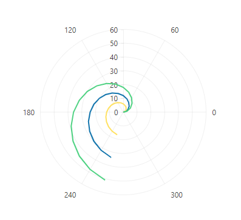
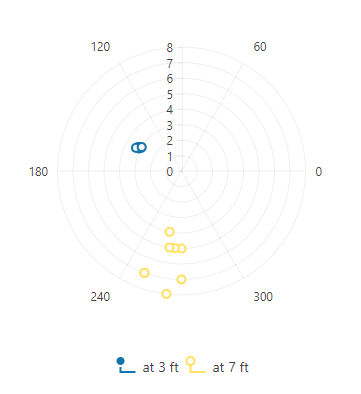
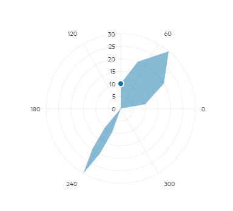

# Polar Charts


The Telerik UI Polar Chart TagHelper and HtmlHelper for {{ site.framework }} are server-side wrappers for the Kendo UI for jQuery Polar Chart widget.

The Telerik UI Polar Chart HtmlHelper for {{ site.framework }} is a server-side wrapper for the Kendo UI for jQuery Polar Chart widget.


The Polar Charts display the data in a circular coordinate system, where each data point is represented by the distance from the center of the coordinate system (the pole) and the angle from the fixed direction (the angular coordinate).

* [Demo page for the Polar Chart HtmlHelper](https://demos.telerik.com/{{ site.platform }}/polar-charts)

* [Demo page for the Polar Chart TagHelper](https://demos.telerik.com/{{ site.platform }}/polar-charts/tag-helper)


## Getting Started

Polar Charts are suitable for visualizing data that has a cyclical nature or is related to radiuses and angles. For example, scientific data like precipitation or heat distribution across the Earth's poles and other multivariate data in a circular layout.

The Polar Charts can be categorized into the following types:

* [Polar Line](#polar-line-charts)&mdash;Represents the series as curves that connect points.
* [Smooth Polar Line](#smooth-polar-line-charts)&mdash;Visualizes the series as smooth curves.
* [Polar Scatter](#polar-scatter-charts)&mdash;Displays plots that represent non-connected data points.
* [Polar Area](#polar-area-charts)&mdash;Shows the data points connected with straight line segments that enclose a filled area together with the chart pole.

To customize the default [chart axes](#configuring-the-axes), explore the various options available through the [`XAxis`](/api/kendo.mvc.ui.fluent/chartxaxisbuilder) and [`YAxis`](/api/kendo.mvc.ui.fluent/chartyaxisbuilder) configurations.

Also, you can bind the Polar Chart to inline, local, and remote data. For more information on the available data binding approaches, refer to the [Charts Data Binding Overview]().

## Polar Line Charts

To create a Polar Line Chart, add each collection of data points to the `PolarLine()` option of the `Series` configuration. The following example shows how to define a Polar Line Chart with three series.

```HtmlHelper
    @(Html.Kendo().Chart()
        .Name("chart")
        .Series(series => {
            series.PolarLine(new int[][] {
                new int[] {0, 0}, new int[] {15, 2}, new int[] {30, 4},
                new int[] {45, 6}, new int[] {60, 8}, new int[] {75, 10},
                new int[] {90, 12}, new int[] {105, 14}, new int[] {120, 16},
                new int[] {135, 18}, new int[] {150, 20}, new int[] {165, 22},
                new int[] {180, 24}, new int[] {195, 26}, new int[] {210, 28},
                new int[] {225, 30}, new int[] {240, 32}, new int[] {255, 34}
            });

            series.PolarLine(new int[][] {
                new int[] {0, 0}, new int[] {15, 1}, new int[] {30, 2},
                new int[] {45, 3}, new int[] {60, 4}, new int[] {75, 5},
                new int[] {90, 6}, new int[] {105, 7}, new int[] {120, 8},
                new int[] {135, 9}, new int[] {150, 10}, new int[] {165, 11},
                new int[] {180, 12}, new int[] {195, 13}, new int[] {210, 14},
                new int[] {225, 15}, new int[] {240, 16}, new int[] {255, 17}
            });

            series.PolarLine(new int[][] {
                new int[] {0, 0}, new int[] {15, 3}, new int[] {30, 6},
                new int[] {45, 9}, new int[] {60, 12}, new int[] {75, 15},
                new int[] {90, 18}, new int[] {105, 21}, new int[] {120, 24},
                new int[] {135, 27}, new int[] {150, 30}, new int[] {165, 33},
                new int[] {180, 36}, new int[] {195, 39}, new int[] {210, 42},
                new int[] {225, 45}, new int[] {240, 48}, new int[] {255, 51}
            });
        })
    ) 
```

```TagHelper
    @addTagHelper *, Kendo.Mvc

    @{ 
        var data1 = new int[][] {
            new int[] {0, 0}, new int[] {15, 2}, new int[] {30, 4},
            new int[] {45, 6}, new int[] {60, 8}, new int[] {75, 10},
            new int[] {90, 12}, new int[] {105, 14}, new int[] {120, 16},
            new int[] {135, 18}, new int[] {150, 20}, new int[] {165, 22},
            new int[] {180, 24}, new int[] {195, 26}, new int[] {210, 28},
            new int[] {225, 30}, new int[] {240, 32}, new int[] {255, 34}
        };
        var data2 = new int[][] {
            new int[] {0, 0}, new int[] {15, 1}, new int[] {30, 2},
            new int[] {45, 3}, new int[] {60, 4}, new int[] {75, 5},
            new int[] {90, 6}, new int[] {105, 7}, new int[] {120, 8},
            new int[] {135, 9}, new int[] {150, 10}, new int[] {165, 11},
            new int[] {180, 12}, new int[] {195, 13}, new int[] {210, 14},
            new int[] {225, 15}, new int[] {240, 16}, new int[] {255, 17}
        };
        var data3 = new int[][] {
            new int[] {0, 0}, new int[] {15, 3}, new int[] {30, 6},
            new int[] {45, 9}, new int[] {60, 12}, new int[] {75, 15},
            new int[] {90, 18}, new int[] {105, 21}, new int[] {120, 24},
            new int[] {135, 27}, new int[] {150, 30}, new int[] {165, 33},
            new int[] {180, 36}, new int[] {195, 39}, new int[] {210, 42},
            new int[] {225, 45}, new int[] {240, 48}, new int[] {255, 51}
        };
    }

    <kendo-chart name="chart">
        <series>
            <series-item data="data1" type="ChartSeriesType.PolarLine">
            </series-item>
            <series-item data="data2" type="ChartSeriesType.PolarLine">
            </series-item>
            <series-item data="data3" type="ChartSeriesType.PolarLine">
            </series-item>
        </series>
    </kendo-chart>
```


The configuration from the example results in the following Polar Chart.



## Smooth Polar Line Charts

By default, the data points in the Polar Line Chart are connected with a straight line. To display a smooth line, use the `Style(ChartSeriesStyle.Smooth)` setting of the `Series` configuration.

```HtmlHelper
    // Setting the line style to "smooth" for the first series only.
    @(Html.Kendo().Chart()
        .Name("smoothPolarLineChart1")
        .Series(series => {
            series.PolarLine(new int[][] {
                new int[] {0, 0}, new int[] {15, 2}, new int[] {30, 4},
                new int[] {45, 6}, new int[] {60, 8}, new int[] {75, 10},
                new int[] {90, 12}, new int[] {105, 14}, new int[] {120, 16},
                new int[] {135, 18}, new int[] {150, 20}, new int[] {165, 22},
                new int[] {180, 24}, new int[] {195, 26}, new int[] {210, 28},
                new int[] {225, 30}, new int[] {240, 32}, new int[] {255, 34}
            })
            .Style(ChartSeriesStyle.Smooth);

            series.PolarLine(new int[][] {
                new int[] {0, 0}, new int[] {15, 1}, new int[] {30, 2},
                new int[] {45, 3}, new int[] {60, 4}, new int[] {75, 5},
                new int[] {90, 6}, new int[] {105, 7}, new int[] {120, 8},
                new int[] {135, 9}, new int[] {150, 10}, new int[] {165, 11},
                new int[] {180, 12}, new int[] {195, 13}, new int[] {210, 14},
                new int[] {225, 15}, new int[] {240, 16}, new int[] {255, 17}
            });
        })
    ) 

    // Setting the line style to "smooth" in the default series settings (it will be applied for all series).
    @(Html.Kendo().Chart()
        .Name("smoothPolarLineChart2")
        .SeriesDefaults(seriesDefaults => seriesDefaults
            .PolarLine()
            .Style(ChartSeriesStyle.Smooth)
        )
        .Series(series => {
            series.PolarLine(new int[][] {
                new int[] {0, 0}, new int[] {15, 2}, new int[] {30, 4},
                new int[] {45, 6}, new int[] {60, 8}, new int[] {75, 10},
                new int[] {90, 12}, new int[] {105, 14}, new int[] {120, 16},
                new int[] {135, 18}, new int[] {150, 20}, new int[] {165, 22},
                new int[] {180, 24}, new int[] {195, 26}, new int[] {210, 28},
                new int[] {225, 30}, new int[] {240, 32}, new int[] {255, 34}
            });

            series.PolarLine(new int[][] {
                new int[] {0, 0}, new int[] {15, 1}, new int[] {30, 2},
                new int[] {45, 3}, new int[] {60, 4}, new int[] {75, 5},
                new int[] {90, 6}, new int[] {105, 7}, new int[] {120, 8},
                new int[] {135, 9}, new int[] {150, 10}, new int[] {165, 11},
                new int[] {180, 12}, new int[] {195, 13}, new int[] {210, 14},
                new int[] {225, 15}, new int[] {240, 16}, new int[] {255, 17}
            });
        })
    )
```

```TagHelper
    @addTagHelper *, Kendo.Mvc

    @{ 
        var data1 = new int[][] {
            new int[] {0, 0}, new int[] {15, 2}, new int[] {30, 4},
            new int[] {45, 6}, new int[] {60, 8}, new int[] {75, 10},
            new int[] {90, 12}, new int[] {105, 14}, new int[] {120, 16},
            new int[] {135, 18}, new int[] {150, 20}, new int[] {165, 22},
            new int[] {180, 24}, new int[] {195, 26}, new int[] {210, 28},
            new int[] {225, 30}, new int[] {240, 32}, new int[] {255, 34}
        };
        var data2 = new int[][] {
            new int[] {0, 0}, new int[] {15, 1}, new int[] {30, 2},
            new int[] {45, 3}, new int[] {60, 4}, new int[] {75, 5},
            new int[] {90, 6}, new int[] {105, 7}, new int[] {120, 8},
            new int[] {135, 9}, new int[] {150, 10}, new int[] {165, 11},
            new int[] {180, 12}, new int[] {195, 13}, new int[] {210, 14},
            new int[] {225, 15}, new int[] {240, 16}, new int[] {255, 17}
        };
    }

    <kendo-chart name="smoothPolarLineChart1">
        <series>
            <series-item data="data1" type="ChartSeriesType.PolarLine" style="ChartSeriesStyle.Smooth">
            </series-item>
            <series-item data="data2" type="ChartSeriesType.PolarLine">
            </series-item>
        </series>
    </kendo-chart>
```


## Polar Scatter Charts

When you want to display non-connected data points, create a Polar Scatter Chart by adding each data points collection to the `PolarScatter()` option of the `Series` configuration.

```HtmlHelper
    @(Html.Kendo().Chart()
        .Name("chart")
        .Legend(legend => legend
            .Position(ChartLegendPosition.Bottom)
        )
        .Series(series => {
            series.PolarScatter(new double[][] {
                new double[] {150, 3}, new double[] {150, 3.1},
                new double[] {152, 3.2}, new double[] {152, 3.1},
                new double[] {151, 3.2}, new double[] {153, 3.3},
                new double[] {149, 3}
            })
            .Name("at 3 ft");

            series.PolarScatter(new double[][] {
                new double[] {270, 5}, new double[] {250, 7},
                new double[] {259, 4}, new double[] {270, 7},
                new double[] {265, 5}, new double[] {250, 7},
                new double[] {263, 8}, new double[] {261, 5}
            })
            .Name("at 7 ft");
        })
    )
```

```TagHelper
    @addTagHelper *, Kendo.Mvc

    @{
        var data1 = new double[][] {
            new double[] {150, 3}, new double[] {150, 3.1},
            new double[] {152, 3.2}, new double[] {152, 3.1},
            new double[] {151, 3.2}, new double[] {153, 3.3},
            new double[] {149, 3}
        };
        var data2 = new double[][] {
            new double[] {270, 5}, new double[] {250, 7},
            new double[] {259, 4}, new double[] {270, 7},
            new double[] {265, 5}, new double[] {250, 7},
            new double[] {263, 8}, new double[] {261, 5}
        };
    }

    <kendo-chart name="chart">
        <chart-legend position="ChartLegendPosition.Bottom"></chart-legend>
        <series>
            <series-item type="ChartSeriesType.PolarScatter" data="data1" name="at 3 ft">
            </series-item>
            <series-item type="ChartSeriesType.PolarScatter" data="data2" name="at 7 ft">
            </series-item>
        </series>
    </kendo-chart>
```


The configuration from the example results in the following Polar Chart.




## Polar Area Charts

Another variation of the Polar Chart is the Polar Area Chart, which represents the data points connected with straight line segments that enclose a filled area, extending from these points to the chart's central pole. As a result, the chart highlights the relative proportions of different data series within a single circular plot.

To create a Polar Area Chart, use the `PolarArea()` option of the `Series` configuration.

```HtmlHelper
    @(Html.Kendo().Chart()
        .Name("chart")
        .Legend(legend => legend
            .Position(ChartLegendPosition.Bottom)
        )
        .Series(series => {
            series.PolarArea(new double[][] {
                new double[] {10, 10}, new double[] {30, 20},
                new double[] {50, 30}, new double[] {70, 20},
                new double[] {90, 10}, new double[] {90, 0},
                new double[] {230, 10}, new double[] {235, 20},
                new double[] {240, 30}, new double[] {245, 20},
                new double[] {250, 10}
            });
        })
    )
```

```TagHelper
    @addTagHelper *, Kendo.Mvc

    @{
        var data = new double[][] {
            new double[] {10, 10}, new double[] {30, 20},
            new double[] {50, 30}, new double[] {70, 20},
            new double[] {90, 10}, new double[] {90, 0},
            new double[] {230, 10}, new double[] {235, 20},
            new double[] {240, 30}, new double[] {245, 20},
            new double[] {250, 10}
        };
    }

    <kendo-chart name="chart">
        <chart-legend position="ChartLegendPosition.Bottom"></chart-legend>
        <series>
            <series-item type="ChartSeriesType.PolarArea" data="data">
            </series-item>
        </series>
    </kendo-chart>
```


The configuration from the example results in the following Polar Chart.




## Configuring the Axes

The Polar Chart contains X and Y-axes. You can configure both axes through the [`XAxis()`](/api/kendo.mvc.ui.fluent/chartxaxisbuilder) and [`YAxis()`](/api/kendo.mvc.ui.fluent/chartyaxisbuilder) configurations.

The following example shows how to set a specified start angle (degrees) for the X-axis and hide the labels of the Y-axis of a Polar Line Chart.

```HtmlHelper
    @(Html.Kendo().Chart()
        .Name("chart")
        .XAxis(axis => axis
            .Polar()
            .StartAngle(-90)
        )
        .YAxis(axis => axis
            .Polar()
            .Labels(labels => labels
                .Visible(false)
            )
        )
        .Series(series => {
            series.PolarLine(new int[][] {
                new int[] {0, 0}, new int[] {15, 2}, new int[] {30, 4},
                new int[] {45, 6}, new int[] {60, 8}, new int[] {75, 10},
                new int[] {90, 12}, new int[] {105, 14}, new int[] {120, 16},
                new int[] {135, 18}, new int[] {150, 20}, new int[] {165, 22},
                new int[] {180, 24}, new int[] {195, 26}, new int[] {210, 28},
                new int[] {225, 30}, new int[] {240, 32}, new int[] {255, 34}
            });

            series.PolarLine(new int[][] {
                new int[] {0, 0}, new int[] {15, 1}, new int[] {30, 2},
                new int[] {45, 3}, new int[] {60, 4}, new int[] {75, 5},
                new int[] {90, 6}, new int[] {105, 7}, new int[] {120, 8},
                new int[] {135, 9}, new int[] {150, 10}, new int[] {165, 11},
                new int[] {180, 12}, new int[] {195, 13}, new int[] {210, 14},
                new int[] {225, 15}, new int[] {240, 16}, new int[] {255, 17}
            });

            series.PolarLine(new int[][] {
                new int[] {0, 0}, new int[] {15, 3}, new int[] {30, 6},
                new int[] {45, 9}, new int[] {60, 12}, new int[] {75, 15},
                new int[] {90, 18}, new int[] {105, 21}, new int[] {120, 24},
                new int[] {135, 27}, new int[] {150, 30}, new int[] {165, 33},
                new int[] {180, 36}, new int[] {195, 39}, new int[] {210, 42},
                new int[] {225, 45}, new int[] {240, 48}, new int[] {255, 51}
            });
        })
    ) 
```

```TagHelper
    @addTagHelper *, Kendo.Mvc

    @{ 
        var data1 = new int[][] {
            new int[] {0, 0}, new int[] {15, 2}, new int[] {30, 4},
            new int[] {45, 6}, new int[] {60, 8}, new int[] {75, 10},
            new int[] {90, 12}, new int[] {105, 14}, new int[] {120, 16},
            new int[] {135, 18}, new int[] {150, 20}, new int[] {165, 22},
            new int[] {180, 24}, new int[] {195, 26}, new int[] {210, 28},
            new int[] {225, 30}, new int[] {240, 32}, new int[] {255, 34}
        };
        var data2 = new int[][] {
            new int[] {0, 0}, new int[] {15, 1}, new int[] {30, 2},
            new int[] {45, 3}, new int[] {60, 4}, new int[] {75, 5},
            new int[] {90, 6}, new int[] {105, 7}, new int[] {120, 8},
            new int[] {135, 9}, new int[] {150, 10}, new int[] {165, 11},
            new int[] {180, 12}, new int[] {195, 13}, new int[] {210, 14},
            new int[] {225, 15}, new int[] {240, 16}, new int[] {255, 17}
        };
        var data3 = new int[][] {
            new int[] {0, 0}, new int[] {15, 3}, new int[] {30, 6},
            new int[] {45, 9}, new int[] {60, 12}, new int[] {75, 15},
            new int[] {90, 18}, new int[] {105, 21}, new int[] {120, 24},
            new int[] {135, 27}, new int[] {150, 30}, new int[] {165, 33},
            new int[] {180, 36}, new int[] {195, 39}, new int[] {210, 42},
            new int[] {225, 45}, new int[] {240, 48}, new int[] {255, 51}
        };
    }

    <kendo-chart name="chart">
        <x-axis>
            <x-axis-item start-angle="-90" type="polar">
            </x-axis-item>
        </x-axis>
        <y-axis>
            <y-axis-item type="polar">
                <labels visible="false"></labels>
            </y-axis-item>
        </y-axis>
        <series>
            <series-item data="data1" type="ChartSeriesType.PolarLine">
            </series-item>
            <series-item data="data2" type="ChartSeriesType.PolarLine">
            </series-item>
            <series-item data="data3" type="ChartSeriesType.PolarLine">
            </series-item>
        </series>
    </kendo-chart>
```



## See Also

* [Basic Usage of the Polar Chart HtmlHelper for {{ site.framework }} (Demo)](https://demos.telerik.com/{{ site.platform }}/polar-charts)

* [Basic Usage of the Polar Chart TagHelper for {{ site.framework }} (Demo)](https://demos.telerik.com/{{ site.platform }}/polar-charts/tag-helper)

* [Binding the Polar Chart to Remote Data (Demo)](https://demos.telerik.com/{{ site.platform }}/polar-charts/remote-data-binding)
* [Binding the Polar Chart to Local Data (Demo)](https://demos.telerik.com/{{ site.platform }}/polar-charts/local-data-binding)
* [Server-Side API of the Polar Chart HtmlHelper](/api/chart)

* [Server-Side API of the Polar Chart TagHelper](/api/taghelpers/chart)

