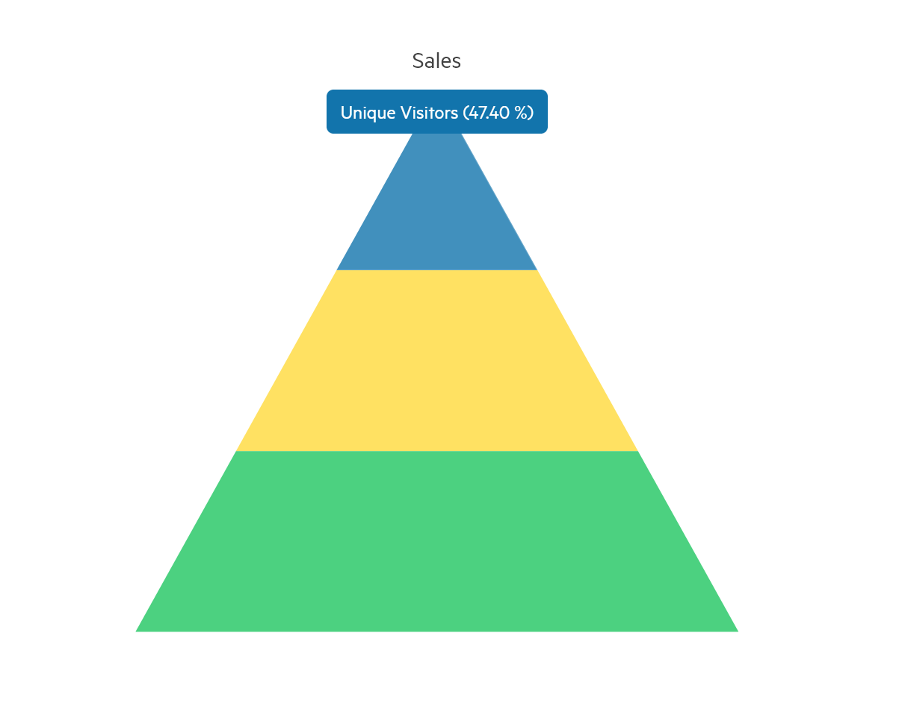

# Pyramid Charts


The Telerik UI Pyramid TagHelper and HtmlHelper for {{ site.framework }} are server-side wrappers for the Kendo UI Pyramid Chart widget.

The Telerik UI Pyramid HtmlHelper for {{ site.framework }} is a server-side wrapper for the Kendo UI Pyramid Chart widget.


Pyramid Charts display a single series of data in progressively increasing proportions, organized in segments, where each segment represents the value for the particular item from the series. The values of the items can also influence the height and the shape of the corresponding segments.

Pyramid Charts are suitable to represent stages in a priority process, population vizualization, singular datasets, etc. 

* [Demo page for the Pyramid Chart](https://demos.telerik.com/{{ site.platform }}/pyramid-charts/index)

## Concepts

The basic conceptual option of a Telerik UI Pyramid Chart is:

* `dynamicHeight`&mdah;When `equal` is set to `false`, `dynamicHeight` specifies whether the different elements will have equal height, or specifies whether the height of each element has to be based on its value.


## Getting Started

The following example demonstrates how to configure a basic Pyramid chart.

```HtmlHelper
    @(Html.Kendo().Chart()
        .Name("chart")
        .Title(title => title
              .Text("Sales"))
        .Legend(legend => legend
            .Visible(false)
        )
        .Series(series => {
            series.Pyramid(new dynamic[] {
                new {category = "Unique Visitors", value = 280022},
                new {category = "Downloads", value = 190374},
                new {category = "Purchases", value = 120392},
            })
            .DynamicHeight(false)
            .Labels(labels => labels
                .Background("none")
            );
        })
        .Tooltip(tooltip => tooltip
            .Visible(true)
            .Template("#=category# (#=kendo.format('{0:p}', percentage)#)")
        )
    )
```

```TagHelper
     <kendo-chart name="chart">
        <chart-title text="Sales"></chart-title>
        <chart-legend visible="false"></chart-legend>
        <series>
            <series-item dynamic-height="false" type="ChartSeriesType.Pyramid"
                   data='new dynamic[]{
                    new {
                        category= "Unique Visitors",
                        value= 280022
                    },
                    new {
                        category= "Downloads",
                        value= 190374
                    },
                    new {
                        category= "Purchases",
                        value= 120392
                    }
                }'>
                <labels background="none"></labels>
            </series-item>
        </series>
        <tooltip visible="true" template="#=category# (#=kendo.format('{0:p}', percentage)#)"></tooltip>
    </kendo-chart>
```




## See Also

* [Basic Usage of the Pyramid Chart for {{ site.framework }} (Demo)](https://demos.telerik.com/{{ site.platform }}/pyramid-charts/index)
* [Server-Side API](/api/chart)
