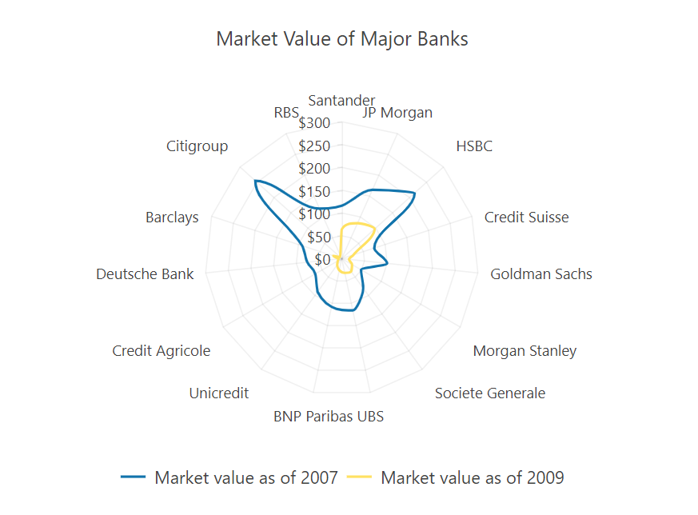

# Radar Charts


The Telerik UI Radar Chart TagHelper and HtmlHelper for {{ site.framework }} are server-side wrappers for the Kendo UI Radar Chart widget.

The Telerik UI Radar Chart HtmlHelper for {{ site.framework }} is a server-side wrapper for the Kendo UI Radar Chart widget.


The Radar Chart is a two-dimensional chart of three or more quantitative factors represented on axes starting from the same point. This type of chart is useful in making comparisons between units that depend on quantitative factors/variables. The closer the point/column of the particular variable is to the center of the chart, the lower its value is. The nearest the point/column of the particular variable is to the edge of the chart, the higher its value is.

* [Demo page for the Radar Chart HtmlHelper](https://demos.telerik.com/{{ site.platform }}/radar-charts)

* [Demo page for the Radar Chart TagHelper](https://demos.telerik.com/{{ site.platform }}/radar-charts/tag-helper)


## Getting Started

The following example demonstrates how to configure a basic Radar Chart.

```HtmlHelper
    @(Html.Kendo().Chart()
        .Name("chart")
        .Title("Market Value of Major Banks")
        .Legend(legend => legend
            .Position(ChartLegendPosition.Bottom)
        )
        .SeriesDefaults(seriesDefaults => seriesDefaults.RadarLine().Style(ChartRadarLineStyle.Smooth))
        .Series(series => {
            series.RadarLine(new double[] {
                    116, 165, 215, 75, 100, 49, 80,
                    116, 108, 90, 67, 76, 91, 255, 120
                })
                .Name("Market value as of 2007");
            
            series.RadarLine(new double[] {
                    64, 85, 97, 27, 16, 26, 35,
                    32, 26, 17, 10, 7, 19, 5
                })
                .Name("Market value as of 2009");
        })
        .CategoryAxis(axis => axis
            .Categories("Santander", "JP Morgan", "HSBC", "Credit Suisse",
                        "Goldman Sachs", "Morgan Stanley", "Societe Generale", "UBS",
                        "BNP Paribas", "Unicredit", "Credit Agricole", "Deutsche Bank",
                        "Barclays", "Citigroup", "RBS")
        )
        .ValueAxis(axis => axis
            .Numeric()
            .Labels(labels => labels.Format("${0}"))
        )
        .Tooltip(tooltip => tooltip
            .Visible(true)
            .Format("${0} bln")
        )
    )
```

```TagHelper
    <kendo-chart name="chart">
        <chart-title text="Market Value of Major Banks"></chart-title>
        <chart-legend position="ChartLegendPosition.Bottom"></chart-legend>
        <value-axis>
            <value-axis-item>
                <labels format="${0}"></labels>
            </value-axis-item>
        </value-axis>
        <series>
            <series-item type="ChartSeriesType.RadarLine" style="ChartSeriesStyle.Smooth" name="Market value as of 2007" data="new double[] {
                    116, 165, 215, 75, 100, 49, 80,
                    116, 108, 90, 67, 76, 91, 255, 120
                }"></series-item>
            <series-item type="ChartSeriesType.RadarLine" style="ChartSeriesStyle.Smooth" name="Market value as of 2009" data="new double[] {
                    64, 85, 97, 27, 16, 26, 35,
                    32, 26, 17, 10, 7, 19, 5
                }"></series-item>
        </series>
        <category-axis>
            <category-axis-item categories='new string[] { "Santander", "JP Morgan", "HSBC", "Credit Suisse",
                        "Goldman Sachs", "Morgan Stanley", "Societe Generale", "UBS",
                        "BNP Paribas", "Unicredit", "Credit Agricole", "Deutsche Bank",
                        "Barclays", "Citigroup", "RBS"}'>
            </category-axis-item>
        </category-axis>
        <tooltip visible="true"></tooltip>
    </kendo-chart>
```


The configuration from the previous example results in the following Radar Chart.



## Series Types

The Telerik UI for {{ site.framework }} Radar Chart supports series of type RadarLine, RadarArea, and RadarColumn.

### RadarLine Series

The default style of the RadarLine is `ChartSeriesStyle.Normal`. You can configure a smooth polar area chart through the `Style` option in the `Series` or `SeriesDefaults` configuration settings. Setting `Style` to `ChartSeriesStyle.Smooth` will create a spline. A spline is a form of line/area chart where each data point from the series is connected with a curved line, which represents a rough approximation of the missing data points.

```HtmlHelper
    .Series(series => {
        series.RadarLine(new double[] {
                116, 165, 215, 75, 100, 49, 80,
                116, 108, 90, 67, 76, 91, 255, 120
            }).Style(ChartRadarLineStyle.Smooth)
            .Name("Market value as of 2007");
        
        series.RadarLine(new double[] {
                64, 85, 97, 27, 16, 26, 35,
                32, 26, 17, 10, 7, 19, 5
            }).Style(ChartRadarLineStyle.Smooth)
            .Name("Market value as of 2009");
    })
```

```TagHelper
    <series>
        <series-item type="ChartSeriesType.RadarLine" style="ChartSeriesStyle.Smooth" name="Market value as of 2007" data="new double[] {
                116, 165, 215, 75, 100, 49, 80,
                116, 108, 90, 67, 76, 91, 255, 120
            }"></series-item>
        <series-item type="ChartSeriesType.RadarLine" style="ChartSeriesStyle.Smooth" name="Market value as of 2009" data="new double[] {
                64, 85, 97, 27, 16, 26, 35,
                32, 26, 17, 10, 7, 19, 5
            }"></series-item>
    </series>
```


### RadarArea Series

The Radar Chart with RadarArea series is represented by data points connected with straight line segments that enclose a filled area. 

```HtmlHelper
    @(Html.Kendo().Chart()
        .Name("chart")
        .Title("Employment candidate review")
        .Legend(legend => legend
            .Position(ChartLegendPosition.Bottom)
        )
        .Series(series => {
            series.RadarArea(new double[] { 10, 3, 3, 10, 2, 10 })
                .Name("Andrew Dodsworth");

            series.RadarArea(new double[] { 9, 7, 7, 9, 6, 7 })
                .Name("Margaret Peacock");

            series.RadarArea(new double[] { 4, 10, 10, 5, 5, 4 })
                .Name("Nancy Callahan");
        })
        .CategoryAxis(axis => axis
            .Categories("Experience", "Communication", "Friendliness",
                        "Subject knowledge", "Presentation", "Education")
            .MajorGridLines(lines => lines.Visible(false))
        )
        .ValueAxis(axis => axis
            .Numeric()
            .Labels(labels => labels.Format("{0}%"))
            .Line(line => line.Visible(false))
        )
    ) 
```

```TagHelper
    @{
        var andrew_data = new double[] { 10, 3, 3, 10, 2, 10 };
        var margaret_data = new double[] { 9, 7, 7, 9, 6, 7 };
        var nancy_data = new double[] { 4, 10, 10, 5, 5, 4 };
        var categories = new object[] { "Experience", "Communication", "Friendliness",
                            "Subject knowledge", "Presentation", "Education"};
    }

    <kendo-chart name="chart">
        <category-axis>
            <category-axis-item categories="categories">
                <major-grid-lines visible="false" />
            </category-axis-item>
        </category-axis>
        <series>
            <series-item type="ChartSeriesType.RadarArea" name="Andrew Dodsworth" data="andrew_data">
            </series-item>
            <series-item type="ChartSeriesType.RadarArea" name="Margaret Peacock" data="margaret_data">
            </series-item>
            <series-item type="ChartSeriesType.RadarArea" name="Nancy Callahan" data="nancy_data">
            </series-item>
        </series>
        <value-axis>
            <value-axis-item name="" type="numeric">
                <labels format="{0}%">
                </labels>
                <line visible="false" />
            </value-axis-item>
        </value-axis>
        <chart-legend position="ChartLegendPosition.Bottom">
        </chart-legend>
        <chart-title text="Employment candidate review">
        </chart-title>
    </kendo-chart>
```


### RadarColumn Series

A Radar Chart that uses RadarColumn series displays data columns the height of which varies according to their value.

```HtmlHelper
    @(Html.Kendo().Chart()
        .Name("chart")
        .Title("Nutrient balance: Apples, raw")
        .Legend(legend => legend
            .Visible(false)
        )
        .Series(series => {
            series.RadarColumn(new double[] {
                    5, 1, 1, 5, 0, 1,
                    1, 2, 1, 2, 1, 0,
                    0, 2, 1, 0, 3, 1,
                    1, 1, 0, 0, 0
                })
                .Name("Nutrients");
        })
        .CategoryAxis(axis => axis
            .Categories("Df", "Pr", "A", "C", "D", "E",
                        "Th", "Ri", "Ni", "B", "F", "B",
                        "Se", "Mn", "Cu", "Zn", "K", "P",
                        "Fe", "Ca", "Na", "Ch", "Sf")
        )
        .ValueAxis(axis => axis
            .Numeric()
            .Visible(false)
        )
    )
```

```TagHelper
    <kendo-chart name="chart">
        <chart-title text="Nutrient balance: Apples, raw"></chart-title>
        <chart-legend visible="false"></chart-legend>
        <series>
            <series-item type="ChartSeriesType.RadarColumn" name="Nutrients" data="new double[] {
                    5, 1, 1, 5, 0, 1,
                    1, 2, 1, 2, 1, 0,
                    0, 2, 1, 0, 3, 1,
                    1, 1, 0, 0, 0
                }"></series-item>
        </series>
        <category-axis>
            <category-axis-item categories='new string[] { "Df", "Pr", "A", "C", "D", "E",
                            "Th", "Ri", "Ni", "B", "F", "B",
                            "Se", "Mn", "Cu", "Zn", "K", "P",
                            "Fe", "Ca", "Na", "Ch", "Sf"}'>
            </category-axis-item>
        </category-axis>
        <value-axis>
            <value-axis-item name="" type="numeric" visible="false">
            </value-axis-item>
        </value-axis>
    </kendo-chart>
```


## See Also

* [Basic Usage of the Radar Chart HtmlHelper for {{ site.framework }} (Demo)](https://demos.telerik.com/{{ site.platform }}/radar-charts)

* [Basic Usage of the Radar Chart TagHelper for {{ site.framework }} (Demo)](https://demos.telerik.com/{{ site.platform }}/radar-charts/tag-helper)

* [Remote Binding of the Telerik UI for {{ site.framework }} Radar Chart (Demo)](https://demos.telerik.com/{{ site.platform }}/radar-charts/remote-data-binding)
* [Server-Side API](/api/chart)
