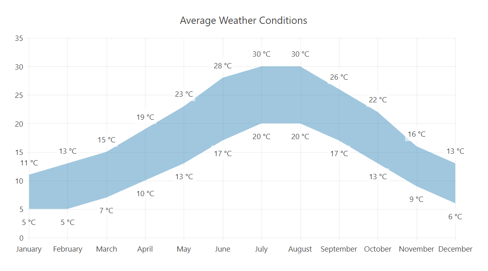

# Range Area Charts


The Telerik UI Range Area TagHelper and HtmlHelper for {{ site.framework }} are server-side wrappers for the Kendo UI Range Area Chart widget.

The Telerik UI Range Area HtmlHelper for {{ site.framework }} is a server-side wrapper for the Kendo UI Range Area widget.


The Range Area chart displays a range between a lower and higher value for each data point. This chart type is useful for comparing the low and high levels of value ranges, for example, working time, blood glucose levels per day, average minimum and maximum temperatures and rainfalls over time.

* [Demo page for the Range Area Chart HtmlHelper](https://demos.telerik.com/{{ site.platform }}/range-area-charts)

* [Demo page for the Range Area Chart TagHelper](https://demos.telerik.com/{{ site.platform }}/range-area-charts/tag-helper)


## Getting Started

The following example demonstrates how to configure a basic Range Area Chart.

```HtmlHelper
    @(Html.Kendo().Chart()
        .Name("chart")
        .Title("Average Weather Conditions")
        .Series(series =>
        {
            series.RangeArea(new double[][] {
                new double[] {5, 11}, new double[] {5, 13}, new double[] {7, 15}, new double[] {10, 19}, new double[] {13, 23}, new double[] {17, 28},
                new double[] {20, 30}, new double[] {20, 30}, new double[] {17, 26}, new double[] {13, 22}, new double[] {9, 16}, new double[] {6, 13}
            }).Labels(labels => labels
                .Visible(true)
                .From(from => from.Template("#=value.from# °C"))
                .To(to => to.Template("#=value.to# °C")));
        })
        .CategoryAxis(axis => axis
            .Categories("January", "February", "March", "April", "May", "June",
                        "July", "August", "September", "October", "November", "December")
        )
        .Tooltip(tooltip => tooltip
            .Visible(true)
            .Template("Avg Min Temp : #= value.from # °C <br>" +
                      "Avg Max Temp : #= value.to # °C")
        )
    )
```

```TagHelper
    @{
        var data = new double[][] {
            new double[] {5, 11}, new double[] {5, 13}, new double[] {7, 15}, new double[] {10, 19}, new double[] {13, 23}, new double[] {17, 28},
            new double[] {20, 30}, new double[] {20, 30}, new double[] {17, 26}, new double[] {13, 22}, new double[] {9, 16}, new double[] {6, 13}
        };

        var categories = new object[] {"January", "February", "March", "April", "May", "June",
            "July", "August", "September", "October", "November", "December"};
    }

    <kendo-chart name="chart">
        <series>
            <series-item type="ChartSeriesType.RangeArea" data="data">
                <labels visible="true">
                    <chart-series-labels-from template="#=value.from# °C">
                    </chart-series-labels-from>
                    <chart-series-labels-to template="#=value.to# °C">
                    </chart-series-labels-to>
                </labels>
            </series-item>
        </series>
        <category-axis>
            <category-axis-item categories="categories"></category-axis-item>
        </category-axis>
        <chart-title text="Average Weather Conditions">
        </chart-title>
        <tooltip template="Avg Min Temp : #= value.from # °C <br>Avg Max Temp : #= value.to # °C" visible="true">
        </tooltip>
    </kendo-chart>
```


The configuration from the previous example results in the following Range Area Chart.



## See Also

* [Basic Usage of the Range Area Chart HtmlHelper for {{ site.framework }} (Demo)](https://demos.telerik.com/{{ site.platform }}/range-area-charts)

* [Basic Usage of the Range Area TagHelper for {{ site.framework }} (Demo)](https://demos.telerik.com/{{ site.platform }}/range-area-charts/tag-helper)

* [Remote Binding of the Telerik UI for {{ site.framework }} Range Area Chart (Demo)](https://demos.telerik.com/{{ site.platform }}/range-area-charts/remote-data-binding)
* [Server-Side API](/api/chart)
