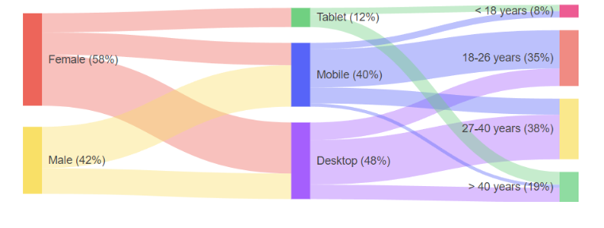


    

    


# Sankey Diagram

The {{ site.product }} Sankey Diagram allows you to create diagrams that visualize changing flows and their distribution between domains. Sankey diagrams suit a variety of use cases like the representation of website traffic, budget breakdowns, energy flow, and others.



## Configuration

Sankey Diagram visualize its data using Nodes (items) and Links (connections). You can add them using their respective collections. In addition to that, you can configure the links, legend, and tooltips displayed on the Sankey Diagram by using the following properties:

 - [`Links`](https://docs.telerik.com/kendo-ui/api/javascript/dataviz/ui/sankey/configuration/links)&mdash;Provides options to set the [`ColorType`](https://www.telerik.com/kendo-jquery-ui/documentation/api/javascript/dataviz/ui/sankey/configuration/links.colortype) of the link to either `Static`, `Source`, or `Target`. It also allows you to control the opacity and highlighting of the link.
 - [`Legend`](https://docs.telerik.com/kendo-ui/api/javascript/dataviz/ui/sankey/configuration/legend)&mdash;Provides options to customize the appearance of the diagram legend.
 - [`Tooltip`](https://docs.telerik.com/kendo-ui/api/javascript/dataviz/ui/sankey/configuration/labels)&mdash;Provides options to modify the the functionality of the diagram element titles.

 Here is a sample demonstration:

```HtmlHelper
    @(Html.Kendo().Sankey()
        .Name("sankey")
        .Theme("sass")
        .Legend(l => l.Position(LegendPosition.Bottom))
        .Links(l => l.ColorType(LinkColorType.Source))
        .Data(d => d.Nodes(n =>
        {
            n.Add().Id(1).Label(l => l.Text("Source"));
            n.Add().Id(2).Label(l => l.Text("Target"));
        })
        .Links(l =>
        {
            l.Add().SourceId(1).Value(12).TargetId(2);
        }))
        .Tooltip(t => t
            .Delay(100)
            .FollowPointer(true))
 )
```

```TagHelper
<kendo-sankey name="sankey" theme="sass">
    <legend position="LegendPosition.Bottom"/>
    <links color-type="LinkColorType.Source"/>
     <data>
          <nodes>
              <node id="1">
                    <label text="Source"></label>
                </node>
                <node id="2">
                    <label text="Target"></label>
                </node>
          </nodes>
            <links>
                <link source-id="1" target-id="2" value="12">
                </link>
            </links>
     </data>
    <tooltip delay="100" follow-pointer="true"/>
</kendo-sankey>
```


## Configuring the Link Colors

The Sankey diagram provides different [`ColorTypes`](https://www.telerik.com/kendo-jquery-ui/documentation/api/javascript/dataviz/ui/sankey/configuration/links.colortype) of the links. The supported LinkColorType values are:

 * `Static`&mdash;The color is static and is determined by the link's color option.
 * `Source`&mdash;The link color is the same as the source node color.
 * `Target`&mdash;The link color is the same as the target node color.

## Functionality and Features

The {{ site.product }} Sankey Diagram includes the following customizable elements:

- Nodes&mdash;The node is a rectangular element that connects to other nodes.
- Links&mdash;The lines that connect the nodes to each other. The greater the value of the link, the greater the width of the link will be.
- Labels&mdash;The labels are the names of the nodes and are displayed on them or next to them.
- Legend&mdash;The legend lists the labels of each link.
- Title&mdash;The title displayed above the component.
- Tooltip&mdash;The tooltip is displayed when hovering above the links and nodes.

## Next Steps

* [Basic Usage of the Sankey Diagram (Demo)](https://demos.telerik.com/{{ site.platform }}/sankey-charts/index)

## See Also

* [Using the API of the Diagram HtmlHelper for {{ site.framework }} (Demo)](https://demos.telerik.com/{{ site.platform }}/chart-api/index)
* [Basic Usage of the Sankey Diagram HtmlHelper for {{ site.framework }} (Demo)](https://demos.telerik.com/{{ site.platform }}/sankey-charts/index)
* [Server-Side API](/api/chart)
