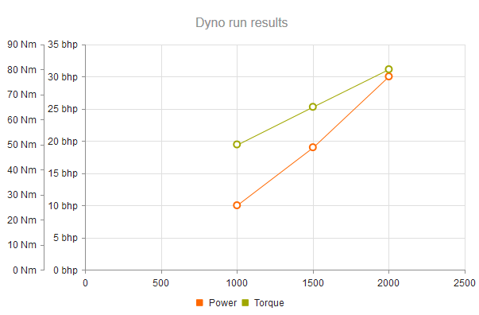
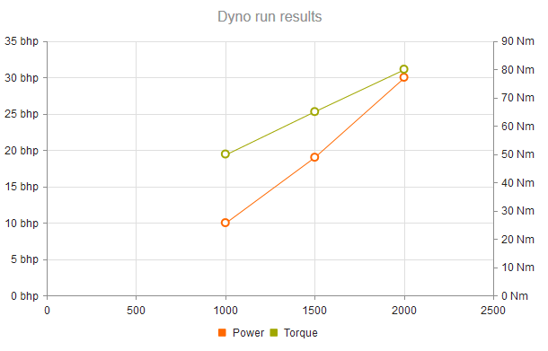


    

    


# Scatter Charts

Scatter charts display data as points that are defined by the values of their items.

Scatter Charts are useful for displaying the relation between different sets of data (for example, scientific experimental results) and plotting two-dimensional data.

## Setting the Primary Axes

XY Charts, such as the [Scatter](https://demos.telerik.com/{{ site.platform }}/scatter-charts/index) and [Scatter Line](https://demos.telerik.com/{{ site.platform }}/scatter-charts/scatter-line) Charts, use one or more X and Y axes which are configured through the `XAxis` and the `YAxis` properties.

```
    @(Html.Kendo().Chart()
        .Name("chart")
        .Series(series => {
            series.Scatter(new double[][] { new[] { 16.4, 5.4 }, new[] { 21.7, 2 }, new[] { 25.4, 3 }, new[] { 19.0, 2.0 } });
        })
        .XAxis(x => x
            .Numeric()
            .Max(35)
        )
        .YAxis(y => y
            .Numeric()
            .Min(-5)
            .Max(25)
        )
    )
```

## Positioning the Label

The X and Y axes provide options for displaying their labels either next to the axis or at the outer edges of the plot area. By default, the labels are positioned next to the axis.

To change the label position, set the [`Position`]({{ Position }}) option of the axis labels which provides the following available options:

* (Default) When `Position` is set to `"ChartAxisLabelsPosition.OnAxis"`, the labels are positioned next to the axis.
* When `Position` is set to `"ChartAxisLabelsPosition.End"`, the labels are placed at the end of the crossing axis. Typically, this configuration positions the labels at the top or right end of the Chart unless the crossing axis was reversed.
* When `Position` is set to `"ChartAxisLabelsPosition.Start"`, the labels are placed at the start of the crossing axis. Typically, this configuration positions the labels at the left or bottom end of the Chart unless the crossing axis was reversed.

```
    @(Html.Kendo().Chart()
        .Name("chart")
        .Series(series => {
            series.Scatter(new double[][] { new[] { 16.4, 5.4 }, new[] { 21.7, 2 }, new[] { 25.4, 3 }, new[] { 19.0, 2.0 } });
        })
        .XAxis(x => x
            .Labels(s=>s.Position(ChartAxisLabelsPosition.Start))
        )
    )
```

## Setting Multiple Axes

You can define more X and Y axes in addition to the primary axes. The additional axes must have unique names. Series are associated to a X and Y axes by specifying their name.

> Do not specify a name for the primary X and Y axes.

```
    @(Html.Kendo().Chart(Model)
        .Name("chart")
        .Series(series => {
            series.ScatterLine(model => model.RPM, model => model.Power)
                .Name("Power")
                .Tooltip(tooltip => tooltip.Format("{1} bhp @ {0:N0} rpm"));

            series.ScatterLine(model => model.RPM, model => model.Torque)
                .Name("Torque")
                .YAxis("torque")
                .Tooltip(tooltip => tooltip.Format("{1} lb-ft @ {0:N0} rpm"));
        })
        .XAxis(x => x
            .Numeric()
            .Title(title => title.Text("Engine rpm"))

            // Align torque axis to the right by specifying
            // a crossing value greater than or equal to the axis maximum.
            .AxisCrossingValue(0, 10000)
            .Labels(labels => labels.Format("{0:N0}"))
        )
        .YAxis(y => y
            .Numeric()
            .Title(title => title.Text("Power (bhp)"))
        )
        .YAxis(y => y
            .Numeric("torque")
            .Title(title => title.Text("Torque (lb-ft)"))
        )
    )
```

Because no axis is specified, the first series is associated with the default Y axis. The `torque` series are plotted on the `torque` Y axis.



## Arranging the Axes

You can also control the arrangement of the X and Y axes by specifying the values at which they cross the primary axes.

```
    .XAxis(x => x
        .Numeric()
        .AxisCrossingValue(0, 2500)
    )
```

The primary Y axis crosses the X axis at point 0 (leftmost). The second, `torque` Y axis crosses the X axis at the 2500 mark or at its right end, whichever comes first.



## See Also

* [Using the API of the Chart HtmlHelper for {{ site.framework }} (Demo)](https://demos.telerik.com/{{ site.platform }}/chart-api/index)
* [Basic Usage of the Bar Chart HtmlHelper for {{ site.framework }} (Demo)](https://demos.telerik.com/{{ site.platform }}/bar-charts/index)
* [Basic Usage of the Line Chart HtmlHelper for {{ site.framework }} (Demo)](https://demos.telerik.com/{{ site.platform }}/line-charts/index)
* [Server-Side API](/api/chart)
