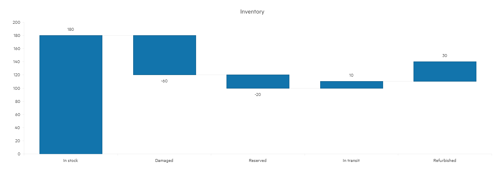

# Waterfall Charts


The Telerik UI Waterfall TagHelper and HtmlHelper for {{ site.framework }} are server-side wrappers for the Kendo UI Waterfall Chart widget.

The Telerik UI Waterfall HtmlHelper for {{ site.framework }} is a server-side wrapper for the Kendo UI Waterfall Chart widget.


Waterfall Charts are ideal for illustrating the cumulative effect of sequentially introduced positive or negative values. Each value can either add to or subtract from the initial value, helping visualize data such as profit and loss, cash flow, inventory, or performance changes over time.

 * [Demo page for the Waterfall Chart HtmlHelper](https://demos.telerik.com/{{ site.platform }}/waterfall-charts/index)

## Configuration Options

 * `Name` - Sets a unique identifier for the Waterfall Chart, used to reference the chart in the application.
 * `Title` - Defines the chart's main heading, providing context for the displayed data.
 * `Legend` - Controls the visibility and customization of the chart’s legend, helping identify series or categories.
 * `Series` - Specifies the data and configuration of the series displayed in the chart, such as values and labels.
 * `CategoryAxis` - Configures the categories displayed on the x-axis, such as labels for data points or time periods.
 * `AxisDefaults` - Defines default settings for both x and y axes, ensuring consistent appearance across the chart.


## Getting Started

The following example demonstrates how to configure a basic Waterfall chart.

```HtmlHelper
    @(Html.Kendo().Chart()
        .Name("chart")
        .Title("Inventory")
        .Legend(legend => legend
            .Visible(false)
        )
        .Series(series => series
            .Waterfall(new int[] { 180, -60, -20, 10, 30 })
            .Labels(l => l.Visible(true))
        )
        .CategoryAxis(axis => axis
            .Categories("In stock", "Damaged", "Reserved", "In transit", "Refurbished")
        )
        .AxisDefaults(axis => axis
            .MajorGridLines(lines => lines.Visible(false))
        )
    )
```

```TagHelper
@addTagHelper *, Kendo.Mvc
@{
    var categories = new string[] { "In stock", "Damaged", "Reserved", "In transit", "Refurbished" };
}

    <kendo-chart name="chart">
        <category-axis>
            <category-axis-item categories="categories">
            </category-axis-item>
        </category-axis>
        <series>
            <series-item type="ChartSeriesType.Waterfall"
                         data="new int[] { 180, -60, -20, 10, 30 }">
                <labels visible="true">
                </labels>
            </series-item>
        </series>
        <axis-defaults>
            <major-grid-lines visible="false" />
        </axis-defaults>
        <chart-legend visible="false">
        </chart-legend>
        <chart-title text="Inventory">
        </chart-title>
    </kendo-chart>
```




## Horizontal Waterfall

The Horizontal Waterfall Chart displays the data across the x-axis instead of the y-axis, showing the progressive effect of increases and decreases horizontally. This orientation can be useful when working with time-based data or when horizontal space better suits the visualization of the data flow. Configuration for a horizontal waterfall chart involves switching the orientation of the series and axes, making it ideal for visualizing timelines, financial reports, or similar datasets that are easier to interpret horizontally.

The following example demonstrates how to configure the horizontal series of Waterfall chart.

```HtmlHelper
    .Series(series => series
        .HorizontalWaterfall(model => model.Elapsed, model => model.Caption)
        .SummaryField("Summary")
        .ColorHandler("pointColor")
    )
```

```TagHelper
    <series>
         <series-item type="ChartSeriesType.HorizontalWaterfall"
                      category-field="Caption"
                      color-handler="pointColor"
                      summary-field="Summary"
                      field="Elapsed"
                      data="@Model.ToArray()">
         </series-item>
    </series>
```



## See Also

* [Basic Usage of the Waterfall Chart HtmlHelper for {{ site.framework }} (Demo)](https://demos.telerik.com/{{ site.platform }}/waterfall-charts/index)
* [Core Waterfall Charts Horizontal Waterfall for {{ site.framework }} (Demo)](https://demos.telerik.com/{{ site.platform }}/waterfall-charts/horizontal)
* [Server-Side API](/api/chart)
