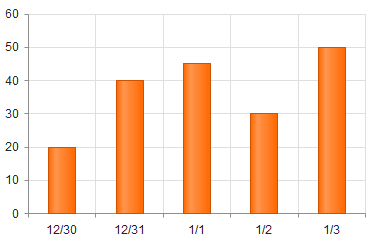
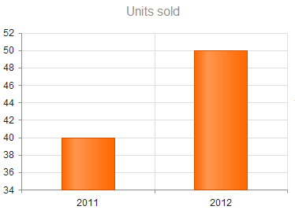


    
    
    
    
    
    
    
    
    
    
    
    
    

    
    
    
    
    
    
    
    
    
    
    
    
    


# Date Series

You can control the display of dates in the Telerik UI Chart for {{ site.framework }}.

## Date Series in Categorical Charts

[Categorical charts]() and other Telerik UI chart types provide built-in support for displaying dates, including the following scenarios:

* Automatic selection of granularity or base unit (minutes, hours, days, and so on).
* Label formatting that is matched to the granularity.
* Grouping of categories into base units and series aggregates.

Specifying categories of type `Date` switches the axis to a date mode. The automatic mode selection can be overridden by setting [`CategoryAxis.Type`]({{ CategoryAxisType }}) to `ChartCategoryAxisType.Date`.

### Date Binding

To bind the date series, use [`CategoryField`]({{ CategoryField }}). The categories (dates) for all series are sorted and merged during data binding.

### Date Grouping

If the series contain two or more values for a specific period (base unit), they are aggregated to display a single value.

> The dates have to match the source.

```
    @(Html.Kendo().Chart()
        .Name("chart")
        .Series(s => s
            .Column(new List<StockDataPoint>() { new StockDataPoint {
                    Date = new DateTime(2011,12,30),
                    Volume = 20
                },
                new StockDataPoint {
                    Date = new DateTime(2011,12,31),
                    Volume = 40
                },
                new StockDataPoint {
                    Date = new DateTime(2012,1,1),
                    Volume = 45
                },
                new StockDataPoint {
                    Date = new DateTime(2012,1,2),
                    Volume = 30
                },
                new StockDataPoint {
                    Date = new DateTime(2012,1,3),
                    Volume = 50
                } })
            .Field("Volume")
            .CategoryField("Date")
        )
        .CategoryAxis(categoryAxis => categoryAxis.Type(ChartCategoryAxisType.Date) )
    )
```

The following image demonstrates a chart with a set date category axis.  



The following example demonstrates date series that are grouped by the year.

```
    @(Html.Kendo().Chart()
        .Name("chart")
        .Series(s => s
            .Column(new List<StockDataPoint>() { new StockDataPoint {
                    Date = new DateTime(2011,12,30),
                    Volume = 20
                },
                new StockDataPoint {
                    Date = new DateTime(2011,12,31),
                    Volume = 40
                },
                new StockDataPoint {
                    Date = new DateTime(2012,1,1),
                    Volume = 45
                },
                new StockDataPoint {
                    Date = new DateTime(2012,1,2),
                    Volume = 30
                },
                new StockDataPoint {
                    Date = new DateTime(2012,1,3),
                    Volume = 50
                } })
            .Field("Volume")
            .CategoryField("Date")
        )
        .CategoryAxis(categoryAxis => categoryAxis.Type(ChartCategoryAxisType.Date).BaseUnit(ChartAxisBaseUnit.Years) )
    )
```

The following image displays a chart with a grouped date category axis. Note how the maximum value for each year is now displayed.



### Setting Aggregates

You can set an aggregate type for each series.

The following options are available:

* `Min`
* (Default) `Max`
* `Count`
* `Sum`
* `Avg`
* `First`
* `SumOrNull`

The following example demonstrates how to handle date grouping with the `sum` aggregate.

```
    @(Html.Kendo().Chart()
        .Name("chart")
        .Series(s => s
            .Column(new List<StockDataPoint>() { new StockDataPoint {
                    Date = new DateTime(2011,12,30),
                    Volume = 20
                },
                new StockDataPoint {
                    Date = new DateTime(2011,12,31),
                    Volume = 40
                },
                new StockDataPoint {
                    Date = new DateTime(2012,1,1),
                    Volume = 45
                },
                new StockDataPoint {
                    Date = new DateTime(2012,1,2),
                    Volume = 30
                },
                new StockDataPoint {
                    Date = new DateTime(2012,1,3),
                    Volume = 50
                } })
            .Field("Volume")
            .CategoryField("Date")
            .Aggregate(ChartSeriesAggregate.Sum)
        )
        .CategoryAxis(categoryAxis => categoryAxis.BaseUnit(ChartAxisBaseUnit.Years).Type(ChartCategoryAxisType.Date) )
    )
```

### Setting Base Units

To set the base units in the categorical charts, use any of the following approaches:

* [Default configuration](#default-configuration)
* [Manual configuration](#manual-configuration)
* [Automatic fitting](#automatic-fitting)
* [Labels format](#label-format)

#### Default Configuration

To determine a default base, use the smallest duration between categories.

```
    .CategoryAxis(categoryAxis => categoryAxis
        .Categories(new DateTime[] {new DateTime(2005, 1, 1), new DateTime(2006, 1, 1) })
        // baseUnit is set to "years".
    )
```

```
    .CategoryAxis(categoryAxis => categoryAxis
        .Categories(new DateTime[] {new DateTime(2005, 1, 1), new DateTime(2005, 1, 2) })
        // baseUnit is set to "days".
    )
```

#### Manual Configuration

You can also manually specify the [`BaseUnit`]({{ BaseUnit }}). To display every n<sup>th</sup> base unit, set the [`BaseUnitStep`]({{ BaseUnitStep }}) option.

The following options are valid for `ChartAxisBaseUnit`:

* Seconds
* Minutes
* Hours
* Days
* Weeks
* Months
* Years
* [Fit](#automatic-fitting)

#### Automatic Fitting

Setting the [`BaseUnit`]({{ BaseUnit }}) to `ChartAxisBaseUnit.Fit` constrains the total number of base units to [`MaxDateGroups`]({{ MaxDateGroups }}). The `BaseUnit` and `BaseUnitStep` are selected according to the [`AutoBaseUnitSteps`]({{ AutoBaseUnitSteps }}).

```
    @(Html.Kendo().Chart()
        .Name("chart")
        .Series(s => s
            .Column(new List<StockDataPoint>() {
                new StockDataPoint {
                    Date = new DateTime(2012,1,2),
                    Volume = 30
                },
                new StockDataPoint {
                    Date = new DateTime(2012,2,1),
                    Volume = 50
                } })
            .Field("Volume")
            .CategoryField("Date").Type("line")


        )
        .CategoryAxis(categoryAxis=> categoryAxis
            .BaseUnit(ChartAxisBaseUnit.Fit)
            .MaxDateGroups(5)
            .AutoBaseUnitSteps(unitSteps => unitSteps
                .Days(new int[] { 1 }) // Would produce 31 groups => Skip to weeks.
                .Weeks(new int[] { }) // Not allowed as no steps are defined => Skip to months.
                .Months(new int[] { 1 }) // Results in 2 groups => Chosen.
            ))
    )
```

#### Labels Format

The date category axis provides options for specifying one format per base unit. If specified, the [`Labels.Format` property]({{ LabelsFormat }}) takes priority. The global culture is used for formatting the dates and can be overridden by setting the [`Labels.Culture`]({{ LabelsCulture }}) property.

```
    .CategoryAxis(categoryAxis => categoryAxis
        .Labels(labels => labels
            .DateFormats(dateFormat => dateFormat.Days("M/d"))
        )
    )
```

## Date Series in Scatter Charts

[Scatter charts]() provide built-in support for displaying dates, including:

* Automatic selection of granularity or base unit (minutes, hours, days, and so on).
* Label formatting that is matched to the granularity.

If the series values are of type `Date`, the X and Y axes switch into date mode. To override the automatic mode selection, specify `type: "Date"`.

The following options accept dates:

* [`Min`]({{ Min }})
* [`Max`]({{ Max }})
* [`AxisCrossingValue`]({{ AxisCrossingValue }})

The following options are expressed in base units:

* [`MinorUnit`]({{ MinorUnit }})
* [`MajorUnit`]({{ MajorUnit }})

### Setting Base Units

To set the base units in the scatter charts, use any of the following approaches:

* [Default configuration](#default-configuration)
* [Manual configuration](#manual-configuration)
* [Labels format](#label-format)

#### Default Configuration

The default base unit is determined by the axis (or series) range.

```
    .XAxis(xAxis => xAxis
        .Min(new DateTime(2005,1,1))
        .Max(new DateTime(2006,1,1))
        // baseUnit is set to "years"
    )
```

```
    .XAxis(xAxis => xAxis
        .Min(new DateTime(2005,1,1))
        .Max(new DateTime(2005,1,2))
        // baseUnit is set to "days"
    )
```

#### Manual Configuration

You can also manually specify the base unit by using the following valid options:

* Milliseconds
* Seconds
* Minutes
* Hours
* Days
* Weeks
* Months
* Years

#### Labels Format

The date axis provides options for specifying one format per base unit. If specified, the [`labels.format` property]({{ LabelsFormat }}) takes priority. The global culture is used for formatting the dates and can be overridden by setting the [`labels.culture`]({{ LabelsCulture }}) property.

```
    .XAxis(xAxis => xAxis
        .Labels(labels => labels
            .DateFormats(formats => formats.Days("M/d"))
        )
    )
```

## See Also

* [Using the API of the Chart HtmlHelper for {{ site.framework }} (Demo)](https://demos.telerik.com/{{ site.platform }}/chart-api/index)
* [Basic Usage of the Area Chart HtmlHelper for {{ site.framework }} (Demos)](https://demos.telerik.com/{{ site.platform }}/area-charts/index)
* [Server-Side API](/api/chart)
