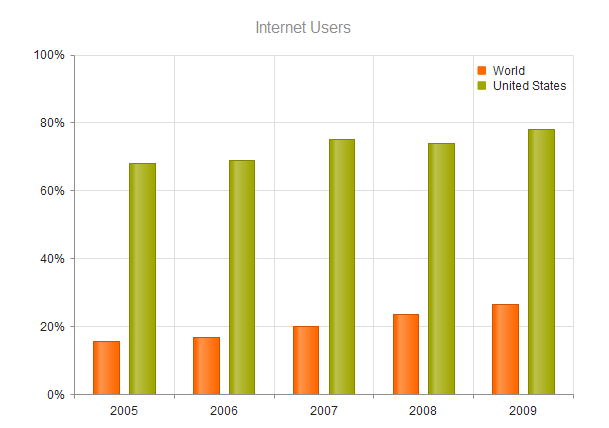

# Legend

The {{ site.product }} Chart supports customization of its legend, which displays the name of the configured data series.

> * Series without a specified name will not display legend items.
> * To render a legend item for the Pie, Donut, and Funnel series, set the [`categoryField`](/api/kendo.mvc.ui.fluent/chartseriesbuilder#categoryfieldsystemstring) of the items.

## Configuring the Legend Items

The legend item types and settings are derived from the series configuration.

To customize the legend, use the [`Legend`](/api/kendo.mvc.ui.fluent/chartbuilder#legendsystemaction) configuration option.

The following example shows how to customize the Legend Item of a given series:

```HtmlHelper
        .Series(series =>
        {
            series.Line(new double[] { 4.54, 3.32, 2.71 }).Name("World")
            .LegendItem(li => li
                .Markers(m => m.Type(ChartMarkerShape.Triangle))
                .Type("line")
                .Area(a => a.Opacity(0.5))
                .Highlight(h => h.Visible(true).Markers(hm => hm.Type(ChartMarkerShape.Rect))));
```


You can also configure the legend items for all series. The following example shows how to do that:

```HtmlHelper
        .SeriesDefaults(sd => sd.Line()
                .LegendItem(li => li
                .Markers(m => m.Type(ChartMarkerShape.Triangle))
                .Type("line")
                .Area(a => a.Opacity(0.5)))
```

## Positioning and Orientation

To control the position of the legend, use any of the following supported `Position` values:

* `"Top"`
* `"Bottom"`
* `"Left"`
* `"Right"`
* `"Custom"`

The following example demonstrates how to configure the position and orientation of the Chart legend.

```HtmlHelper
    @(Html.Kendo().Chart()
        .Name("chart")
        .Legend(legend => legend
            .Position(ChartLegendPosition.Bottom)
            .Orientation(ChartLegendOrientation.Horizontal)
        )
        // Other options.
    )
```

```TagHelper

    <kendo-chart name="chart">
        <chart-legend position="ChartLegendPosition.Bottom" orientation="ChartLegendOrientation.Horizontal" ></chart-legend>
        <!-- Other options.-->
    </kendo-chart>

```


To customize the position of the legend, use the `offsetX` and `offsetY` options.



```HtmlHelper
    @(Html.Kendo().Chart()
        .Name("chart")
        .Legend(legend => legend.Position(ChartLegendPosition.Custom).OffsetX(500).OffsetY(200))
        // Other options.
    )
```

```TagHelper

    <kendo-chart name="chart">
        <chart-legend position="ChartLegendPosition.Custom" offset-x="500" offset-y="200"></chart-legend>
        <!-- Other options.-->
    </kendo-chart>

```


## Showing and Hiding

If you set the series names, the Chart displays a default legend.

The following example demonstrates how to hide the legend by setting its `Visisble` option to `false`.

```HtmlHelper
     @(Html.Kendo().Chart()
        .Name("chart")
        .Legend(legend => legend
            .Visible(false)
        )
        // Other options.
    )
```

```TagHelper

    <kendo-chart name="chart">
        <chart-legend visible="false"></chart-legend>
        <!-- Other options.-->
    </kendo-chart>

```



## Hiding a Series from the Legend

To exclude series from the legend, set their `VisibleInLegend` option to `false`.

```HtmlHelper
    @(Html.Kendo().Chart()
        .Name("chart")
        .Legend(legend => legend.Position(ChartLegendPosition.Top))
        .Series(series =>
        {
            series.Bar(new double[] { 56000, 63000, 74000, 91000, 117000, 138000 }).Name("Total Visits").VisibleInLegend(false);
            series.Bar(new double[] { 52000, 34000, 23000, 48000, 67000, 83000 }).Name("Unique visitors");
        })
        // Other options.
    )
```

```TagHelper

    @{
        var total_visits = new double[] { 56000, 63000, 74000, 91000, 117000, 138000 };
        var unique_visitors = new double[] { 52000, 34000, 23000, 48000, 67000, 83000 };
    }

    <kendo-chart name="chart">
        <chart-legend position="ChartLegendPosition.Top"></chart-legend>
        <series>
            <series-item type="ChartSeriesType.Bar" name="Total Visits" data="total_visits" visible-in-legend="false">
            </series-item>
            <series-item type="ChartSeriesType.Bar" name="Unique visitors" data="unique_visitors">
            </series-item>
        </series>
        <!-- Other options.-->
    </kendo-chart>

```


## Setting a Title

You can configure the legend section of the Chart to render a title with customizable layout and content.

To define a title, configure the [`Title`](/api/kendo.mvc.ui.fluent/chartlegendsettingsbuilder#titlesystemaction) property of the `Legend` configuration.

```HtmlHelper
    @(Html.Kendo().Chart()
        .Name("chart")
       .Legend(legend => legend
              .Title(title=>title.Text("Series")
        )
        // Other options.
    )
```

```TagHelper
    <kendo-chart name="chart">
        <chart-legend position="ChartLegendPosition.Top">
            <title text="Series" />
        </chart-legend>
        <!-- Other options.-->
    </kendo-chart>
```


## See Also

* [Using the API of the Chart HtmlHelper for {{ site.framework }} (Demo)](https://demos.telerik.com/{{ site.platform }}/chart-api/index)
* [Basic Usage of the Area Chart HtmlHelper for {{ site.framework }} (Demos)](https://demos.telerik.com/{{ site.platform }}/area-charts/index)
* [Basic Usage of the Area Chart TagHelper for {{ site.framework }} (Demo)](https://demos.telerik.com/{{ site.platform }}/area-charts/tag-helper)
* [Server-Side API of the Chart for {{ site.framework }}](/api/chart)
