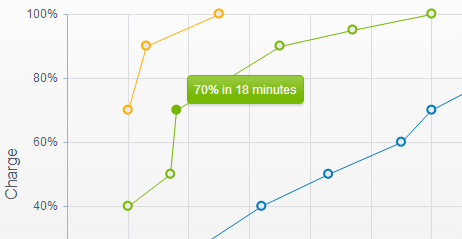


    

    


# Tooltip

The Telerik UI Chart enables you to display details about the data point over which the mouse is currently hovering.

The border of this tooltip matches the color of the series.



## Getting Started

By default, the tooltip of the Chart is not visible. You can enable it by setting the visible property of the tooltip object to `true`.

```
    @(Html.Kendo().Chart()
        .Name("chart")
        .Series(s => s
            .Bar(new double[] { 67.96, 68.93, 75, 74, 78 })
        )
        .CategoryAxis(c => c
            .Categories(new string[] { "2005", "2006", "2007", "2008", "2009" })
        )
        .Tooltip(t => t.Visible(true))
    )
```

The tooltip can also be configured per series.

```
    .Series(s => s
        .Bar(new double[] { 67.96, 68.93, 75, 74, 78 })
        .Tooltip(t=>t.Visible(true))
    )
```

## Using Format Values

To format the point value, use the `Format` property. In the following example, `N0` indicates that the value will be rounded to a whole number and will have a thousands separator.

> Points in categorical (XY) Charts have two values&mdash;`{0}` and `{1}` (X and Y).

```
    .Tooltip(t => t
        .Visible(true)
        .Format("Value: {0:N0}")
    )
```

## Using Templates

To provide better flexibility, define the content of a tooltip through a template.

The template provides access to all information associated with the point:

* `value`&mdash;The point value. Value dimensions are available as properties, for example, `value.x` and `value.y`.
* `category`&mdash;The category name.
* `series`&mdash;The data series.
* (When binding to a data source) `dataItem`&mdash;The original data item.

```
    .Tooltip(t => t
        .Visible(true)
        .Template("Value: #= value # ; Category: #= category #")
    )
```

You can also use an external template by specifying [`TemplateId`]({{ TemplateId }}).

```
    .Tooltip(t => t
        .Visible(true)
        .TemplateId("tooltipTemplate")
    )
```

```
    <script id="tooltipTemplate" type="text/x-kendo-template">
        Value: #= value # ; Category: #= category #
    </script>
```


## See Also

* [Using the API of the Chart HtmlHelper for {{ site.framework }} (Demo)](https://demos.telerik.com/{{ site.platform }}/chart-api/index)
* [Basic Usage of the Area Chart HtmlHelper for {{ site.framework }} (Demos)](https://demos.telerik.com/{{ site.platform }}/area-charts/index)
* [Server-Side API](/api/chart)
