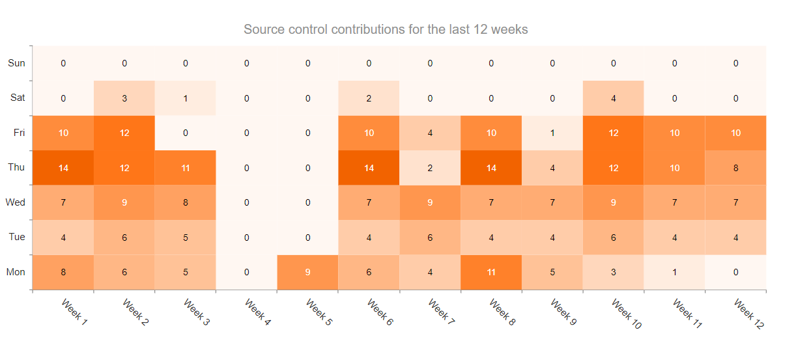

# Getting Started with the HeatMap

This tutorial explains how to set up a basic Telerik UI for {{ site.framework }} HeatMap and highlights the major steps in the configuration of the component.

You will initialize a HeatMap control and configure the chart series, category axis, and value axis. Next, you will handle some of the HeatMap events. Finally, you can run the sample code in [Telerik REPL](https://netcorerepl.telerik.com/) and continue exploring the components.

 

@[template](/_contentTemplates/core/getting-started-prerequisites.md#repl-component-gs-prerequisites)

## 1. Prepare the CSHTML File

@[template](/_contentTemplates/core/getting-started-directives.md#gs-adding-directives)

Optionally, you can structure the document by adding the desired HTML elements like headings, divs, paragraphs, and apply some basic styles.

## 2. Declare the Data for the Series

Declare an array of objects. In this guide, the data array will contain 12 weeks with seven unique elements for each weekday—a total of 84 elements that the HeatMap will visualize.

```Razor
    @{
        var data = new object[] {
                new {Week = 1, Day = "Mon", Value = 8},  new {Week = 1, Day = "Tue", Value = 4},  new {Week = 1, Day = "Wed", Value = 7},  new {Week = 1, Day = "Thu", Value = 14}, new {Week = 1, Day = "Fri", Value = 10}, new {Week = 1, Day = "Sat", Value = 0}, new {Week = 1, Day = "Sun", Value = 0},
                new {Week = 2, Day = "Mon", Value = 6},  new {Week = 2, Day = "Tue", Value = 6},  new {Week = 2, Day = "Wed", Value = 9},  new {Week = 2, Day = "Thu", Value = 12}, new {Week = 2, Day = "Fri", Value = 12}, new {Week = 2, Day = "Sat", Value = 3}, new {Week = 2, Day = "Sun", Value = 0},
                new {Week = 3, Day = "Mon", Value = 5},  new {Week = 3, Day = "Tue", Value = 5},  new {Week = 3, Day = "Wed", Value = 8},  new {Week = 3, Day = "Thu", Value = 11}, new {Week = 3, Day = "Fri", Value = 0}, new {Week = 3, Day = "Sat", Value = 1}, new {Week = 3, Day = "Sun", Value = 0},
                new {Week = 4, Day = "Mon", Value = 0},  new {Week = 4, Day = "Tue", Value = 0},  new {Week = 4, Day = "Wed", Value = 0},  new {Week = 4, Day = "Thu", Value = 0}, new {Week = 4, Day = "Fri", Value = 0}, new {Week = 4, Day = "Sat", Value = 0}, new {Week = 4, Day = "Sun", Value = 0},
                new {Week = 5, Day = "Mon", Value = 9},  new {Week = 5, Day = "Tue", Value = 0},  new {Week = 5, Day = "Wed", Value = 0},  new {Week = 5, Day = "Thu", Value = 0}, new {Week = 5, Day = "Fri", Value = 0}, new {Week = 5, Day = "Sat", Value = 0}, new {Week = 5, Day = "Sun", Value = 0},
                new {Week = 6, Day = "Mon", Value = 6},  new {Week = 6, Day = "Tue", Value = 4},  new {Week = 6, Day = "Wed", Value = 7},  new {Week = 6, Day = "Thu", Value = 14}, new {Week = 6, Day = "Fri", Value = 10}, new {Week = 6, Day = "Sat", Value = 2}, new {Week = 6, Day = "Sun", Value = 0},
                new {Week = 7, Day = "Mon", Value = 4},  new {Week = 7, Day = "Tue", Value = 6},  new {Week = 7, Day = "Wed", Value = 9},  new {Week = 7, Day = "Thu", Value = 2}, new {Week = 7, Day = "Fri", Value = 4}, new {Week = 7, Day = "Sat", Value = 0}, new {Week = 7, Day = "Sun", Value = 0},
                new {Week = 8, Day = "Mon", Value = 11}, new {Week = 8, Day = "Tue", Value = 4},  new {Week = 8, Day = "Wed", Value = 7},  new {Week = 8, Day = "Thu", Value = 14}, new {Week = 8, Day = "Fri", Value = 10}, new {Week = 8, Day = "Sat", Value = 0}, new {Week = 8, Day = "Sun", Value = 0},
                new {Week = 9, Day = "Mon", Value = 5},  new {Week = 9, Day = "Tue", Value = 4},  new {Week = 9, Day = "Wed", Value = 7},  new {Week = 9, Day = "Thu", Value = 4}, new {Week = 9, Day = "Fri", Value = 1}, new {Week = 9, Day = "Sat", Value = 0}, new {Week = 9, Day = "Sun", Value = 0},
                new {Week = 10, Day = "Mon", Value = 3}, new {Week = 10, Day = "Tue", Value = 6}, new {Week = 10, Day = "Wed", Value = 9}, new {Week = 10, Day = "Thu", Value = 12}, new {Week = 10, Day = "Fri", Value = 12}, new {Week = 10, Day = "Sat", Value = 4}, new {Week = 10, Day = "Sun", Value = 0},
                new {Week = 11, Day = "Mon", Value = 1}, new {Week = 11, Day = "Tue", Value = 4}, new {Week = 11, Day = "Wed", Value = 7}, new {Week = 11, Day = "Thu", Value = 10}, new {Week = 11, Day = "Fri", Value = 10}, new {Week = 11, Day = "Sat", Value = 0}, new {Week = 11, Day = "Sun", Value = 0},
                new {Week = 12, Day = "Mon", Value = 0}, new {Week = 12, Day = "Tue", Value = 4}, new {Week = 12, Day = "Wed", Value = 7}, new {Week = 12, Day = "Thu", Value = 8}, new {Week = 12, Day = "Fri", Value = 10}, new {Week = 12, Day = "Sat", Value = 0}, new {Week = 12, Day = "Sun", Value = 0}
        };
    }
```

## 3. Initialize the HeatMap

Use the HeatMap HtmlHelper or TagHelper to add the component to a page:

* The `Name()` configuration method is mandatory as its value is used for the `id` and the `name` attributes of the HeatMap element.

* The [`Title`]() configuration method sets up the text that will appear over the component.

* The [`Series()`](/api/kendo.mvc.ui.fluent/chartseriesfactory#heatmapsystemcollectionsienumerable) configuration method determines the configuration of the chart series. To visualize the data in a HeatMap Chart, make sure to specify the `HeatMap` property of the `Series`.

```HtmlHelper
    @using Kendo.Mvc.UI

    @{
        var data = new object[] {
                new {Week = 1, Day = "Mon", Value = 8},  new {Week = 1, Day = "Tue", Value = 4},  new {Week = 1, Day = "Wed", Value = 7},  new {Week = 1, Day = "Thu", Value = 14}, new {Week = 1, Day = "Fri", Value = 10}, new {Week = 1, Day = "Sat", Value = 0}, new {Week = 1, Day = "Sun", Value = 0},
                new {Week = 2, Day = "Mon", Value = 6},  new {Week = 2, Day = "Tue", Value = 6},  new {Week = 2, Day = "Wed", Value = 9},  new {Week = 2, Day = "Thu", Value = 12}, new {Week = 2, Day = "Fri", Value = 12}, new {Week = 2, Day = "Sat", Value = 3}, new {Week = 2, Day = "Sun", Value = 0},
                new {Week = 3, Day = "Mon", Value = 5},  new {Week = 3, Day = "Tue", Value = 5},  new {Week = 3, Day = "Wed", Value = 8},  new {Week = 3, Day = "Thu", Value = 11}, new {Week = 3, Day = "Fri", Value = 0}, new {Week = 3, Day = "Sat", Value = 1}, new {Week = 3, Day = "Sun", Value = 0},
                new {Week = 4, Day = "Mon", Value = 0},  new {Week = 4, Day = "Tue", Value = 0},  new {Week = 4, Day = "Wed", Value = 0},  new {Week = 4, Day = "Thu", Value = 0}, new {Week = 4, Day = "Fri", Value = 0}, new {Week = 4, Day = "Sat", Value = 0}, new {Week = 4, Day = "Sun", Value = 0},
                new {Week = 5, Day = "Mon", Value = 9},  new {Week = 5, Day = "Tue", Value = 0},  new {Week = 5, Day = "Wed", Value = 0},  new {Week = 5, Day = "Thu", Value = 0}, new {Week = 5, Day = "Fri", Value = 0}, new {Week = 5, Day = "Sat", Value = 0}, new {Week = 5, Day = "Sun", Value = 0},
                new {Week = 6, Day = "Mon", Value = 6},  new {Week = 6, Day = "Tue", Value = 4},  new {Week = 6, Day = "Wed", Value = 7},  new {Week = 6, Day = "Thu", Value = 14}, new {Week = 6, Day = "Fri", Value = 10}, new {Week = 6, Day = "Sat", Value = 2}, new {Week = 6, Day = "Sun", Value = 0},
                new {Week = 7, Day = "Mon", Value = 4},  new {Week = 7, Day = "Tue", Value = 6},  new {Week = 7, Day = "Wed", Value = 9},  new {Week = 7, Day = "Thu", Value = 2}, new {Week = 7, Day = "Fri", Value = 4}, new {Week = 7, Day = "Sat", Value = 0}, new {Week = 7, Day = "Sun", Value = 0},
                new {Week = 8, Day = "Mon", Value = 11}, new {Week = 8, Day = "Tue", Value = 4},  new {Week = 8, Day = "Wed", Value = 7},  new {Week = 8, Day = "Thu", Value = 14}, new {Week = 8, Day = "Fri", Value = 10}, new {Week = 8, Day = "Sat", Value = 0}, new {Week = 8, Day = "Sun", Value = 0},
                new {Week = 9, Day = "Mon", Value = 5},  new {Week = 9, Day = "Tue", Value = 4},  new {Week = 9, Day = "Wed", Value = 7},  new {Week = 9, Day = "Thu", Value = 4}, new {Week = 9, Day = "Fri", Value = 1}, new {Week = 9, Day = "Sat", Value = 0}, new {Week = 9, Day = "Sun", Value = 0},
                new {Week = 10, Day = "Mon", Value = 3}, new {Week = 10, Day = "Tue", Value = 6}, new {Week = 10, Day = "Wed", Value = 9}, new {Week = 10, Day = "Thu", Value = 12}, new {Week = 10, Day = "Fri", Value = 12}, new {Week = 10, Day = "Sat", Value = 4}, new {Week = 10, Day = "Sun", Value = 0},
                new {Week = 11, Day = "Mon", Value = 1}, new {Week = 11, Day = "Tue", Value = 4}, new {Week = 11, Day = "Wed", Value = 7}, new {Week = 11, Day = "Thu", Value = 10}, new {Week = 11, Day = "Fri", Value = 10}, new {Week = 11, Day = "Sat", Value = 0}, new {Week = 11, Day = "Sun", Value = 0},
                new {Week = 12, Day = "Mon", Value = 0}, new {Week = 12, Day = "Tue", Value = 4}, new {Week = 12, Day = "Wed", Value = 7}, new {Week = 12, Day = "Thu", Value = 8}, new {Week = 12, Day = "Fri", Value = 10}, new {Week = 12, Day = "Sat", Value = 0}, new {Week = 12, Day = "Sun", Value = 0}
        };
    }

    @(Html.Kendo().Chart()
            .Name("heatmap")
            .Title("Source control contributions for the last 12 weeks")
            .Series(series =>
            {
                series.HeatMap(data).XField("Week").YField("Day").Field("Value");
            })
    )
```

```TagHelper
    @addTagHelper *, Kendo.Mvc
    @{
        var data = new object[] {
            new {Week = 1, Day = "Mon", Value = 8},  new {Week = 1, Day = "Tue", Value = 4},  new {Week = 1, Day = "Wed", Value = 7},  new {Week = 1, Day = "Thu", Value = 14}, new {Week = 1, Day = "Fri", Value = 10}, new {Week = 1, Day = "Sat", Value = 0}, new {Week = 1, Day = "Sun", Value = 0},
            new {Week = 2, Day = "Mon", Value = 6},  new {Week = 2, Day = "Tue", Value = 6},  new {Week = 2, Day = "Wed", Value = 9},  new {Week = 2, Day = "Thu", Value = 12}, new {Week = 2, Day = "Fri", Value = 12}, new {Week = 2, Day = "Sat", Value = 3}, new {Week = 2, Day = "Sun", Value = 0},
            new {Week = 3, Day = "Mon", Value = 5},  new {Week = 3, Day = "Tue", Value = 5},  new {Week = 3, Day = "Wed", Value = 8},  new {Week = 3, Day = "Thu", Value = 11}, new {Week = 3, Day = "Fri", Value = 0}, new {Week = 3, Day = "Sat", Value = 1}, new {Week = 3, Day = "Sun", Value = 0},
            new {Week = 4, Day = "Mon", Value = 0},  new {Week = 4, Day = "Tue", Value = 0},  new {Week = 4, Day = "Wed", Value = 0},  new {Week = 4, Day = "Thu", Value = 0}, new {Week = 4, Day = "Fri", Value = 0}, new {Week = 4, Day = "Sat", Value = 0}, new {Week = 4, Day = "Sun", Value = 0},
            new {Week = 5, Day = "Mon", Value = 9},  new {Week = 5, Day = "Tue", Value = 0},  new {Week = 5, Day = "Wed", Value = 0},  new {Week = 5, Day = "Thu", Value = 0}, new {Week = 5, Day = "Fri", Value = 0}, new {Week = 5, Day = "Sat", Value = 0}, new {Week = 5, Day = "Sun", Value = 0},
            new {Week = 6, Day = "Mon", Value = 6},  new {Week = 6, Day = "Tue", Value = 4},  new {Week = 6, Day = "Wed", Value = 7},  new {Week = 6, Day = "Thu", Value = 14}, new {Week = 6, Day = "Fri", Value = 10}, new {Week = 6, Day = "Sat", Value = 2}, new {Week = 6, Day = "Sun", Value = 0},
            new {Week = 7, Day = "Mon", Value = 4},  new {Week = 7, Day = "Tue", Value = 6},  new {Week = 7, Day = "Wed", Value = 9},  new {Week = 7, Day = "Thu", Value = 2}, new {Week = 7, Day = "Fri", Value = 4}, new {Week = 7, Day = "Sat", Value = 0}, new {Week = 7, Day = "Sun", Value = 0},
            new {Week = 8, Day = "Mon", Value = 11},  new {Week = 8, Day = "Tue", Value = 4},  new {Week = 8, Day = "Wed", Value = 7},  new {Week = 8, Day = "Thu", Value = 14}, new {Week = 8, Day = "Fri", Value = 10}, new {Week = 8, Day = "Sat", Value = 0}, new {Week = 8, Day = "Sun", Value = 0},
            new {Week = 9, Day = "Mon", Value = 5},  new {Week = 9, Day = "Tue", Value = 4},  new {Week = 9, Day = "Wed", Value = 7},  new {Week = 9, Day = "Thu", Value = 4}, new {Week = 9, Day = "Fri", Value = 1}, new {Week = 9, Day = "Sat", Value = 0}, new {Week = 9, Day = "Sun", Value = 0},
            new {Week = 10, Day = "Mon", Value = 3}, new {Week = 10, Day = "Tue", Value = 6}, new {Week = 10, Day = "Wed", Value = 9}, new {Week = 10, Day = "Thu", Value = 12}, new {Week = 10, Day = "Fri", Value = 12}, new {Week = 10, Day = "Sat", Value = 4}, new {Week = 10, Day = "Sun", Value = 0},
            new {Week = 11, Day = "Mon", Value = 1}, new {Week = 11, Day = "Tue", Value = 4}, new {Week = 11, Day = "Wed", Value = 7}, new {Week = 11, Day = "Thu", Value = 10}, new {Week = 11, Day = "Fri", Value = 10}, new {Week = 11, Day = "Sat", Value = 0}, new {Week = 11, Day = "Sun", Value = 0},
            new {Week = 12, Day = "Mon", Value = 0}, new {Week = 12, Day = "Tue", Value = 4}, new {Week = 12, Day = "Wed", Value = 7}, new {Week = 12, Day = "Thu", Value = 8}, new {Week = 12, Day = "Fri", Value = 10}, new {Week = 12, Day = "Sat", Value = 0}, new {Week = 12, Day = "Sun", Value = 0}
        };
    }

    <kendo-chart name="heatmap">
        <chart-title text="Source control contributions for the last 12 weeks">
        <series>
            <series-item type="ChartSeriesType.HeatMap"
                        field="Value"
                        x-field="Week"
                        y-field="Day"
                        data="data">
            </series-item>
        </series>
    </kendo-chart>

```


## 4. Add Axes to the Chart

Add [`XAxis`](https://docs.telerik.com/{{ site.platform }}/api/kendo.mvc.ui.fluent/chartseriesbuilder#xaxissystemstring) and [`YAxis`](https://docs.telerik.com/{{ site.platform }}/api/kendo.mvc.ui.fluent/chartseriesbuilder#yaxissystemstring) configurations.

```HtmlHelper
    @using Kendo.Mvc.UI

    @{
    var data = new object[] {
                new {Week = 1, Day = "Mon", Value = 8},  new {Week = 1, Day = "Tue", Value = 4},  new {Week = 1, Day = "Wed", Value = 7},  new {Week = 1, Day = "Thu", Value = 14}, new {Week = 1, Day = "Fri", Value = 10}, new {Week = 1, Day = "Sat", Value = 0}, new {Week = 1, Day = "Sun", Value = 0},
                new {Week = 2, Day = "Mon", Value = 6},  new {Week = 2, Day = "Tue", Value = 6},  new {Week = 2, Day = "Wed", Value = 9},  new {Week = 2, Day = "Thu", Value = 12}, new {Week = 2, Day = "Fri", Value = 12}, new {Week = 2, Day = "Sat", Value = 3}, new {Week = 2, Day = "Sun", Value = 0},
                new {Week = 3, Day = "Mon", Value = 5},  new {Week = 3, Day = "Tue", Value = 5},  new {Week = 3, Day = "Wed", Value = 8},  new {Week = 3, Day = "Thu", Value = 11}, new {Week = 3, Day = "Fri", Value = 0}, new {Week = 3, Day = "Sat", Value = 1}, new {Week = 3, Day = "Sun", Value = 0},
                new {Week = 4, Day = "Mon", Value = 0},  new {Week = 4, Day = "Tue", Value = 0},  new {Week = 4, Day = "Wed", Value = 0},  new {Week = 4, Day = "Thu", Value = 0}, new {Week = 4, Day = "Fri", Value = 0}, new {Week = 4, Day = "Sat", Value = 0}, new {Week = 4, Day = "Sun", Value = 0},
                new {Week = 5, Day = "Mon", Value = 9},  new {Week = 5, Day = "Tue", Value = 0},  new {Week = 5, Day = "Wed", Value = 0},  new {Week = 5, Day = "Thu", Value = 0}, new {Week = 5, Day = "Fri", Value = 0}, new {Week = 5, Day = "Sat", Value = 0}, new {Week = 5, Day = "Sun", Value = 0},
                new {Week = 6, Day = "Mon", Value = 6},  new {Week = 6, Day = "Tue", Value = 4},  new {Week = 6, Day = "Wed", Value = 7},  new {Week = 6, Day = "Thu", Value = 14}, new {Week = 6, Day = "Fri", Value = 10}, new {Week = 6, Day = "Sat", Value = 2}, new {Week = 6, Day = "Sun", Value = 0},
                new {Week = 7, Day = "Mon", Value = 4},  new {Week = 7, Day = "Tue", Value = 6},  new {Week = 7, Day = "Wed", Value = 9},  new {Week = 7, Day = "Thu", Value = 2}, new {Week = 7, Day = "Fri", Value = 4}, new {Week = 7, Day = "Sat", Value = 0}, new {Week = 7, Day = "Sun", Value = 0},
                new {Week = 8, Day = "Mon", Value = 11}, new {Week = 8, Day = "Tue", Value = 4},  new {Week = 8, Day = "Wed", Value = 7},  new {Week = 8, Day = "Thu", Value = 14}, new {Week = 8, Day = "Fri", Value = 10}, new {Week = 8, Day = "Sat", Value = 0}, new {Week = 8, Day = "Sun", Value = 0},
                new {Week = 9, Day = "Mon", Value = 5},  new {Week = 9, Day = "Tue", Value = 4},  new {Week = 9, Day = "Wed", Value = 7},  new {Week = 9, Day = "Thu", Value = 4}, new {Week = 9, Day = "Fri", Value = 1}, new {Week = 9, Day = "Sat", Value = 0}, new {Week = 9, Day = "Sun", Value = 0},
                new {Week = 10, Day = "Mon", Value = 3}, new {Week = 10, Day = "Tue", Value = 6}, new {Week = 10, Day = "Wed", Value = 9}, new {Week = 10, Day = "Thu", Value = 12}, new {Week = 10, Day = "Fri", Value = 12}, new {Week = 10, Day = "Sat", Value = 4}, new {Week = 10, Day = "Sun", Value = 0},
                new {Week = 11, Day = "Mon", Value = 1}, new {Week = 11, Day = "Tue", Value = 4}, new {Week = 11, Day = "Wed", Value = 7}, new {Week = 11, Day = "Thu", Value = 10}, new {Week = 11, Day = "Fri", Value = 10}, new {Week = 11, Day = "Sat", Value = 0}, new {Week = 11, Day = "Sun", Value = 0},
                new {Week = 12, Day = "Mon", Value = 0}, new {Week = 12, Day = "Tue", Value = 4}, new {Week = 12, Day = "Wed", Value = 7}, new {Week = 12, Day = "Thu", Value = 8}, new {Week = 12, Day = "Fri", Value = 10}, new {Week = 12, Day = "Sat", Value = 0}, new {Week = 12, Day = "Sun", Value = 0}
        };
    }

    @(Html.Kendo().Chart()
        .Name("heatmap")
		.Title("Source control contributions for the last 12 weeks")
        .Series(series =>
        {
            series.HeatMap(data).XField("Week").YField("Day").Field("Value");
        })
        .XAxis(x=>x
            .Numeric()
            .Labels(l=>l.Template("Week #:value#").Rotation(45))
        )
        .YAxis(y=>y
            .Categories(new[] { "Mon", "Tue", "Wed", "Thu", "Fri", "Sat", "Sun"})
        )
    )
```

```TagHelper
    @addTagHelper *, Kendo.Mvc
    @{
        var categories = new[] { "Mon", "Tue", "Wed", "Thu", "Fri", "Sat", "Sun"};
        var data = new object[] {
            new {Week = 1, Day = "Mon", Value = 8},  new {Week = 1, Day = "Tue", Value = 4},  new {Week = 1, Day = "Wed", Value = 7},  new {Week = 1, Day = "Thu", Value = 14}, new {Week = 1, Day = "Fri", Value = 10}, new {Week = 1, Day = "Sat", Value = 0}, new {Week = 1, Day = "Sun", Value = 0},
            new {Week = 2, Day = "Mon", Value = 6},  new {Week = 2, Day = "Tue", Value = 6},  new {Week = 2, Day = "Wed", Value = 9},  new {Week = 2, Day = "Thu", Value = 12}, new {Week = 2, Day = "Fri", Value = 12}, new {Week = 2, Day = "Sat", Value = 3}, new {Week = 2, Day = "Sun", Value = 0},
            new {Week = 3, Day = "Mon", Value = 5},  new {Week = 3, Day = "Tue", Value = 5},  new {Week = 3, Day = "Wed", Value = 8},  new {Week = 3, Day = "Thu", Value = 11}, new {Week = 3, Day = "Fri", Value = 0}, new {Week = 3, Day = "Sat", Value = 1}, new {Week = 3, Day = "Sun", Value = 0},
            new {Week = 4, Day = "Mon", Value = 0},  new {Week = 4, Day = "Tue", Value = 0},  new {Week = 4, Day = "Wed", Value = 0},  new {Week = 4, Day = "Thu", Value = 0}, new {Week = 4, Day = "Fri", Value = 0}, new {Week = 4, Day = "Sat", Value = 0}, new {Week = 4, Day = "Sun", Value = 0},
            new {Week = 5, Day = "Mon", Value = 9},  new {Week = 5, Day = "Tue", Value = 0},  new {Week = 5, Day = "Wed", Value = 0},  new {Week = 5, Day = "Thu", Value = 0}, new {Week = 5, Day = "Fri", Value = 0}, new {Week = 5, Day = "Sat", Value = 0}, new {Week = 5, Day = "Sun", Value = 0},
            new {Week = 6, Day = "Mon", Value = 6},  new {Week = 6, Day = "Tue", Value = 4},  new {Week = 6, Day = "Wed", Value = 7},  new {Week = 6, Day = "Thu", Value = 14}, new {Week = 6, Day = "Fri", Value = 10}, new {Week = 6, Day = "Sat", Value = 2}, new {Week = 6, Day = "Sun", Value = 0},
            new {Week = 7, Day = "Mon", Value = 4},  new {Week = 7, Day = "Tue", Value = 6},  new {Week = 7, Day = "Wed", Value = 9},  new {Week = 7, Day = "Thu", Value = 2}, new {Week = 7, Day = "Fri", Value = 4}, new {Week = 7, Day = "Sat", Value = 0}, new {Week = 7, Day = "Sun", Value = 0},
            new {Week = 8, Day = "Mon", Value = 11}, new {Week = 8, Day = "Tue", Value = 4},  new {Week = 8, Day = "Wed", Value = 7},  new {Week = 8, Day = "Thu", Value = 14}, new {Week = 8, Day = "Fri", Value = 10}, new {Week = 8, Day = "Sat", Value = 0}, new {Week = 8, Day = "Sun", Value = 0},
            new {Week = 9, Day = "Mon", Value = 5},  new {Week = 9, Day = "Tue", Value = 4},  new {Week = 9, Day = "Wed", Value = 7},  new {Week = 9, Day = "Thu", Value = 4}, new {Week = 9, Day = "Fri", Value = 1}, new {Week = 9, Day = "Sat", Value = 0}, new {Week = 9, Day = "Sun", Value = 0},
            new {Week = 10, Day = "Mon", Value = 3}, new {Week = 10, Day = "Tue", Value = 6}, new {Week = 10, Day = "Wed", Value = 9}, new {Week = 10, Day = "Thu", Value = 12}, new {Week = 10, Day = "Fri", Value = 12}, new {Week = 10, Day = "Sat", Value = 4}, new {Week = 10, Day = "Sun", Value = 0},
            new {Week = 11, Day = "Mon", Value = 1}, new {Week = 11, Day = "Tue", Value = 4}, new {Week = 11, Day = "Wed", Value = 7}, new {Week = 11, Day = "Thu", Value = 10}, new {Week = 11, Day = "Fri", Value = 10}, new {Week = 11, Day = "Sat", Value = 0}, new {Week = 11, Day = "Sun", Value = 0},
            new {Week = 12, Day = "Mon", Value = 0}, new {Week = 12, Day = "Tue", Value = 4}, new {Week = 12, Day = "Wed", Value = 7}, new {Week = 12, Day = "Thu", Value = 8}, new {Week = 12, Day = "Fri", Value = 10}, new {Week = 12, Day = "Sat", Value = 0}, new {Week = 12, Day = "Sun", Value = 0}
        };
    }

    <kendo-chart name="heatmap">
        <series>
            <series-item type="ChartSeriesType.HeatMap"
                         field="Value"
                         x-field="Week"
                         y-field="Day"
                         data="data">
            </series-item>
        </series>
        <x-axis>
            <x-axis-item type="numeric">
                <labels template="Week #:value#">
                    <chart-x-axis-labels-rotation angle="45" />
                </labels>
            </x-axis-item>
        </x-axis>
        <y-axis>
            <y-axis-item type="string" categories="categories">
            </y-axis-item>
        </y-axis>
        <chart-title text="Source control contributions for the last 12 weeks">
        </chart-title>
    </kendo-chart>

```


## 5. Add a Tooltip

The `Tooltip` configuration method specifies the behavior and the content of the tooltip.

```HtmlHelper
    @using Kendo.Mvc.UI

    @{
    var data = new object[] {
                new {Week = 1, Day = "Mon", Value = 8},  new {Week = 1, Day = "Tue", Value = 4},  new {Week = 1, Day = "Wed", Value = 7},  new {Week = 1, Day = "Thu", Value = 14}, new {Week = 1, Day = "Fri", Value = 10}, new {Week = 1, Day = "Sat", Value = 0}, new {Week = 1, Day = "Sun", Value = 0},
                new {Week = 2, Day = "Mon", Value = 6},  new {Week = 2, Day = "Tue", Value = 6},  new {Week = 2, Day = "Wed", Value = 9},  new {Week = 2, Day = "Thu", Value = 12}, new {Week = 2, Day = "Fri", Value = 12}, new {Week = 2, Day = "Sat", Value = 3}, new {Week = 2, Day = "Sun", Value = 0},
                new {Week = 3, Day = "Mon", Value = 5},  new {Week = 3, Day = "Tue", Value = 5},  new {Week = 3, Day = "Wed", Value = 8},  new {Week = 3, Day = "Thu", Value = 11}, new {Week = 3, Day = "Fri", Value = 0}, new {Week = 3, Day = "Sat", Value = 1}, new {Week = 3, Day = "Sun", Value = 0},
                new {Week = 4, Day = "Mon", Value = 0},  new {Week = 4, Day = "Tue", Value = 0},  new {Week = 4, Day = "Wed", Value = 0},  new {Week = 4, Day = "Thu", Value = 0}, new {Week = 4, Day = "Fri", Value = 0}, new {Week = 4, Day = "Sat", Value = 0}, new {Week = 4, Day = "Sun", Value = 0},
                new {Week = 5, Day = "Mon", Value = 9},  new {Week = 5, Day = "Tue", Value = 0},  new {Week = 5, Day = "Wed", Value = 0},  new {Week = 5, Day = "Thu", Value = 0}, new {Week = 5, Day = "Fri", Value = 0}, new {Week = 5, Day = "Sat", Value = 0}, new {Week = 5, Day = "Sun", Value = 0},
                new {Week = 6, Day = "Mon", Value = 6},  new {Week = 6, Day = "Tue", Value = 4},  new {Week = 6, Day = "Wed", Value = 7},  new {Week = 6, Day = "Thu", Value = 14}, new {Week = 6, Day = "Fri", Value = 10}, new {Week = 6, Day = "Sat", Value = 2}, new {Week = 6, Day = "Sun", Value = 0},
                new {Week = 7, Day = "Mon", Value = 4},  new {Week = 7, Day = "Tue", Value = 6},  new {Week = 7, Day = "Wed", Value = 9},  new {Week = 7, Day = "Thu", Value = 2}, new {Week = 7, Day = "Fri", Value = 4}, new {Week = 7, Day = "Sat", Value = 0}, new {Week = 7, Day = "Sun", Value = 0},
                new {Week = 8, Day = "Mon", Value = 11}, new {Week = 8, Day = "Tue", Value = 4},  new {Week = 8, Day = "Wed", Value = 7},  new {Week = 8, Day = "Thu", Value = 14}, new {Week = 8, Day = "Fri", Value = 10}, new {Week = 8, Day = "Sat", Value = 0}, new {Week = 8, Day = "Sun", Value = 0},
                new {Week = 9, Day = "Mon", Value = 5},  new {Week = 9, Day = "Tue", Value = 4},  new {Week = 9, Day = "Wed", Value = 7},  new {Week = 9, Day = "Thu", Value = 4}, new {Week = 9, Day = "Fri", Value = 1}, new {Week = 9, Day = "Sat", Value = 0}, new {Week = 9, Day = "Sun", Value = 0},
                new {Week = 10, Day = "Mon", Value = 3}, new {Week = 10, Day = "Tue", Value = 6}, new {Week = 10, Day = "Wed", Value = 9}, new {Week = 10, Day = "Thu", Value = 12}, new {Week = 10, Day = "Fri", Value = 12}, new {Week = 10, Day = "Sat", Value = 4}, new {Week = 10, Day = "Sun", Value = 0},
                new {Week = 11, Day = "Mon", Value = 1}, new {Week = 11, Day = "Tue", Value = 4}, new {Week = 11, Day = "Wed", Value = 7}, new {Week = 11, Day = "Thu", Value = 10}, new {Week = 11, Day = "Fri", Value = 10}, new {Week = 11, Day = "Sat", Value = 0}, new {Week = 11, Day = "Sun", Value = 0},
                new {Week = 12, Day = "Mon", Value = 0}, new {Week = 12, Day = "Tue", Value = 4}, new {Week = 12, Day = "Wed", Value = 7}, new {Week = 12, Day = "Thu", Value = 8}, new {Week = 12, Day = "Fri", Value = 10}, new {Week = 12, Day = "Sat", Value = 0}, new {Week = 12, Day = "Sun", Value = 0}
        };
    }


    @(Html.Kendo().Chart()
        .Name("heatmap")
		.Title("Source control contributions for the last 12 weeks")
        .Series(series =>
        {
            series.HeatMap(data).XField("Week").YField("Day").Field("Value");
        })
        .XAxis(x=>x
            .Numeric()
            .Labels(l=>l.Template("Week #:value#").Rotation(45))
        )
        .YAxis(y=>y
            .Categories(new[] { "Mon", "Tue", "Wed", "Thu", "Fri", "Sat", "Sun"})
        )
        .Tooltip(t=>t.Visible(true).Template("#:value.value# contributions on #:value.y#, week #:value.x#"))
    )
```

```TagHelper
    @addTagHelper *, Kendo.Mvc
    @{
        var categories = new[] { "Mon", "Tue", "Wed", "Thu", "Fri", "Sat", "Sun"};
        var data = new object[] {
            new {Week = 1, Day = "Mon", Value = 8},  new {Week = 1, Day = "Tue", Value = 4},  new {Week = 1, Day = "Wed", Value = 7},  new {Week = 1, Day = "Thu", Value = 14}, new {Week = 1, Day = "Fri", Value = 10}, new {Week = 1, Day = "Sat", Value = 0}, new {Week = 1, Day = "Sun", Value = 0},
            new {Week = 2, Day = "Mon", Value = 6},  new {Week = 2, Day = "Tue", Value = 6},  new {Week = 2, Day = "Wed", Value = 9},  new {Week = 2, Day = "Thu", Value = 12}, new {Week = 2, Day = "Fri", Value = 12}, new {Week = 2, Day = "Sat", Value = 3}, new {Week = 2, Day = "Sun", Value = 0},
            new {Week = 3, Day = "Mon", Value = 5},  new {Week = 3, Day = "Tue", Value = 5},  new {Week = 3, Day = "Wed", Value = 8},  new {Week = 3, Day = "Thu", Value = 11}, new {Week = 3, Day = "Fri", Value = 0}, new {Week = 3, Day = "Sat", Value = 1}, new {Week = 3, Day = "Sun", Value = 0},
            new {Week = 4, Day = "Mon", Value = 0},  new {Week = 4, Day = "Tue", Value = 0},  new {Week = 4, Day = "Wed", Value = 0},  new {Week = 4, Day = "Thu", Value = 0}, new {Week = 4, Day = "Fri", Value = 0}, new {Week = 4, Day = "Sat", Value = 0}, new {Week = 4, Day = "Sun", Value = 0},
            new {Week = 5, Day = "Mon", Value = 9},  new {Week = 5, Day = "Tue", Value = 0},  new {Week = 5, Day = "Wed", Value = 0},  new {Week = 5, Day = "Thu", Value = 0}, new {Week = 5, Day = "Fri", Value = 0}, new {Week = 5, Day = "Sat", Value = 0}, new {Week = 5, Day = "Sun", Value = 0},
            new {Week = 6, Day = "Mon", Value = 6},  new {Week = 6, Day = "Tue", Value = 4},  new {Week = 6, Day = "Wed", Value = 7},  new {Week = 6, Day = "Thu", Value = 14}, new {Week = 6, Day = "Fri", Value = 10}, new {Week = 6, Day = "Sat", Value = 2}, new {Week = 6, Day = "Sun", Value = 0},
            new {Week = 7, Day = "Mon", Value = 4},  new {Week = 7, Day = "Tue", Value = 6},  new {Week = 7, Day = "Wed", Value = 9},  new {Week = 7, Day = "Thu", Value = 2}, new {Week = 7, Day = "Fri", Value = 4}, new {Week = 7, Day = "Sat", Value = 0}, new {Week = 7, Day = "Sun", Value = 0},
            new {Week = 8, Day = "Mon", Value = 11}, new {Week = 8, Day = "Tue", Value = 4},  new {Week = 8, Day = "Wed", Value = 7},  new {Week = 8, Day = "Thu", Value = 14}, new {Week = 8, Day = "Fri", Value = 10}, new {Week = 8, Day = "Sat", Value = 0}, new {Week = 8, Day = "Sun", Value = 0},
            new {Week = 9, Day = "Mon", Value = 5},  new {Week = 9, Day = "Tue", Value = 4},  new {Week = 9, Day = "Wed", Value = 7},  new {Week = 9, Day = "Thu", Value = 4}, new {Week = 9, Day = "Fri", Value = 1}, new {Week = 9, Day = "Sat", Value = 0}, new {Week = 9, Day = "Sun", Value = 0},
            new {Week = 10, Day = "Mon", Value = 3}, new {Week = 10, Day = "Tue", Value = 6}, new {Week = 10, Day = "Wed", Value = 9}, new {Week = 10, Day = "Thu", Value = 12}, new {Week = 10, Day = "Fri", Value = 12}, new {Week = 10, Day = "Sat", Value = 4}, new {Week = 10, Day = "Sun", Value = 0},
            new {Week = 11, Day = "Mon", Value = 1}, new {Week = 11, Day = "Tue", Value = 4}, new {Week = 11, Day = "Wed", Value = 7}, new {Week = 11, Day = "Thu", Value = 10}, new {Week = 11, Day = "Fri", Value = 10}, new {Week = 11, Day = "Sat", Value = 0}, new {Week = 11, Day = "Sun", Value = 0},
            new {Week = 12, Day = "Mon", Value = 0}, new {Week = 12, Day = "Tue", Value = 4}, new {Week = 12, Day = "Wed", Value = 7}, new {Week = 12, Day = "Thu", Value = 8}, new {Week = 12, Day = "Fri", Value = 10}, new {Week = 12, Day = "Sat", Value = 0}, new {Week = 12, Day = "Sun", Value = 0}
        };
    }


    <kendo-chart name="heatmap">
        <series>
            <series-item type="ChartSeriesType.HeatMap"
                         field="Value"
                         x-field="Week"
                         y-field="Day"
                         data="data">
            </series-item>
        </series>
        <x-axis>
            <x-axis-item type="numeric">
                <labels template="Week #:value#">
                    <chart-x-axis-labels-rotation angle="45" />
                </labels>
            </x-axis-item>
        </x-axis>
        <y-axis>
            <y-axis-item type="string" categories="categories">
            </y-axis-item>
        </y-axis>
        <chart-title text="Source control contributions for the last 12 weeks">
        </chart-title>
        <tooltip template="#:value.value# contributions on #:value.y#, week #:value.x#" visible="true">
        </tooltip>
    </kendo-chart>

```


## 6. Handle the HeatMap Events

The HeatMap [inherits its various events for the Chart component](/api/kendo.mvc.ui.fluent/charteventbuilder). You can handle them and further customize the functionality of the component. In this tutorial, you will use the `SeriesHover`, `Close`, and `Zoom` events of the HeatMap to log a message in the Browser's console.

```HtmlHelper
    @using Kendo.Mvc.UI

    @* data configuration omitted for brevity *@

    @(Html.Kendo().Chart()
        .Name("heatmap")
        .Title("Source control contributions for the last 12 weeks")
        .Series(series =>
        {
            series.HeatMap(data).XField("Week").YField("Day").Field("Value");
        })
        .XAxis(x=>x
            .Numeric()
            .Labels(l=>l.Template("Week #:value#").Rotation(45))
        )
        .YAxis(y=>y
            .Categories(new[] { "Mon", "Tue", "Wed", "Thu", "Fri", "Sat", "Sun"})
        )
        .Tooltip(t=>t.Visible(true).Template("#:value.value# contributions on #:value.y#, week #:value.x#"))
        .Events(e => e
            .SeriesHover("onSeriesHover")
            .Render("onRender")
            .Zoom("onZoom")
        )
    )  

<script>
    function onSeriesHover(e) {
        console.log(e.value);
    }

    function onRender(e) {
        console.log("render");
    }

    function onZoom() {
        console.log("zoom");
    }
</script>
```

```TagHelper

@addTagHelper *, Kendo.Mvc

    @* data configuration omitted for brevity *@

    <kendo-chart name="heatmap" on-series-hover="onSeriesHover" on-render="onRender" on-zoom="onZoom">
        <series>
            <series-item type="ChartSeriesType.HeatMap"
                         field="Value"
                         x-field="Week"
                         y-field="Day"
                         data="data">
            </series-item>
        </series>
        <x-axis>
            <x-axis-item type="numeric">
                <labels template="Week #:value#">
                    <chart-x-axis-labels-rotation angle="45" />
                </labels>
            </x-axis-item>
        </x-axis>
        <y-axis>
            <y-axis-item type="string" categories="categories">
            </y-axis-item>
        </y-axis>
        <chart-title text="Source control contributions for the last 12 weeks">
        </chart-title>
        <tooltip template="#:value.value# contributions on #:value.y#, week #:value.x#" visible="true">
        </tooltip>
    </kendo-chart>

<script>
    function onSeriesHover(e) {
        console.log(e.value);
    }

    function onRender(e) {
        console.log("render");
    }

    function onZoom() {
        console.log("zoom");
    }
</script>
```


For more examples, refer to the [documentation of the HeatMap client API Events](https://docs.telerik.com/kendo-ui/api/javascript/dataviz/ui/chart#events).

## 7. (Optional) Reference Existing HeatMap Instances

To use the [client-side API of the HeatMap](https://docs.telerik.com/kendo-ui/api/javascript/ui/chart) and build on top of its initial configuration, you need a reference to the HeatMap instance. Once you get a valid reference, you can call the respective API methods:

1. Use the `.Name()` (`id` attribute) of the component instance to get a reference.

    ```script
        <script>
            var chartReference = $("#chart").data("kendoChart"); // chartReference is a reference to the existing instance of the helper.
        </script>
    ```

1. Use the [client-side API of the HeatMap](https://docs.telerik.com/kendo-ui/api/javascript/ui/chart) to control the behavior of the widget. In this example, you will use the [`redraw`](https://docs.telerik.com/kendo-ui/api/javascript/dataviz/ui/chart/methods/redraw) method to redraw the HeatMap in the DOM.

    ```script
        <script>
            $(document).ready(function () {
                var chart= $("#chart").data("kendoChart");

                chart.redraw();
            })
        </script>
    ```

For more information on referencing specific helper instances, see the [Methods and Events]() article.



## Explore this Tutorial in REPL

You can continue experimenting with the code sample above by running it in the Telerik REPL server playground:

* [Sample code with the HeatMap HtmlHelper](https://netcorerepl.telerik.com/GRvcaCPY13Q3qONl26)

* [Sample code with the HeatMap TagHelper](https://netcorerepl.telerik.com/mdFmasPO13maKVr504)


## Next Steps

* [Subscribing and Handling of Chart Event]()
* [Configuring the HeatMap Data Binding]()
* [Changing the Appearance of the HeatMap]()

## See Also

* [Client-Side API of the Chart](https://docs.telerik.com/kendo-ui/api/javascript/dataviz/ui/chart)
* [Server-Side API of the Chart](/api/chart)
* [Knowledge Base Section](/knowledge-base)
