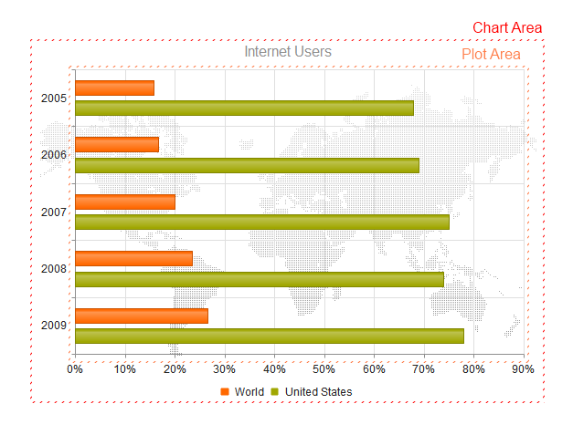
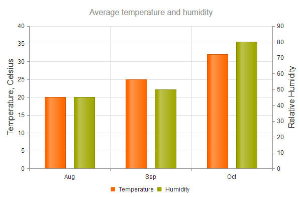
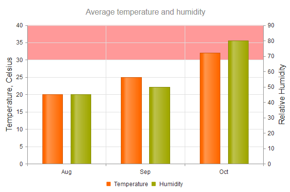


    

    


# Chart HtmlHelper Overview

The Telerik UI Chart HtmlHelper for {{ site.framework }} is a server-side wrapper for the Kendo UI Chart widget.

The Chart uses modern browser technologies to render high-quality data visualizations. All graphics are rendered on the client by using [Scalable Vector Graphics (SVG)](https://en.wikipedia.org/wiki/Scalable_Vector_Graphics) with a fallback to [Canvas](http://www.canvasgfx.com/). The Charts support a [set of series types]() such as Bar, Line, Area, Bullet, Pie, Scatter, Bubble, Polar, and other.

The Chart contains the following [building block elements]():

* Title
* Legend
* Chart Area
* Plot Area
* Axes
* Series

The following image displays the structure of the Chart.



* [Demo page for the Chart](https://demos.telerik.com/{{ site.platform }}/chart-api/index)

## Initializing the Chart

The following example demonstrates how to define a Bar Chart by using the Chart HtmlHelper.

```Razor
   @(Html.Kendo().Chart(Model)
      .Name("internetUsersChart") // The name of the Chart is mandatory. It specifies the "id" attribute of the widget.
      .Title("Internet Users")
      .Series(series => {
          series.Bar(model => model.Value) // Create a Bar Chart series bound to the "Value" property.
                .Name("United States");
      })
      .CategoryAxis(axis => axis
          .Categories(model => model.Year)
      )
    )
```
```Controller
    public ActionResult Index()
    {
        return View(ChartDataRepository.InternetUsers());
    }
```

## Basic Configuration

The following example demonstrates the basic configuration for the Line Chart HtmlHelper.

```
    @(Html.Kendo().Chart()
        .Name("chart")
        .Title("Gross domestic product growth \n /GDP annual %/")
        .Legend(legend => legend
            .Position(ChartLegendPosition.Bottom)
        )
        .ChartArea(chartArea => chartArea
            .Background("transparent")
        )
        .SeriesDefaults(seriesDefaults =>
            seriesDefaults.Line().Style(ChartSeriesStyle.Smooth)
        )
        .Series(series => {
            series.Line(new double[] { 3.907, 7.943, 7.848, 9.284, 9.263, 9.801, 3.890, 8.238, 9.552, 6.855 }).Name("India");
            series.Line(new double[] { 1.988, 2.733, 3.994, 3.464, 4.001, 3.939, 1.333, -2.245, 4.339, 2.727 }).Name("World");
            series.Line(new double[] { 4.743, 7.295, 7.175, 6.376, 8.153, 8.535, 5.247, -7.832, 4.3, 4.3 }).Name("Russian Federation");
            series.Line(new double[] { -0.253, 0.362, -3.519, 1.799, 2.252, 3.343, 0.843, 2.877, -5.416, 5.590 }).Name("Haiti");
        })
        .CategoryAxis(axis => axis
            .Categories("2002", "2003", "2004", "2005", "2006", "2007", "2008", "2009", "2010", "2011")
            .MajorGridLines(lines => lines.Visible(false))
        )
        .ValueAxis(axis => axis
            .Numeric().Labels(labels => labels.Format("{0}%"))
            .Line(line => line.Visible(false))
            .AxisCrossingValue(-10)
        )
        .Tooltip(tooltip => tooltip
            .Visible(true)
            .Format("{0}%")
        )
    )
```

You can also add a title to clearly indicate the role of the axis.

```
    @(Html.Kendo().Chart()
        .Name("chart")
        .Title("Average temperature and humidity")
        .Legend(legend => legend
            .Position(ChartLegendPosition.Bottom)
        )
        .Series(series => {
            series.Column(new double[] { 20, 25, 32 }).Name("Temperature").Axis("temperature");
            series.Column(new double[] { 45, 50, 80 }).Name("Humidity").Axis("humidity");
        })
        .CategoryAxis(axis => axis            
            .Categories("Aug", "Sep", "Oct")
            .AxisCrossingValue(0, 3)
        )
        .ValueAxis(axis => axis
            .Numeric()
            .Name("temperature")
            .Title(t=>t.Text("Temperature, Celsius"))
        )
        .ValueAxis(axis => axis
            .Numeric()
            .Name("humidity")
            .Title(t=>t.Text("Relative Humidity"))
        )
    )
```



The Chart enables you to configure each axis to display bands with different colors for predefined value ranges. The category index (zero-based) is used as a value for the category axis.

```
    .ValueAxis(axis => axis.Numeric()
        .Labels(labels => labels.Format("{0:N0}"))
        .MajorUnit(10000)
        .Max(70000)
        .Line(line => line.Visible(false))
        .PlotBands(bands => {
            bands.Add().From(10000).To(30000).Color("#c00").Opacity(0.3);
            bands.Add().From(30000).To(30500).Color("#c00").Opacity(0.8);
        })
    )
```



You may also need to apply global settings that affect all axes. In such cases, use [`AxisDefaults`]({{ AxisDefaults }}).

```
    .AxisDefaults(a=> a
        .Labels(l=>l.Font("16px Verdana"))
    )
```

## Functionality and Features

* [Data binding]()
* [Appearance]()

## Events

You can subscribe to all Chart [events](/api/chart). For a complete example on basic Chart events, refer to the [demo on using the events of the Chart](https://demos.telerik.com/{{ site.platform }}/chart-api/events).

### Handling by Handler Name

The following example demonstrates how to subscribe to events by a handler name.

```
    @(Html.Kendo().Chart<Kendo.Mvc.Examples.Models.ElectricityProduction>()
        .Name("chart")
        .Events(events => events
            .SeriesClick("onSeriesClick")
            .DataBound("onDataBound")
        )
    )

    <script>
        function onSeriesClick(e) {
            // Handle the seriesClick event
        }

        function onDataBound(e) {
            // Handle the dataBound event
        }
    </script>
```

### Handling by Handler Name

The following example demonstrates how to subscribe to events by a handler name.

```
    @(Html.Kendo().Chart<Kendo.Mvc.Examples.Models.ElectricityProduction>()
        .Name("chart")
        .Events(events => events
            .SeriesClick(@<text>
                function() {
                    // Handle the seriesClick event
                }
            </text>)
            .DataBound(@<text>
                function() {
                    // Handle the dataBound event
                }
            </text>)
        )
    )
```

## Referencing Existing Instances

To reference an existing Chart instance, use the [`jQuery.data()`](http://api.jquery.com/jQuery.data/) configuration option. Once a reference is established, use the [Chart client-side API](https://docs.telerik.com/kendo-ui/api/javascript/dataviz/ui/chart#methods) to control its behavior.

```
    // Place the following after the Chart for {{ site.framework }} declaration.
    <script>
        $(function() {
            // The Name() of the Chart is used to get its client-side instance.
            var chart = $("#internetUsersChart").data("kendoChart");
        });
    </script>
```


## See Also

* [Using the API of the Chart HtmlHelper for {{ site.framework }} (Demo)](https://demos.telerik.com/{{ site.platform }}/chart-api/index)
* [Basic Usage of the Bar Chart HtmlHelper for {{ site.framework }} (Demo)](https://demos.telerik.com/{{ site.platform }}/bar-charts/index)
* [Basic Usage of the Line Chart HtmlHelper for {{ site.framework }} (Demo)](https://demos.telerik.com/{{ site.platform }}/line-charts/index)
* [Server-Side API](/api/chart)
