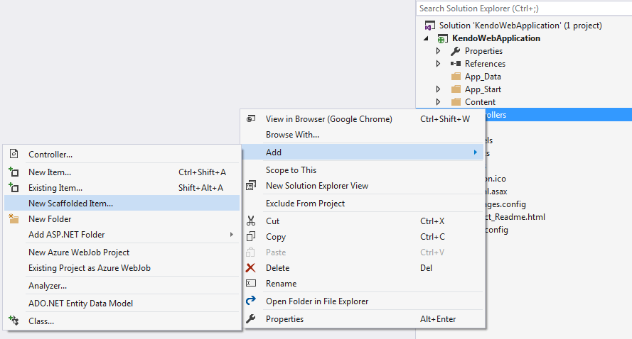

# Scaffolding

The Chart HtmlHelper for ASP.NET MVC enables you to use the Kendo UI Scaffolder Visual Studio extension.

> The Kendo UI Scaffolder will not include the required `UI for ASP.NET MVC` files to the project. To automatically include these files, use the [Telerik UI for ASP.NET MVC Visual Studio extensions](). To manually include these files, refer to [this article]().

To scaffold the Chart HtmlHelper for ASP.NET MVC:

1. Create a new ASP.NET MVC application. Include an Entity Framework Data Model and add `Telerik UI for ASP.NET MVC`. If you have already done so, you can move on to next step. Otherwise, follow the steps from the [**Getting Started** section of this article]().
1. Right-click the location where the Chart Controller has to be generated. Select **Add** > **New Scaffolded item...** from the displayed menu. In this example, you are going to generate it in the **Controllers** folder.

	

1. Select **Kendo UI Scaffolder** from the list of available Scaffolders.

	

1. Select the Kendo UI Chart to scaffold.

	

1. On the next screen which renders the **Model** and **Data Context** options, enter **Controller Name** and **View Name**.

	

1. The **Model Class** drop-down list contains all model types from the active project&mdash;this example will list products in the Chart. Select the **Product** entity.

	

1. From the **Data Context Class** drop-down, select the **Entity Framework Data Model** class (**NorthwindEntities**).

	

1. (Optional) In some scenarios it is convenient to use view model objects instead of the entities returned by Entity Framework. If this is the case, check the **Use an existing ViewModel** checkbox which loads a drop-down list similar to the first one. Select the **ViewModel**.
1. If you have not yet created it, add a new class to the `~/Models` folder. Name it `ProductViewModel`.

      ```C#
	public class ProductViewModel
      {
          public int ProductID { get; set; }
          public string ProductName { get; set; }
          public short? UnitsInStock { get; set; }
      }
      ```

1. Select the **ProductViewModel** class from the **ViewModel Class** DropDownList.

		> The names of the properties in the ViewModel have to be exactly the same as the corresponding ones in the Entity. Otherwise, the Kendo UI Scaffolder is not able to link them correctly.

		

1. Click the **Chart options** item on the left. Each field marked with an asterisk `*` is mandatory. The rest of the fields are optional.

	

	This screen contains the Chart functionalities that you can configure before scaffolding:
	* **Data Binding Type**&mdash;Remote or Local.
	* **Title**&mdash;Define the `Title` of the Chart.
	* **Show Tooltip**&mdash;Show the tooltip.
	* **Show Legend**&mdash;Show a legend. The available options are `Bottom`,`Top`, `Left`, and `Right`.

		

	* **Series Type**&mdash;Select the series type. Each series type shows different **Series Options** configuration.

		

	* **Add More Series**&mdash;Add one additional configuration panel for a series.

1. When you finish configuring the Chart, click **Add** at the bottom. As a result, the Chart Controller and the corresponding View are generated.

## See Also

* [Using the API of the Chart HtmlHelper for ASP.NET MVC (Demo)](https://demos.telerik.com/aspnet-mvc/chart-api/index)
* [Basic Usage of the Bar Chart HtmlHelper for ASP.NET MVC (Demo)](https://demos.telerik.com/aspnet-mvc/bar-charts/index)
* [Basic Usage of the Line Chart HtmlHelper for ASP.NET MVC (Demo)](https://demos.telerik.com/aspnet-mvc/line-charts/index)
* [Server-Side API](/api/chart)
