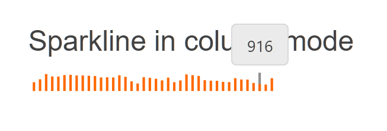

# Getting Started with the Sparkline

This tutorial explains how to set up a basic Telerik UI for {{ site.framework }} Sparkline and highlights the major steps in the configuration of the component.

You will initialize a Sparkline and learn how to change its display type. Then, you can run the sample code in [Telerik REPL](https://netcorerepl.telerik.com/) and continue exploring the component.

 

@[template](/_contentTemplates/core/getting-started-prerequisites.md#repl-component-gs-prerequisites)

## 1. Prepare the CSHTML File

@[template](/_contentTemplates/core/getting-started-directives.md#gs-adding-directives)

Optionally, you can structure the document by adding the desired HTML elements like headings, divs, paragraphs, and others.

```HtmlHelper
@using Kendo.Mvc.UI

<h4>Sparkline in column mode</h4>

<p>

</p>
```

```TagHelper
@addTagHelper *, Kendo.Mvc

<h4>Sparkline in column mode</h4>

<p>

</p>
```


## 2. Initialize the Sparkline

Use the Sparkline HtmlHelper or TagHelper to add the component to a page:

* The `Name()` configuration method is mandatory as its value is used for the `id` attribute of the Sparkline element.
* The `Data()` option allows you to pass the content.
* The `Type()` configuration allows changing the display mode.

```HtmlHelper
@using Kendo.Mvc.UI

@{
    var pressureData = new double[] {
                936, 968, 1025, 999, 998, 1014, 1017, 1010, 1010, 1007,
                1004, 988, 990, 988, 1012, 995, 946, 922, 991, 984,
                974, 956, 986, 936, 955, 1021, 1013, 1005, 958, 953,
                952, 940, 937, 980, 966, 965, 928, 916, 910, 980
    };
}

<h4>Sparkline in column mode</h4>

<p>
    @(Html.Kendo().Sparkline()
        .Name("sparkline")
        .Data(pressureData)
    )
</p>
```

```TagHelper
@addTagHelper *, Kendo.Mvc

@{
    var pressureData = new double[] {
                936, 968, 1025, 999, 998, 1014, 1017, 1010, 1010, 1007,
                1004, 988, 990, 988, 1012, 995, 946, 922, 991, 984,
                974, 956, 986, 936, 955, 1021, 1013, 1005, 958, 953,
                952, 940, 937, 980, 966, 965, 928, 916, 910, 980
    };
}

<h4>Sparkline in column mode</h4>

<p>
    <kendo-sparkline name="sparkline" data="pressureData">
    </kendo-sparkline>
</p>
```


## 3. Change the display mode to Column

The next step is to configure the Sparkline to change its mode.

```HtmlHelper
@using Kendo.Mvc.UI

@{
    var pressureData = new double[] {
                936, 968, 1025, 999, 998, 1014, 1017, 1010, 1010, 1007,
                1004, 988, 990, 988, 1012, 995, 946, 922, 991, 984,
                974, 956, 986, 936, 955, 1021, 1013, 1005, 958, 953,
                952, 940, 937, 980, 966, 965, 928, 916, 910, 980
    };
}

<h4>Sparkline in column mode</h4>

<p>
    @(Html.Kendo().Sparkline()
        .Name("sparkline")
        .Data(pressureData)
        .Type(SparklineType.Column)
    )
</p>
```

```TagHelper
@addTagHelper *, Kendo.Mvc

@{
    var pressureData = new double[] {
                936, 968, 1025, 999, 998, 1014, 1017, 1010, 1010, 1007,
                1004, 988, 990, 988, 1012, 995, 946, 922, 991, 984,
                974, 956, 986, 936, 955, 1021, 1013, 1005, 958, 953,
                952, 940, 937, 980, 966, 965, 928, 916, 910, 980
    };
}

<h4>Sparkline in column mode</h4>

<p>
    <kendo-sparkline name="sparkline" data="pressureData"
     type="SparklineType.Column">
    </kendo-sparkline>
</p>
```



## 4. (Optional) Reference Existing Sparkline Instances

You can reference the Sparkline instances that you have created and build on top of their existing configuration:

1. Use the `id` attribute of the component instance to establish a reference.

    ```JS script
    <script>
        var sparklineReference = $("#sparkline").data("kendoSparkline"); // sparklineReference is a reference to the existing sparkline instance of the helper.
    </script>
    ```

1. Use the [Sparkline client-side API](https://docs.telerik.com/kendo-ui/api/javascript/dataviz/ui/sparkline) to control the behavior of the widget. In this example, you will use the `refresh` method to reset the sparkline content.

    ```JS script
    <script>
        var sparklineReference = $("#sparkline").data("kendoSparkline"); // sparklineReference is a reference to the existing timeSparkline instance of the helper.
        var view = sparklineReference.refresh(); 
    </script>
    ```


## Explore this Tutorial in REPL

You can continue experimenting with the code sample above by running it in the Telerik REPL server playground:

* [Sample code with the Sparkline HtmlHelper](https://netcorerepl.telerik.com/GeOlOhwl53oBJpMY12)
* [Sample code with the Sparkline TagHelper](https://netcorerepl.telerik.com/GoOPuMOq42UQULLa37)



## Next Steps

* [Configure the Axes]()

## See Also

* [Basic Usage of the Sparkline for {{ site.framework }} (Demo)](https://demos.telerik.com/{{ site.platform }}/sparklines)
* [Client-Side API of the Sparkline](https://docs.telerik.com/kendo-ui/api/javascript/dataviz/ui/sparkline)
* [Server-Side API of the Sparkline](/api/sparkline)
* [Knowledge Base Section](/knowledge-base)
