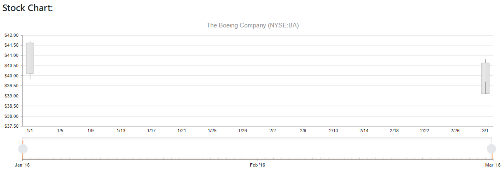

# Getting Started with the StockChart

This tutorial explains how to set up a basic Telerik UI for {{ site.framework }} StockChart and highlights the major steps in the configuration of the component.

After completing this guide, you will achieve the following result:

 

## 1. Prepare the CSHTML File

@[template](/_contentTemplates/core/getting-started-prerequisites.md#component-gs-prerequisites)

Optionally, you can structure the document by adding the desired HTML elements like headings, divs, paragraphs, and others.

```HtmlHelper
    @using Kendo.Mvc.UI
    <h4>StockChart with a placeholder</h4>
    <div>
    
    </div>
```

```TagHelper
    @addTagHelper *, Kendo.Mvc
    <h4>StockChart with a placeholder</h4>
    <div>
    
    </div>
```


## 2. Declare the View Model

Declare the `StockDataPoint` view model. The model must have a property field that represents the associated date of the entries. In this tutorial, this is the `Date` field.

```C#
    public class StockDataPoint
    {
        public DateTime Date { get; set; }

        public decimal Close { get; set; }

        public long Volume { get; set; }

        public decimal Open { get; set; }

        public decimal High { get; set; }

        public decimal Low { get; set; }

        public string Symbol { get; set; }
    }
```

## 3. Initialize the StockChart

Use the StockChart HtmlHelper or TagHelper to add the component to a page and set some of its options.

* Use the `Name()` configuration method to assign a name to the instance of the helper&mdash;this is mandatory as its value is used for the `id` and the `name` attributes of the StockChart element.
* Add the `DataSource()` configuration option and set the `Read` endpoint.
* Configure the `Date()` field to ensure that the date field is bound accordingly. 
* Incorporate the `Series()` configuration and explicitly configure a `CandleStick()` chart series option. In order to correctly bind the data to the respective StockChart properties.

```HtmlHelper
    @(Html.Kendo().StockChart<StockDataPoint>()
         .Name("stockChart")
         .Title("The Boeing Company (NYSE:BA)")
         .DataSource(ds => ds.Read(read => read
             .Action("_BoeingStockData", "Home")
         ))
         .DateField("Date")
         .Series(series =>
         {
             series.Candlestick(s => s.Open, s => s.High, s => s.Low, s => s.Close);
         })
    )
```


```TagHelper
    <kendo-stockchart name="stockChart" date-field="Date">
        <chart-title text=" The Boeing Company (NYSE:BA)"></chart-title>
        <datasource>
            <transport>
                <read  url="@Url.Action("_BoeingStockData", "Home")"/>
            </transport>
            <schema>
                <model>
                    <fields>
                        <field name="Date" type="date"></field>
                        <field name="Close" type="number"></field>
                        <field name="Volume" type="number"></field>
                        <field name="Open" type="number"></field>
                        <field name="High" type="number"></field>
                        <field name="Low" type="number"></field>
                        <field name="Symbol" type="string"></field>
                    </fields>
                </model>
            </schema>
        </datasource>
        <series>
            <series-item type="ChartSeriesType.Candlestick" open-field="Open" high-field="High" low-field="Low"                 close-field="Close">
            </series-item>
        </series>
    </kendo-stockchart>
```


## 4. Add the StockChart Navigator

To add an additional pane that is placed at the bottom of the chart and can be used to change the date interval in the main panes, use the `Navigator()` option.

```HtmlHelper
    @(Html.Kendo().StockChart<StockDataPoint>()
        .Name("stockChart")
        .Title("The Boeing Company (NYSE:BA)")
        .DataSource(ds => ds.Read(read => read
            .Action("_BoeingStockData", "Home")
        ))
        .DateField("Date")
        .Series(series =>
         {
             series.Candlestick(s => s.Open, s => s.High, s => s.Low, s => s.Close);
         })
        .Navigator(nav => nav
          .Series(series =>
          {
              series.Area(s => s.Volume);
          })
        )
    )
```


```TagHelper
    <kendo-stockchart name="stockChart" date-field="Date">
        <chart-title text=" The Boeing Company (NYSE:BA)"></chart-title>
        <datasource>
            <transport>
                <read  url="@Url.Action("_BoeingStockData", "Home")"/>
            </transport>
            <schema>
                <model>
                    <fields>
                        <field name="Date" type="date"></field>
                        <field name="Close" type="number"></field>
                        <field name="Volume" type="number"></field>
                        <field name="Open" type="number"></field>
                        <field name="High" type="number"></field>
                        <field name="Low" type="number"></field>
                        <field name="Symbol" type="string"></field>
                    </fields>
                </model>
            </schema>
        </datasource>
        <series>
            <series-item type="ChartSeriesType.Candlestick" open-field="Open" high-field="High" low-field="Low" close-field="Close">
            </series-item>
        </series>
        <navigator>
            <navigator-series>
                <series-item type="ChartSeriesType.Area" field="Volume"></series-item>
            </navigator-series>
        </navigator>
    </kendo-stockchart>
```


## 5. Declare the Read Action

In the `Home` controller, declare the `RemoteDataBindingData` action that you set to the DataSource `Read` configuration in step `3`.


```Controller
    public IActionResult _BoeingStockData()
    {
        var data = new List<StockDataPoint>()
        {
            new StockDataPoint {
                Date= new DateTime(2016,1,1),
                Open= 41.62M,
                High= 41.69M,
                Low= 39.81M,
                Close= 40.12M,
                Volume= 2632000
            },
            new StockDataPoint {
                Date= new DateTime(2016,3,1),
                Open= 40.62M,
                High= 39.69M,
                Low= 40.81M,
                Close= 39.12M,
                Volume= 2631986
            }

        };

        return Json(data);
    }
```

```Controller
    public ActionResult _BoeingStockData()
    {
        var data = new List<StockDataPoint>()
        {
            new StockDataPoint {
                Date= new DateTime(2016,1,1),
                Open= 41.62M,
                High= 41.69M,
                Low= 39.81M,
                Close= 40.12M,
                Volume= 2632000
            },
            new StockDataPoint {
                Date= new DateTime(2016,3,1),
                Open= 40.62M,
                High= 39.69M,
                Low= 40.81M,
                Close= 39.12M,
                Volume= 2631986
            }

        };

        return Json(data, JsonRequestBehavior.AllowGet);
    }
```


## 6. Handle the StockChart Events

The StockChart [exposes various events](/api/kendo.mvc.ui.fluent/stockcharteventbuilder)[exposes various events](/api/kendo.mvc.ui.fluent/charteventbuilder) that you can handle and further customize the functionality of the component. In this tutorial, you will use the `DataBound` event of the StockChart.

```HtmlHelper
    @(Html.Kendo().StockChart<StockDataPoint>()
        .Name("stockChart")
        .Title("The Boeing Company (NYSE:BA)")
        .Events((Action<Kendo.Mvc.UI.Fluent.StockChartEventBuilder>)(e => e.DataBound("onDataBound")))
        .DataSource(ds => ds.Read(read => read
            .Action("_BoeingStockData", "Home")
        ))
        .DateField("Date")
        .Series(series =>
         {
             series.Candlestick(s => s.Open, s => s.High, s => s.Low, s => s.Close);
         })
        .Navigator(nav => nav
          .Series(series =>
          {
              series.Area(s => s.Volume);
          })
        )
    )
```


```TagHelper
    <kendo-stockchart name="stockChart" date-field="Date" on-data-bound="onDataBound">
        <chart-title text=" The Boeing Company (NYSE:BA)"></chart-title>
        <datasource>
            <transport>
                <read  url="@Url.Action("_BoeingStockData", "Home")"/>
            </transport>
            <schema>
                <model>
                    <fields>
                        <field name="Date" type="date"></field>
                        <field name="Close" type="number"></field>
                        <field name="Volume" type="number"></field>
                        <field name="Open" type="number"></field>
                        <field name="High" type="number"></field>
                        <field name="Low" type="number"></field>
                        <field name="Symbol" type="string"></field>
                    </fields>
                </model>
            </schema>
        </datasource>
        <series>
            <series-item type="ChartSeriesType.Candlestick" open-field="Open" high-field="High" low-field="Low" close-field="Close">
            </series-item>
        </series>
        <navigator>
            <navigator-series>
                <series-item type="ChartSeriesType.Area" field="Volume"></series-item>
            </navigator-series>
        </navigator>
    </kendo-stockchart>
```

```JavaScript
    <script>
        function onDataBound(e) {
            console.log("StockChart data bound");
        }
    </script>
```

## 7. (Optional) Reference Existing StockChart Instances

To use the client-side API of the StockChart and build on top of its initial configuration, you need a reference to the StockChart instance. Once you get a valid reference, you can call the respective API methods:

1. Use the `.Name()` (`id` attribute) of the component instance to get a reference.

    ```JS script
        <script>
            var stockchartReference = $("#stockChart").data("kendoStockChart"); // stockchartReference is a reference to the existing instance of the helper.
        </script>
    ```

1. Use the [StockChart client-side API](https://docs.telerik.com/kendo-ui/api/javascript/dataviz/ui/stock-chart#methods) to control the behavior of the widget. In this example, you will use the [`exportPDF()`](https://docs.telerik.com/kendo-ui/api/javascript/dataviz/ui/stock-chart/methods/exportpdf) method to export the StockChart to a PDF file programmatically.

    ```JS script
        <script>
            $(document).ready(function () {
                var stockchartReference = $("#stockChart").data("kendoStockChart"); // stockchartReference is a reference to the existing instance of the helper.
                
                stockchartReference.exportPDF(); // Export the StockChart to a PDF file.
            })
        </script>
    ```

## Next Steps

* [Binding the StockChart to Data]()
* [Configuring the StockChart with Multiple Graph Panes]()

## See Also

* [Basic Usage of the StockChart for {{ site.framework }} (Demo)](https://demos.telerik.com/{{ site.platform }}/financial)
* [Client-Side API of the StockChart](https://docs.telerik.com/kendo-ui/api/javascript/dataviz/ui/stock-chart)
* [Server-Side API of the StockChart](/api/stockchart)
* [Knowledge Base Section](/knowledge-base)