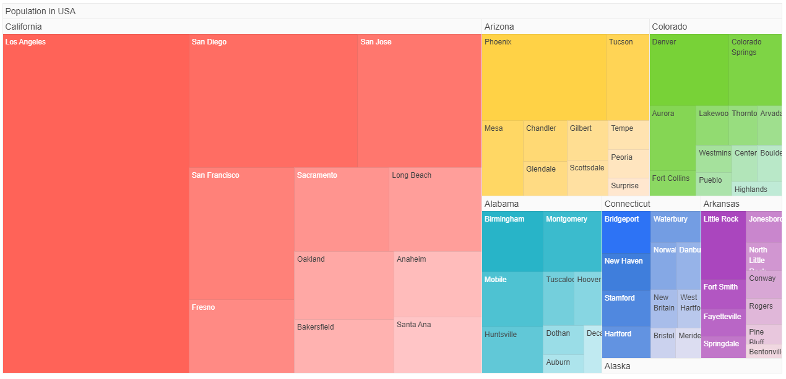

# Getting Started with the TreeMap

This tutorial explains how to set up a basic Telerik UI for {{ site.framework }} TreeMap and highlights the major steps in the configuration of the component.

You will initialize a TreeMap and learn how to resize it. Then, you will see how to attach an event handler to the component. 

Finally, you can run the sample code in [Telerik REPL](https://netcorerepl.telerik.com/) and continue exploring the component.

 

@[template](/_contentTemplates/core/getting-started-prerequisites.md#repl-component-gs-prerequisites)

## 1. Prepare the CSHTML File

@[template](/_contentTemplates/core/getting-started-directives.md#gs-adding-directives)

Optionally, you can structure the document by adding the desired HTML elements like headings, divs, paragraphs, and others.

```HtmlHelper
@using Kendo.Mvc.UI
<h4>TreeMap with event handler</h4>
<p>
</p>
```

```TagHelper
@addTagHelper *, Kendo.Mvc
<h4>TreeMap with event handler</h4>
<p>
</p>
``` 


## 2. Initialize the TreeMap

Use the TreeMap HtmlHelper or TagHelper to add the component to a page:

* The `Name()` configuration method is mandatory as its value is used for the `id` and the `name` attributes of the TreeMap element.
* The `ValueField()` configuration method sets the data item field which contains the tile value.
* The `TextField()` configuration method sets the data item field which contains the tile title.
* The `ColorField()` configuration method sets the data item field which contains the tile color.

```HtmlHelper
@using Kendo.Mvc.UI
<h4>TreeMap with event handler</h4>

<p>
    @(Html.Kendo().TreeMap()
          .Name("treeMap")
          .ValueField("value")
          .TextField("name")
          .ColorField("color")
    )
</p>

<script>
    $(document).ready(function(){
        var dataSource = new kendo.data.HierarchicalDataSource({
            data: [{
                name: "foo",
                value: 1,
                items: [{
                    name: "bar",
                    value: 1
                },{
                    name: "baz",
                    value: 1
                }]
            }],
            schema: {
                model: {
                    children: "items"
                }
            }
        });     

        var treeMap = $("#treeMap").getKendoTreeMap();
        treeMap.setDataSource(dataSource);
    })
</script>
```

```TagHelper
@addTagHelper *, Kendo.Mvc
<h4>TreeMap with event handler</h4>

<p>
    <kendo-treemap value-field="value" 
    			   text-field="name" 
    			   name="treeMap">
    </kendo-treemap>
</p>

<script>
    $(document).ready(function(){
        var dataSource = new kendo.data.HierarchicalDataSource({
            data: [{
                name: "foo",
                value: 1,
                items: [{
                    name: "bar",
                    value: 1
                },{
                    name: "baz",
                    value: 1
                }]
            }],
            schema: {
                model: {
                    children: "items"
                }
            }
        });         

        var treeMap = $("#treeMap").getKendoTreeMap();
        treeMap.setDataSource(dataSource);
    })
</script>
```


## 3. Change the Theme Configuration of the TreeMap

The next step is to configure Theme configuration. You can do that by using the `Theme()` configuration.

```HtmlHelper
@using Kendo.Mvc.UI
<h4>TreeMap with event handler</h4>

<p>
    @(Html.Kendo().TreeMap()
          .Name("treeMap")
          .ValueField("value")
          .TextField("name")
          .ColorField("color")
          .Theme("BlueOpal")
    )
</p>

<script>
    $(document).ready(function(){
        var dataSource = new kendo.data.HierarchicalDataSource({
            data: [{
                name: "foo",
                value: 1,
                items: [{
                    name: "bar",
                    value: 1
                },{
                    name: "baz",
                    value: 1
                }]
            }],
            schema: {
                model: {
                    children: "items"
                }
            }
        });     

        var treeMap = $("#treeMap").getKendoTreeMap();
        treeMap.setDataSource(dataSource);
    })
</script>
```

```TagHelper
@addTagHelper *, Kendo.Mvc
<h4>TreeMap with event handler</h4>

<p>
    <kendo-treemap value-field="value" 
    			   text-field="name" 
    			   name="treeMap"
                   theme="BlueOpal">
    </kendo-treemap>
</p>

<script>
    $(document).ready(function(){
        var dataSource = new kendo.data.HierarchicalDataSource({
            data: [{
                name: "foo",
                value: 1,
                items: [{
                    name: "bar",
                    value: 1
                },{
                    name: "baz",
                    value: 1
                }]
            }],
            schema: {
                model: {
                    children: "items"
                }
            }
        });     

        var treeMap = $("#treeMap").getKendoTreeMap();
        treeMap.setDataSource(dataSource);
    })
</script>
```


## 4. Handle a TreeMap Event

The Map exposes a `DataBound()` event that you can handle and assign specific functions to the component. In this tutorial, you will use the `DataBound()` event to display a message when data for the component is bounded.

```HtmlHelper
@using Kendo.Mvc.UI
<h4>TreeMap with event handler</h4>

<p>
    @(Html.Kendo().TreeMap()
          .Name("treeMap")
          .ValueField("value")
          .TextField("name")
          .ColorField("color")
          .Theme("BlueOpal")
          .Events(e => e.DataBound("onDataBound"))
    )
</p>

<script>
    $(document).ready(function(){
        var dataSource = new kendo.data.HierarchicalDataSource({
            data: [{
                name: "foo",
                value: 1,
                items: [{
                    name: "bar",
                    value: 1
                },{
                    name: "baz",
                    value: 1
                }]
            }],
            schema: {
                model: {
                    children: "items"
                }
            }
        });     

        var treeMap = $("#treeMap").getKendoTreeMap();
        treeMap.setDataSource(dataSource);
    })

    function onDataBound(){
        console.log("Data bound");
    }
</script>
```

```TagHelper
@addTagHelper *, Kendo.Mvc
<h4>TreeMap with event handler</h4>

<p>
    <kendo-treemap value-field="value" 
    			   text-field="name" 
    			   name="treeMap"
                   theme="BlueOpal"
                   on-data-bound="onDataBound">
    </kendo-treemap>
</p>

<script>
    $(document).ready(function(){
        var dataSource = new kendo.data.HierarchicalDataSource({
            data: [{
                name: "foo",
                value: 1,
                items: [{
                    name: "bar",
                    value: 1
                },{
                    name: "baz",
                    value: 1
                }]
            }],
            schema: {
                model: {
                    children: "items"
                }
            }
        });     

        var treeMap = $("#treeMap").getKendoTreeMap();
        treeMap.setDataSource(dataSource);
    })

    function onDataBound(){
        console.log("Data bound");
    }
</script>
```


For more examples, refer to the [demo on using the events of the TreeMap](https://demos.telerik.com/{{ site.platform }}/treemap/events).

## 5. (Optional) Reference Existing TreeMap Instances

You can reference the Map instances that you have created and build on top of their existing configuration:

1. Use the `id` attribute of the component instance to establish a reference.

    ```script
    <script>
        var treeMap = $("#treeMap").getKendoTreeMap(); // treeMap is a reference to the existing treeMap instance of the helper.
    </script>
    ```
1. Use the [TreeMap client-side API](https://docs.telerik.com/kendo-ui/api/javascript/ui/treemap#methods) to control the behavior of the widget. In this example, you will use the `resize` method to resize the element of the TreeMap.
    ```script
    <script>
        $("#treeMap").css("width", "800px"); // Set new width to the element.
        var treeMap = $("#treeMap").getKendoTreeMap(); // treeMap is a reference to the existing treeMap instance of the helper.
        treeMap.resize();// Apply the new width.
    </script>
    ```
For more information on referencing specific helper instances, see the [Methods and Events]() article.

## Explore this Tutorial in REPL
You can continue experimenting with the code sample above by running it in the Telerik REPL server playground:
* [Sample code with the TreeMap HtmlHelper](https://netcorerepl.telerik.com/wSubOGFH49UfEYLj20)

* [Sample code with the TreeMap TagHelper](https://netcorerepl.telerik.com/QSuFaGbR498IScab35)


## Next Steps
* [Use the TreeMap in Razor Pages](https://docs.telerik.com/aspnet-core/html-helpers/charts/treemap/razor-pages)

## See Also
* [Using the API of the Map for {{ site.framework }} (Demo)](https://demos.telerik.com/{{ site.platform }}/treemap/api)
* [Client-Side API of the TreeMap](https://docs.telerik.com/kendo-ui/api/javascript/ui/treemap)
* [Server-Side API of the TreeMap](/api/map)
* [Knowledge Base Section](/knowledge-base)