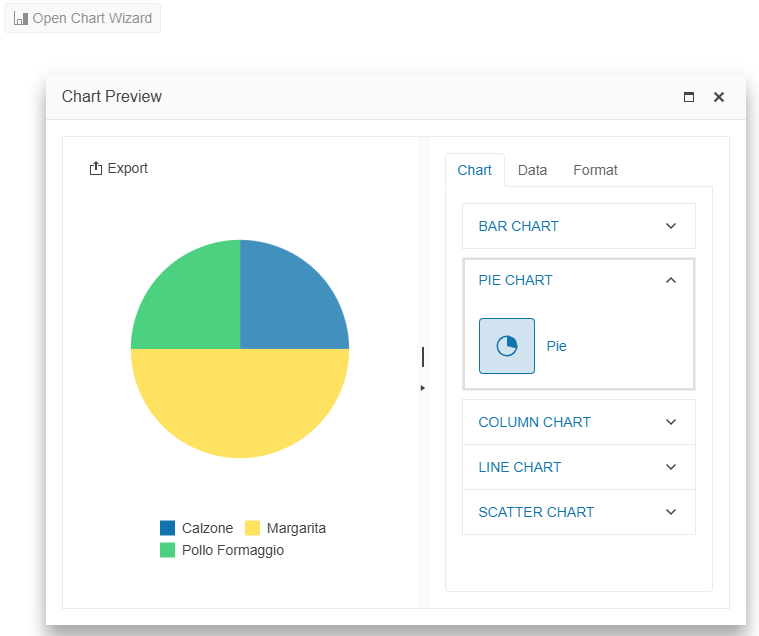

# Getting Started with the Chart Wizard

This tutorial explains how to set up the Telerik UI for {{ site.framework }} Chart Wizard and goes through the steps in the configuration of the component.

The Chart Wizard component provides a user-friendly interface that allows you to create and customize various chart visualizations using data from external sources or from a [Grid](). 

You will initialize a Chart Wizard component and bind it to a remote service. Then, you will configure different export and window options for the component. Finally, you can run the sample code in [Telerik REPL](https://netcorerepl.telerik.com/) and continue exploring the components.

After completing this guide, you will achieve the following results:

 

@[template](/_contentTemplates/core/getting-started-prerequisites.md#component-gs-prerequisites)

## 1. Prepare the CSHTML File

@[template](/_contentTemplates/core/getting-started-directives.md#gs-adding-directives)

Optionally, you can structure the document by adding the desired HTML elements like headings, divs, paragraphs, and others.

```HtmlHelper
    @using Kendo.Mvc.UI

    <h4>Generate charts using the Chart Wizard</h4>
    <div>

    </div>
```

```TagHelper
    @addTagHelper *, Kendo.Mvc

    <h4>Generate charts using the Chart Wizard</h4>
    <div>

    </div>
```


## 2. Initialize the Chart Wizard

Use the Chart Wizard HtmlHelper or TagHelper to configure the component.

* The `Name()` configuration method is mandatory as its value is used for the `id` and the `name` attributes of the Chart Wizard element.
* The `DataColumns()` option specifies the Model properties that will be available in the chart configurator to set up the chart series and axes.
* The `DataSource()` configuration connects the component to a dataset retrieved from a remote endpoint.

```HtmlHelper
    @(Html.Kendo().ChartWizard<Product>()
        .Name("chartwizard")
        .DataSource(dataSource => dataSource
            .Read(read => read.Action("Read", "Home"))
        )
        .DataColumns(columns =>
        {
            columns.Add().Field(f => f.ProductName).Title("Product Name");
            columns.Add().Field(f => f.Quantity);
        })
    )
```

```TagHelper
    @addTagHelper *, Kendo.Mvcl

    <kendo-chartwizard name="chartwizard">
        <datasource type="DataSourceTagHelperType.Ajax">
            <schema data="Data" total="Total" errors="Errors">
                <model>
                    <fields>
                        <field name="ProductName" type="string"></field>
                        <field name="Quantity" type="number"></field>
                    </fields>
                </model>
            </schema>
            <transport>
                <read url="@Url.Action("Read", "Home")"/>
            </transport>
        </datasource>
        <data-columns>
            <data-column field="ProductName" title="Product Name"/>
            <data-column field="Quantity" />
        </data-columns>
    </kendo-chartwizard>
```


## 3. Bind the Chart Wizard Component to Its Data

Create a `Product` Model and define an Action method that returns the data collection.

```Model
    public class Product
    {
        public int ProductID { get; set; }
        public string ProductName { get; set; }
        public int Quantity { get; set; }
    }
```
```C# HomeController.cs
    public JsonResult Read([DataSourceRequest] DataSourceRequest request)
    {
        return Json(ProductsData().ToDataSourceResult(request));
    }

    private static List<Product> ProductsData()
    {
        return new List<Product>()
        {
            new Product { ProductID = 216321, ProductName = "Calzone", Quantity = 1 },
            new Product { ProductID = 546897, ProductName = "Margarita", Quantity = 2 },
            new Product { ProductID = 456231, ProductName = "Pollo Formaggio", Quantity = 1 }
        };
    }
```

## 4. Configure the Export Options

The Chart Wizard component allows you to export the generated chart in `PDF`, `JPG`, or `PNG` formats.

In this step, configure the paper size of the PDF file and the dimensions of the exported images.

```HtmlHelper
    @(Html.Kendo().ChartWizard<Product>()
        .Name("chartwizard")
        .ExportOptions(export =>
        {
            export.Pdf(pdf => pdf.PaperSize("A4"));
            export.Image(image => image.Width(1900).Height(1200));
        })
        .DataSource(dataSource => dataSource
            .Read(read => read.Action("Read", "Home"))
        )
        .DataColumns(columns =>
        {
            columns.Add().Field(f => f.ProductName).Title("Product Name");
            columns.Add().Field(f => f.Quantity);
        })
    )
```

```TagHelper
    @addTagHelper *, Kendo.Mvcl

    <kendo-chartwizard name="chartwizard">
        <export-options>
            <pdf paper-size="A4"/>
            <image width="1900" height="1200"/>
        </export-options>
        <datasource type="DataSourceTagHelperType.Ajax">
            <schema data="Data" total="Total" errors="Errors">
                <model>
                    <fields>
                        <field name="ProductName" type="string"></field>
                        <field name="Quantity" type="number"></field>
                    </fields>
                </model>
            </schema>
            <transport>
                <read url="@Url.Action("Read", "Home")"/>
            </transport>
        </datasource>
        <data-columns>
            <data-column field="ProductName" title="Product Name"/>
            <data-column field="Quantity" />
        </data-columns>
    </kendo-chartwizard>
```


## 5. Configure the Window Options

You can use the configuration options of the [Window]() component to customize the appearance of the window that holds the Chart Wizard.

```HtmlHelper
    @(Html.Kendo().ChartWizard<Product>()
        .Name("chartwizard")
        .ExportOptions(export =>
        {
            export.Pdf(pdf => pdf.PaperSize("A4"));
            export.Image(image => image.Width(1900).Height(1200));
        })
        .Window(window =>
        {
            window.Modal(false);
            window.Actions(actions => actions
                .Minimize()
                .Maximize()
                .Close()
            );
            window.Resizable(resizable => resizable.Enabled(true));
            window.Height(550);
            window.Width(700);
        })
        .DataSource(dataSource => dataSource
            .Read(read => read.Action("Read", "Home"))
        )
        .DataColumns(columns =>
        {
            columns.Add().Field(f => f.ProductName).Title("Product Name");
            columns.Add().Field(f => f.Quantity);
        })
    )
```

```TagHelper
    @addTagHelper *, Kendo.Mvcl

    @{
        string[] windowActions = new string[] { "Minimize", "Maximize", "Close" };
    }

    <kendo-chartwizard name="chartwizard">
        <export-options>
            <pdf paper-size="A4"/>
            <image width="1900" height="1200"/>
        </export-options>
        <window modal="false" width="700" height="550" actions="windowActions"></window>
        <datasource type="DataSourceTagHelperType.Ajax">
            <schema data="Data" total="Total" errors="Errors">
                <model>
                    <fields>
                        <field name="ProductName" type="string"></field>
                        <field name="Quantity" type="number"></field>
                    </fields>
                </model>
            </schema>
            <transport>
                <read url="@Url.Action("Read", "Home")"/>
            </transport>
        </datasource>
        <data-columns>
            <data-column field="ProductName" title="Product Name"/>
            <data-column field="Quantity" />
        </data-columns>
    </kendo-chartwizard>
```


## 6. (Optional) Reference Existing Chart Wizard Instances

Referencing existing component instances allows you to build on top of their configuration. To reference an existing Chart Wizard instance, use the [`jQuery.data()`](http://api.jquery.com/jQuery.data/) method.

1. Use the `Name()` option of the component to establish a reference.

    ```JS script
        <script>
            var chartWizardReference = $("#chartwizard").data("kendoChartWizard"); // chartWizardReference is a reference to the existing instance of the helper.
        </script>
    ```

1. Use the [Chart Wizard client-side API](https://docs.telerik.com/kendo-ui/api/javascript/ui/chartwizard#methods) to control the behavior of the component. In this example, you will see how to open the Chart Wizard (for example, when a button is clicked).

    ```HtmlHelper
        @(Html.Kendo().Button()
            .Name("btn")
            .Content("Open Chart Wizard")
            .Events(ev => ev.Click("onBtnClick")))
        
        <script>
            function onBtnClick() {
                var chartWizardReference = $("#chartwizard").data("kendoChartWizard");
                chartWizardReference.open();
            }
        </script>
    ```
    
    ```TagHelper
        @addTagHelper *, Kendo.Mvc

        <kendo-button name="btn" on-click="onBtnClick">
            Open Chart Wizard
        </kendo-button>

        <script>
            function onBtnClick() {
                var chartWizardReference = $("#chartwizard").data("kendoChartWizard");
                chartWizardReference.open();
            }
        </script>
    ```
    

For more information on referencing specific helper instances, see the [Methods and Events]() article.

## Next Steps

* [Configuring the Chart Wizard Export Options]()
* [Customizing the Window of the Chart Wizard]()
* [Handling JavaScript Events of the User Interactions]() 

## See Also

* [Using the API of the Chart Wizard for {{ site.framework }} (Demo)](https://demos.telerik.com/{{ site.platform }}/chartwizard/api)
* [Client-Side API of the Chart Wizard](https://docs.telerik.com/kendo-ui/api/javascript/ui/chartwizard)
* [Server-Side API of the Chart Wizard](/api/chartwizard)

* [Server-Side API of the Chart Wizard TagHelper](/api/taghelpers/chartwizard)
