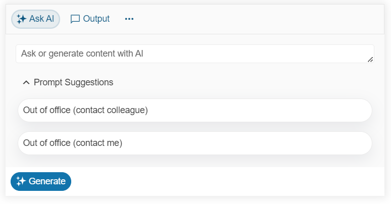

# Getting Started with the AIPrompt

This tutorial explains how to set up the Telerik UI for {{ site.framework }} AIPrompt and goes through the steps in the configuration of the component.

You will initialize an AIPrompt component with `Prompt`, `Output`, and `Commands` views and configure prompt suggestions options. Next, you will create a custom command that translates the output in Spanish. Then, you will use the template options to enhance the prompt suggestion cards and learn how to handle the JavaScript events of the component. Finally, you can run the sample code in [Telerik REPL](https://netcorerepl.telerik.com/) and continue exploring the components.

After completing this guide, you will achieve the following results:

 

@[template](/_contentTemplates/core/getting-started-prerequisites.md#component-gs-prerequisites)

## 1. Prepare the CSHTML File

@[template](/_contentTemplates/core/getting-started-directives.md#gs-adding-directives)

Optionally, you can structure the document by adding the desired HTML elements like headings, divs, paragraphs, and others.

```HtmlHelper
    @using Kendo.Mvc.UI

    <h4>Generated templates with AI</h4>
    <div>

    </div>
```

```TagHelper
    @addTagHelper *, Kendo.Mvc

    <h4>Generated templates with AI</h4>
    <div>

    </div>
```


## 2. Initialize the AIPrompt

Use the AIPrompt HtmlHelper or TagHelper to configure the component.

* The `Name()` configuration method is mandatory as its value is used for the `id` and the `name` attributes of the AIPrompt element.
* The `Views()` configuration specifies the component views. For example, `Prompt`, `Output`, and `Commands` views.
* The `PromptCommands()` option sets the desired custom commands of the `Commands` view.

```HtmlHelper
    @(Html.Kendo().AIPrompt()
        .Name("aiprompt")
        .Views(views =>
        {
            views.Add().Type(ViewType.Prompt);
            views.Add().Type(ViewType.Output);
            views.Add().Type(ViewType.Commands)
            .PromptCommands(commands =>
            {
                commands.Add().Id("1").Text("Translate in Spanish").Icon("edit-tools");
            });
        })
    )

```

```TagHelper
    @addTagHelper *, Kendo.Mvcl

    <kendo-aiprompt name="aiprompt">
        <aiprompt-views>
            <aiprompt-view type="ViewType.Prompt"></aiprompt-view>
            <aiprompt-view type="ViewType.Output"></aiprompt-view>
            <aiprompt-view type="ViewType.Commands">
                <prompt-commands>
                    <prompt-command id="1" text="Translate in Spanish" icon="edit-tools"></prompt-command>
                </prompt-commands>
            </aiprompt-view>
        </aiprompt-views>
    </kendo-aiprompt>
```


## 3. Configure the Prompt Suggestions

The next step is to create a JavaScript array that contains the prompt suggestion, its output in English, and the translated output in Spanish. 

```HTML
    <!DOCTYPE html>
    <html
        <head>
            <meta charset="UTF-8">
        </head>
        <script>
            var defaultResponse = 'For real prompt processing, please connect the component to a preferred AI service.';
            var promptData = [
            {
                suggestion: "Out of office (contact colleague)",
                output: `Subject: Out of Office: [Your Name]

                    Dear [Recipient's Name],

                    I am currently out of the office until [Return Date] and won't have access to email. For urgent matters, please contact [Colleague's Name] at [Colleague's Email]. I'll respond to your email upon my return.

                    Thank you,
                    [Your Name]`,
                spanish: `Asunto: Fuera de la Oficina: [Tu Nombre]

                    Estimado/a [Nombre del Destinatario],

                    Actualmente estoy fuera de la oficina hasta el [Fecha de Regreso] y no tendré acceso al correo electrónico. Para asuntos urgentes, por favor contacta a [Nombre del Colega] en [Correo Electrónico del Colega]. Responderé a tu correo a mi regreso.

                    Gracias,
                    [Tu Nombre]`
            },
            {
                suggestion: "Out of office (contact me)",
                output: `Subject: Out of Office: [Your Name]

                Dear [Recipient's Name],

                I am currently out of the office until [Return Date] and have limited email access. For urgent matters, please call me at [Your Phone Number]. Otherwise, I will respond to your email upon my return.

                Thank you for your understanding.

                Best,
                [Your Name]`,
                spanish: `Asunto: Fuera de la Oficina: [Tu Nombre]

                    Estimado/a [Nombre del Destinatario],

                    Actualmente estoy fuera de la oficina hasta el [Fecha de Regreso] y tengo acceso limitado al correo electrónico. Para asuntos urgentes, por favor llámame al [Tu Número de Teléfono]. De lo contrario, responderé a tu correo electrónico a mi regreso.

                    Gracias por tu comprensión.

                    Saludos,
                    [Tu Nombre]`
            }];
        </script>
    </html>
```

Now, configure the prompt suggestions that the user can select, and handle the `PromptRequest` event that triggers when the **Generate** button is clicked. 

To define the prompt suggestions, use the `PromptSuggestions()` option of the `Prompt` view.

```HtmlHelper
    @(Html.Kendo().AIPrompt()
        .Name("aiprompt")
        .Events(ev => ev.PromptRequest("onPromptRequest"))
        .Views(views =>
        {
            views.Add().Type(ViewType.Prompt).PromptSuggestions(new string[] { "Out of office (contact colleague)", "Out of office (contact me)" });
            views.Add().Type(ViewType.Output);
            views.Add().Type(ViewType.Commands)
            .PromptCommands(commands =>
            {
                commands.Add().Id("1").Text("Translate in Spanish").Icon("edit-tools");
            });
        })
    )
```

```TagHelper
    @addTagHelper *, Kendo.Mvc

    @{
        var promptSuggestions = new string[] { "Out of office (contact colleague)", "Out of office (contact me)" };
    }

    <kendo-aiprompt name="aiprompt" 
        on-prompt-request="onPromptRequest">
        <aiprompt-views>
            <aiprompt-view type="ViewType.Prompt" prompt-suggestions="promptSuggestions"></aiprompt-view>
            <aiprompt-view type="ViewType.Output"></aiprompt-view>
            <aiprompt-view type="ViewType.Commands">
                <prompt-commands>
                    <prompt-command id="1" text="Translate in Spanish" icon="edit-tools"></prompt-command>
                </prompt-commands>
            </aiprompt-view>
        </aiprompt-views>
    </kendo-aiprompt>
```

```Scripts
    <script>
        function onPromptRequest(ev) {
            var aipromptWidget = ev.sender; // Get a reference to the AIPrompt.
            const response = promptData.find((s) => s.suggestion === ev.prompt); // Find the prompt item in the data collection "promptData".
            const output = { // Construct the output object.
                id: kendo.guid(),
                output: response?.output || defaultResponse,
                prompt: ev.prompt,
                isRetry: ev.isRetry
            };
            aipromptWidget.addPromptOutput(output); // Set the output based on the selected prompt suggestion.
            aipromptWidget.activeView(1); // Activate the Output view.
        }
    </script>
```

## 4. Configure the Prompt Command

In this step, handle the `CommandExecute` event of the AIPromprt that triggers when a command item from the `Commands` view is clicked, and get the translated version of the latest output in the `Output` view from the **promptData** array. Then, call the `addPromptOutput()` client-side method to modify the current output in the AIPrompt.

```HtmlHelper
    @(Html.Kendo().AIPrompt()
        .Name("aiprompt")
        .Events(ev => ev.CommandExecute("onCommandExecute").PromptRequest("onPromptRequest"))
        .Views(views =>
        {
            views.Add().Type(ViewType.Prompt).PromptSuggestions(new string[] { "Out of office (contact colleague)", "Out of office (contact me)" });
            views.Add().Type(ViewType.Output);
            views.Add().Type(ViewType.Commands)
            .PromptCommands(commands =>
            {
                commands.Add().Id("1").Text("Translate in Spanish").Icon("edit-tools");
            });
        })
    )
```

```TagHelper
    @addTagHelper *, Kendo.Mvc

    @{
        var promptSuggestions = new string[] { "Out of office (contact colleague)", "Out of office (contact me)" };
    }

    <kendo-aiprompt name="aiprompt" 
        on-command-execute="onCommandExecute"
        on-prompt-request="onPromptRequest">
        <aiprompt-views>
            <aiprompt-view type="ViewType.Prompt" prompt-suggestions="promptSuggestions"></aiprompt-view>
            <aiprompt-view type="ViewType.Output"></aiprompt-view>
            <aiprompt-view type="ViewType.Commands">
                <prompt-commands>
                    <prompt-command id="1" text="Translate in Spanish" icon="edit-tools"></prompt-command>
                </prompt-commands>
            </aiprompt-view>
        </aiprompt-views>
    </kendo-aiprompt>
```

```Scripts
    <script>
        function onCommandExecute(ev) {
            var aipromptWidget = ev.sender; // Get a reference to the AIPrompt.
            if (this.promptOutputs.length > 0) { // Check if the Output view is not empty.
                let output = this.promptOutputs[0].prompt; // Get the first prompt in the Output view.
                const response = promptData.find((s) => s.suggestion === output); // Find the prompt item in the data collection defined in the previous step.
                
                if (response) {
                    let result = { // Construct the modified output.
                        id: kendo.guid(),
                        output: response["spanish"], // Select the transalted verison of the output.
                        prompt: output,
                        isRetry: ev.isRetry
                    };
                    aipromptWidget.addPormptOutput(result); // Update the output content when the command is clicked.
                }
            }
        }
    </script>
```

## 5. Customize the Appearance of the Prompt Suggestions

To alter the appearance of the prompt suggestion cards, use the `PromptSuggestionItemTemplateHandler` template option. By using this method, you can return the desired template through a JavaScript function. Another option is to pass the template as a string to the `PromptSuggestionItemTemplate()` method.

```HtmlHelper
    @(Html.Kendo().AIPrompt()
        .Name("aiprompt")
        .PromptSuggestionItemTemplateHandler("promptSuggestionTemplate")
        ...... //Additional configuration
    )
```

```TagHelper
    @addTagHelper *, Kendo.Mvc

    <kendo-aiprompt name="aiprompt"
        prompt-suggestion-item-template-handler="promptSuggestionTemplate">
        <!--Other configuration-->
    </kendo-aiprompt>
```

```Scripts
    <script>
        function promptSuggestionTemplate(data) {
            let suggestionText = data.suggestion;
            return `<span role="listitem" class="k-prompt-suggestion prompt-suggestion-item">${suggestionText}</span>`;
        }
    </script>
```
```Styles
    <style>
        .prompt-suggestion-item {
            cursor: pointer;
            border: 1px solid #eaeaea;
            border-radius: 24px;
            margin: 3px;
            padding: 0.5rem;
            transition: transform 0.2s;
            box-shadow: rgba(149, 157, 165, 0.2) 0px 8px 24px;
        }

        .prompt-suggestion-item:hover {
            transform: scale(1.05)
        }
    </style>
```

## 6. Handle the AIPrompt Events

The AIPrompt exposes events that you can handle and further customize the functionality of the component. In this tutorial, you will use the exposed `OutputRatingChange` event to log the selected rating of an output in the browser's console.

```HtmlHelper
    @(Html.Kendo().AIPrompt()
        .Name("aiprompt")
        .Events(ev => ev.OutputRatingChange("onOutputRatingChange"))
        ...... //Additional configuration
    )
```

```TagHelper
    @addTagHelper *, Kendo.Mvc

    <kendo-aiprompt name="aiprompt" on-output-rating-change="onOutputRatingChange">
        <!--Other configuration-->
    </kendo-aiprompt>
```

```Scripts
    <script>
        function onOutputRatingChange(e) {
            console.log("Output Rated: " + ev.rateType);
        }
    </script>
```

## 7. (Optional) Reference Existing AIPrompt Instances

Referencing existing component instances allows you to build on top of their configuration. To reference an existing AIPrompt instance, use the [`jQuery.data()`](http://api.jquery.com/jQuery.data/) method.

1. Use the `Name()` option of the component to establish a reference.

    ```script
        <script>
            var aipromptReference = $("#aiprompt").data("kendoAIPrompt"); // aipromptReference is a reference to the existing instance of the helper.
        </script>
    ```

1. Use the [AIPrompt client-side API](https://docs.telerik.com/kendo-ui/api/javascript/ui/aiprompt#methods) to control the behavior of the widget. In this example, you will see how to change the current active view (for example, when a button is clicked).

    ```HtmlHelper
        @(Html.Kendo().Button()
            .Name("btn")
            .Content("Select Commands view")
            .Events(ev => ev.Click("onBtnClick")))
        
        <script>
            function onBtnClick() {
                var aipromptReference = $("#aiprompt").data("kendoAIPrompt"); 
                aipromptReference.activeView("commands");
            }
        </script>
    ```
    
    ```TagHelper
        @addTagHelper *, Kendo.Mvc

        <kendo-button name="btn" on-click="onBtnClick">
            Select Commands view
        </kendo-button>

        <script>
            function onBtnClick() {
                var aipromptReference = $("#aiprompt").data("kendoAIPrompt"); 
                aipromptReference.activeView("commands");
            }
        </script>
    ```
    

For more information on referencing specific helper instances, see the [Methods and Events]() article.


## Explore this Tutorial in REPL

You can continue experimenting with the code sample above by running it in the Telerik REPL server playground:

* [Sample code with the AIPrompt HtmlHelper](https://netcorerepl.telerik.com/cyuJutvA39Tc93O433)
* [Sample code with the AIPrompt TagHelper](https://netcorerepl.telerik.com/cSYzEZlg41a4iTNe23)



## Next Steps

* [Configuring the AIPrompt Views]()
* [Using templates in the AIPrompt]()
* [Handling JavaScript Events of the User Interactions]() 

## See Also

* [Using the API of the AIPrompt for {{ site.framework }} (Demo)](https://demos.telerik.com/{{ site.platform }}/aiprompt/api)
* [Client-Side API of the AIPrompt](https://docs.telerik.com/kendo-ui/api/javascript/ui/aiprompt)
* [Server-Side API of the AIPrompt](/api/aiprompt)

* [Server-Side API of the AIPrompt TagHelper](/api/taghelpers/aiprompt)
