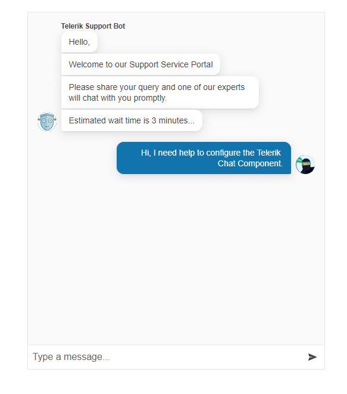

# Getting Started with the Chat

This tutorial explains how to set up a basic Telerik UI for {{ site.framework }} Chat and highlights the major steps in the configuration of the component.

You will initialize a Chat component and load it with data. Finally, you can run the sample code in [Telerik REPL](https://netcorerepl.telerik.com/) and continue exploring the components.

 

@[template](/_contentTemplates/core/getting-started-prerequisites.md#repl-component-gs-prerequisites)

## 1. Prepare the CSHTML File

@[template](/_contentTemplates/core/getting-started-directives.md#gs-adding-directives)

## 2. Initialize the Chat

Use the Chat HtmlHelper or TagHelper to add the component to the page. The `Name()` configuration method is mandatory as its value is used for the `id` and the `name` attributes of the Chat element. 


```HtmlHelper
    @using Kendo.Mvc.UI

    @(Html.Kendo().Chat()
        .Name("chat")
    )
```

```TagHelper
    @addTagHelper *, Kendo.Mvc

    <kendo-chat name="chat">
    </kendo-chat>
```


## 3. Configure a Default User

The next step is to configure the `User` property and set a default avatar and name for the current user.

```HtmlHelper
    @using Kendo.Mvc.UI

    @(Html.Kendo().Chat()
        .Name("chat")
        .User(u => u
            .Name("ChatBot Name")
            .IconUrl("https://demos.telerik.com/aspnet-core/shared/images/site/devcraft-ninja-small.svg")
        )
    )
```

```TagHelper
    @addTagHelper *, Kendo.Mvc

     <kendo-chat name="chat">
        <user name="ChatBot Name" icon-url="https://demos.telerik.com/aspnet-core/shared/images/site/devcraft-ninja-small.svg"/>
    </kendo-chat>
```


## 4. Handle a Chat Event

The Chat exposes different client-side events that you can handle and use to customize the component's functions. In this tutorial, you will use the [SendMessage](https://docs.telerik.com/aspnet-core/api/kendo.mvc.ui.fluent/chateventbuilder#sendmessagesystemfunc) event. Attach a handler in the declaration of the Chat and declare the onSendMessage JavaScript function.

```HtmlHelper
    @(Html.Kendo().Chat()
        .Name("chat") 
        .User(u => u
            .Name("ChatBot Name")
            .IconUrl("https://demos.telerik.com/aspnet-core/shared/images/site/devcraft-ninja-small.svg")
        )
        .Events(e => e
            .SendMessage("onSendMessage")
        )
    )
    <script>
        function onSendMessage() {
            // Handle the send message event.
        }
    </script>
```

```TagHelper
    <script>
        function onSendMessage() {
            // Handle the send message event.
        }
    </script>

    <kendo-chat name="chat"
        on-send-message="onSendMessage">
        <user name="ChatBot Name" icon-url="https://demos.telerik.com/aspnet-core/shared/images/site/devcraft-ninja-small.svg"/>
    </kendo-chat>
```


## 5. (Optional) Reference Existing Chat Instances

To use the client-side API of the Chat and build on top of its initial configuration, you need a reference to the Chat instance. Once you get a valid reference, you can call the respective API methods:

1. Use the `.Name()` (`id` attribute) of the component instance to get a reference.

    ```script
        <script>
            $(document).ready(function() {
                var chatReference = $("#chat").data("kendoChat"); // chatReference is a reference to the existing Chat instance of the helper.
            })
        </script>
    ```

1. Use the [Chat client-side API](https://docs.telerik.com/kendo-ui/api/javascript/ui/chat#methods) to control the behavior of the control. In this example, you will set up a `kendoChatBotUser` and will iterate an array of strings to render an automated greeting message with the use of the [`renderMessage`](https://docs.telerik.com/kendo-ui/api/javascript/ui/chat/methods/rendermessage) method.

    ```script
        <script>
        $(document).ready( function () {
            var kendoChatBotUser = {
                id: kendo.guid(),
                name: "Telerik Support Bot", // the name of the use will be shown in the Chat
                iconUrl: "https://demos.telerik.com/kendo-ui/content/chat/avatar.png" // url for the avatar of the user shown in the Chat
            }; 
            var primary_messages = ["Hello,","Welcome to our Support Service Portal"] // array of messages

            renderMessages(primary_messages,kendoChatBotUser)
        });
        function renderMessages(messages,user){
            var chat = $("#chat").data("kendoChat"); // access the client-side reference of the Chat component
            messages.forEach((message,i)=>{
                    // render a message for each string of the array
                    chat.renderMessage({
                    type: "text",
                    text: message
                }, user );
            })
        }
        </script>
    ```


## Explore this Tutorial in REPL

You can continue experimenting with the code sample above by running it in the Telerik REPL server playground:

* [Sample code with the Chat HtmlHelper](https://netcorerepl.telerik.com/GRbvvRFy356A7aOh39)
* [Sample code with the Chat TagHelper](https://netcorerepl.telerik.com/QRPlbxbe34S5W18I48)



## Next Steps

* [Subscribing to Chat Events]()
* [Configuring a Peer-to-Peer Chat]()
* [Automating Chat Responses with a DirectLine Agent (Demo)](https://demos.telerik.com/{{ site.platform }}/chat)

## See Also

* [Using the Toolbar of the Chat for {{ site.framework }} (Demo)](https://demos.telerik.com/{{ site.platform }}/chat/toolbar)
* [Client-Side API of the Chat](https://docs.telerik.com/kendo-ui/api/javascript/ui/chat)
* [Server-Side API of the Chat](/api/chat)
* [Knowledge Base Section](/knowledge-base)
