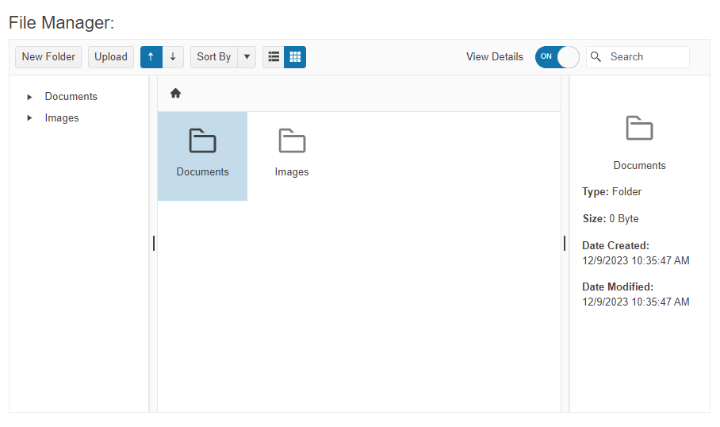

This tutorial explains how to set up the Telerik UI for {{ site.framework }} FileManager and highlights the major steps in the configuration of the component.

You will initialize the UI component by adding a data source, configure the columns, and enable a few optional FileManager features such as the `Toolbar` command. To make the FileManager fully operational, you will also configure the CRUD and Upload operations for the files.

After completing this guide, you will achieve the following results:

 


@[template](/_contentTemplates/core/getting-started-prerequisites.md#component-gs-prerequisites)

# 1. Prepare the CSHTML File

@[template](/_contentTemplates/core/getting-started-directives.md#gs-adding-directives)

Optionally, you can structure the document by adding the desired HTML elements like headings, divs, paragraphs, and others.


```HtmlHelper
    @using Kendo.Mvc.UI
```

```TagHelper
    @addTagHelper *, Kendo.Mvc
```



## 2. Initialize the FileManager

* Use the `Name()` configuration method to assign a name to the instance of the helper&mdash;this is mandatory as its value is used for the `id` and the `name` attributes of the FileManager element.
* Add the `DataSource()` configuration option and set the endpoints for the [Read operation](https://docs.telerik.com/aspnet-core/html-helpers/data-management/filemanager/binding/overview#remote-binding).  
* [Configure the ToolBar commands]() of the FileManager.

```HtmlHelper
    @using Kendo.Mvc.UI

    @(Html.Kendo().FileManager().Name("filemanager")
        .DataSource(ds =>
            {
                ds.Read(operation => operation
                .Type(HttpVerbs.Post)
                .Action("Read", "FileManagerData")
            );
        })
        .Toolbar(tb => tb.Items(items =>
        {
            items.Add("changeView");
            items.Add("details");
            items.Add("search");
        }))
    )

```


```TagHelper
    @addTagHelper *, Kendo.Mvc
    
    <kendo-filemanager name="filemanager">
    	<filemanager-datasource  >
    	 	<transport>
    	 	 	<read url="@Url.Action("Read", "FileManagerData")" type="POST" />
    	 	</transport>
    	</filemanager-datasource>
    	<toolbar enabled="true">
    	 	<items>
    	 	 	<item name="changeView">
    	 	 	</item>
    	 	 	<item name="details">
    	 	 	</item>
    	 	 	<item name="search">
    	 	 	</item>
    	 	</items>
    	</toolbar>
    </kendo-filemanager>
```


## 3. Create a FileContentBrowser Helper Class

When you create applications that must retrieve single or multiple files or folders on the server-side layer of the application, use a `FileContentBrowser` helper class. This class abstraction delegates the responsibility for the retrieval of the files and folders to separate methods that help improving the code readability.

Each of the methods in the `FileContentBrowser` helper class returns a `FileManagerEntry` instance that the FileManager can recognize and display as a file or folder. The `FileManagerEntry` instance comprises the following fields: 

| Property | Description |
|--- | --- |
|`Name`|The file name|
|`Path`|The physical path of the file|
|`Extension`| The extension of the file|
|`Size`| The file's size|
|`IsDirectory`| A Boolean parameter that specifies if the file is a directory or not|
|`HasDirectories`| A Boolean parameter that specifies if the file contains folders|
|`Created`| The file's date of creation|
|`CreatedUtc`| The file's date of creation in UTC format|
|`Modified`| The last time the file was updated|
|`ModifiedUtc`| The last time the file was updated in UTC format|

To create the `FileContentBrowser` helper class, use the following code:

```C#
    public class FileContentBrowser
    {
        public virtual IWebHostEnvironment HostingEnvironment { get; set; }
        public IEnumerable<FileManagerEntry> GetFiles(string path, string filter)
        {
            var directory = new DirectoryInfo(path);

            var extensions = (filter ?? "*").Split(new string[] { ", ", ",", "; ", ";" }, System.StringSplitOptions.RemoveEmptyEntries);

            return extensions.SelectMany(directory.GetFiles)
                .Select(file => new FileManagerEntry
                {
                    Name = Path.GetFileNameWithoutExtension(file.Name),
                    Size = file.Length,
                    Path = file.FullName,
                    Extension = file.Extension,
                    IsDirectory = false,
                    HasDirectories = false,
                    Created = file.CreationTime,
                    CreatedUtc = file.CreationTimeUtc,
                    Modified = file.LastWriteTime,
                    ModifiedUtc = file.LastWriteTimeUtc
                });
        }

        public IEnumerable<FileManagerEntry> GetDirectories(string path)
        {
            var directory = new DirectoryInfo(path);

            return directory.GetDirectories()
                .Select(subDirectory => new FileManagerEntry
                {
                    Name = subDirectory.Name,
                    Path = subDirectory.FullName,
                    Extension = subDirectory.Extension,
                    IsDirectory = true,
                    HasDirectories = subDirectory.GetDirectories().Length > 0,
                    Created = subDirectory.CreationTime,
                    CreatedUtc = subDirectory.CreationTimeUtc,
                    Modified = subDirectory.LastWriteTime,
                    ModifiedUtc = subDirectory.LastWriteTimeUtc
                });
        }

        public FileManagerEntry GetDirectory(string path)
        {
            var directory = new DirectoryInfo(path);

            return new FileManagerEntry
            {
                Name = directory.Name,
                Path = directory.FullName,
                Extension = directory.Extension,
                IsDirectory = true,
                HasDirectories = directory.GetDirectories().Length > 0,
                Created = directory.CreationTime,
                CreatedUtc = directory.CreationTimeUtc,
                Modified = directory.LastWriteTime,
                ModifiedUtc = directory.LastWriteTimeUtc
            };
        }

        public FileManagerEntry GetFile(string path)
        {
            var file = new FileInfo(path);

            return new FileManagerEntry
            {
                Name = Path.GetFileNameWithoutExtension(file.Name),
                Path = file.FullName,
                Size = file.Length,
                Extension = file.Extension,
                IsDirectory = false,
                HasDirectories = false,
                Created = file.CreationTime,
                CreatedUtc = file.CreationTimeUtc,
                Modified = file.LastWriteTime,
                ModifiedUtc = file.LastWriteTimeUtc
            };
        }
    }
```

## 4. Declare the Read Operation

To allow FileManager to successfully read the files and folders from a physical location, you must create several helper methods, such as:

* `NormalizePath()`&mdash;Uses a combination of the `ToAbsolute` and `CombinePaths` methods.
    ```C#
        public string NormalizePath(string path)
        {
            if (string.IsNullOrEmpty(path))
            {
                return ToAbsolute(ContentPath);
            }

            return CombinePaths(ToAbsolute(ContentPath), path);
        }
    ```
* `ToAbsolute()`&mdash;Converts a virtual path to an application absolute path.

    ```C#
        private string ToAbsolute(string virtualPath)
        {
            return VirtualPathUtility.ToAbsolute(virtualPath);
        }
    ```
* `CombinePaths()`&mdash;Combines a base and relative file paths.

    ```C#
        private string CombinePaths(string basePath, string relativePath)
        {
            return VirtualPathUtility.Combine(VirtualPathUtility.AppendTrailingSlash(basePath), relativePath);
        }
    ```

The following example shapes all required methods into one single `Read` operation.



```
    /// <summary>
    /// Reads all the file entries from a given target path.
    /// </summary>
    /// <param name="target">The target in which file entry resides.</param>
    public virtual JsonResult Read(string target)
    {
        var path = NormalizePath(target);
        try
        {
            var files = directoryBrowser.GetFiles(path, Filter); // Gather all the directories from the previously created FileContentBrowser.

            var directories = directoryBrowser.GetDirectories(path); // Gather all the files from the previously created FileContentBrowser.
            
            var result = files.Concat(directories).Select(VirtualizePath);  // Transpose the paths from absolute to virtual. E.g: C://Telerik/Kendo/MyFile -> ~/Telerik/Kendo/MyFile
            
            return Json(result.ToArray());
        }
        catch (DirectoryNotFoundException)
        {
            throw new Exception("File Not Found");
        }
    }
```

```
    /// <summary>
    /// Reads all the file entries from a given target path.
    /// </summary>
    /// <param name="target">The target in which file entry resides.</param>
    public virtual JsonResult Read(string target)
    {
        var path = NormalizePath(target);
        try
        {
            var files = directoryBrowser.GetFiles(path, Filter); // Gather all the directories from the previously created FileContentBrowser.
            
            var directories = directoryBrowser.GetDirectories(path); // Gather all the files from the previously created FileContentBrowser.

            var result = files.Concat(directories).Select(VirtualizePath); // Transpose the paths from absolute to virtual. E.g: C://Telerik/Kendo/MyFile -> ~/Telerik/Kendo/MyFile
            return Json(result.ToArray());
        }
        catch (DirectoryNotFoundException)
        {
            throw new Exception("File Not Found");
        }
    }
```


For more common helper methods, see the [Remote Binding Helper Methods](https://docs.telerik.com/{{ site.platform }}/html-helpers/data-management/filemanager/binding/remote#common-helper-methods) section.


## 5. Handle a FileManager Event

The FileManager exposes different client-side events that you can handle and use to customize the component's functions. In this tutorial, you will use the `DataBound` event to toggle the `Preview` command by using the component's [Client-Side API](https://docs.telerik.com/kendo-ui/api/javascript/ui/filemanager).


```HtmlHelper
    @using Kendo.Mvc.UI

    @(Html.Kendo().FileManager().Name("filemanager")
        .DataSource(ds =>
            {
                ds.Read(operation => operation
                .Type(HttpVerbs.Post)
                .Action("Read", "FileManagerData")
            );
        })
        .Events(events => events.DataBound("onDataBound"))
        .Toolbar(tb => tb.Items(items =>
        {
            items.Add("changeView");
            items.Add("details");
            items.Add("search");
        }))
    )

```


```TagHelper
    @addTagHelper *, Kendo.Mvc
    
    <kendo-filemanager name="filemanager" on-data-bound="onDataBound" upload-url="@Url.Action("Upload", "FileManagerData")">
    	<filemanager-datasource  >
    	 	<transport>
    	 	 	<read url="@Url.Action("Read", "FileManagerData")" type="POST" />
    	 	</transport>
    	</filemanager-datasource>
    	<toolbar enabled="true">
    	 	<items>
    	 	 	<item name="changeView">
    	 	 	</item>
    	 	 	<item name="details">
    	 	 	</item>
    	 	 	<item name="search">
    	 	 	</item>
    	 	</items>
    	</toolbar>
    </kendo-filemanager>
```


```Script.js
    <script>
        function onDataBound(e){
            e.sender.executeCommand({ command: "TogglePaneCommand", options: { type: "preview" } });
            $("#details-toggle").getKendoSwitch().toggle();
        }
    </script>
```

## (Optional) Reference Existing FileManager Instances

Referencing existing instances allows you to build on top of their configuration. To reference an existing FileManager instance, use the [`jQuery.data()`](http://api.jquery.com/jQuery.data/) method:

Use the `id` attribute of the component instance to get a client-side reference.

```script
    <script>
        var fileManagerReference = $("#filemanager").data("kendoFileManager"); // fileManagerReference is a reference to the existing instance of the helper.
    </script>
```

## Explore this Tutorial in REPL

You can continue experimenting with the code sample above by running it in the Telerik REPL server playground:

* [Sample code with the FileManager HtmlHelper](https://netcorerepl.telerik.com/QxbwFsbp02kuY17v27)
* [Sample code with the FileManager TagHelper](https://netcorerepl.telerik.com/mHlcFMkK26Aqib5Q19)

## Next Steps

* [FileManager Remote Binding]()
* [Views of the FileManager]()
* [File Manager ToolBar Commands]()
* [FileManager ContextMenu]()

## See Also

* [Using the API of the FileManager for {{ site.framework }} (Demo)](https://demos.telerik.com/{{ site.platform }}/filemanager/api)
* [FileManager Client-Side API](https://docs.telerik.com/kendo-ui/api/javascript/ui/filemanager)
* [FileManager Server-Side API](/api/filemanager)
* [Knowledge Base Section](/knowledge-base)
