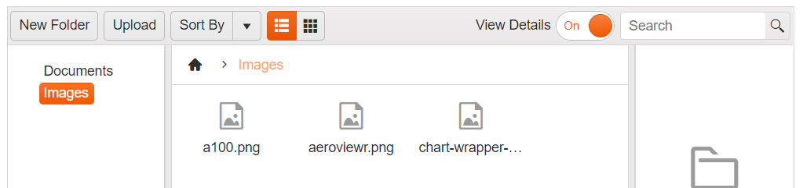

# Toolbar Commands

The {{ site.product }} FileManager component contains a nested {{ site.product }} Toolbar component.

The toolbar has a predefined set of tools which you can show or hide, depending on your preferences and business scenario. By default, the toolbar contains the following tools:

* *New Folder* button, allowing you to create new folders in the current location.
* *Upload Button* prompting you with a window to upload files.
* *Sort By* dropdown, allowing you to sort by a number of predicates
* *Views* button group to control 
* *View Details* switch button to toggle the Preview Pane visibility
* *Search* textbox to filter the content

**Inbuilt Sort  functionality in {{ site.product }} FileManager:** 


## Customizing the Toolbar Commands

To Enable/Disable a Toolbar command button or update the its text you can use the  `Toolbar.Items()` configuration option:

```HtmlHelper
    .Toolbar(toolbar => toolbar.Items(items =>
        {
            items.Add("").Text("Add New Folder").Enable(false).Command("CreateFolderCommand").Type("button");
        }))
```

```TagHelper
    <toolbar enabled="true">
 		<items>
            <item name="newFolder" text="Add New Folder" enable="false" type="button" command="CreateFolderCommand">
            </item>
 		</items>
	</toolbar>
```


## Adding Custom Commands to the Toolbar

As of Kendo UI R1 2020 SP1 the kendo.ui.filemanager namespace exposes the FileManagerCommand class that could be extended to implement a custom FileManager command. The example below demonstrates how to create a custom command that shows the total size of the selected files.

First, create a new command by extending the FileManagerCommand class.
```
    <script>
        var filemanagerNS = kendo.ui.filemanager;

        filemanagerNS.commands.MyCustomCommand = filemanagerNS.FileManagerCommand.extend({
            exec: function () {
                var that = this,
                    filemanager = that.filemanager, // get the kendo.ui.FileManager instance
                    options = that.options, // get the options passed through the tool
                    target = options.target, // options.target is available only when command is executed from the context menu
                    selectedFiles = filemanager.getSelected(); // get the selected files
                
                var totalSize = 0;
                selectedFiles.forEach(function (fileEntry) {
                    totalSize += fileEntry.size;
                });

                kendo.alert(selectedFiles.length + ' file(s) selected; Total size: ' + kendo.getFileSizeMessage(totalSize))
            }
        });
    </script>
```

Then add the custom command to the FileManager Toolbar:
```HtmlHelper
    .Toolbar(toolbar => toolbar.Items(items =>
        {
            items.Add("").Type("button").Name("GetInfo").Text("Get Info").Command("MyCustomCommand");
        }))
```

```TagHelper
    <toolbar enabled="true">
 		<items>
            <item name="getInfo" text="Get Info" type="button" command="MyCustomCommand">
            </item>
 		</items>
	</toolbar>
```


You can also add the custom command to the ContextMenu of the FileManager
```HtmlHelper
    .ContextMenu(context => context.Items(items =>
        {
            items.Add("rename");
            items.Add("delete");
            items.Add("custom").Name("GetInfo").Text("Get Info").Command("MyCustomCommand").SpriteCssClass("k-icon k-i-info");
        }))
```

```TagHelper
    <context-menu enabled="true">
 	    <items>
 		    <item name="rename">
 		    </item>
            <item name="delete">
 		    </item>
            <item name="custom" text="Get Info" command="MyCustomCommand" sprite-css-class="k-icon k-i-info">
            </item>
 	    </items>
	</context-menu>
```


## See Also

* [Overview of {{ site.product }} FileManager]()
* [ContextMenu in {{ site.product }} FileManager]()
* [Drag and Drop in {{ site.product }} FileManager]()
