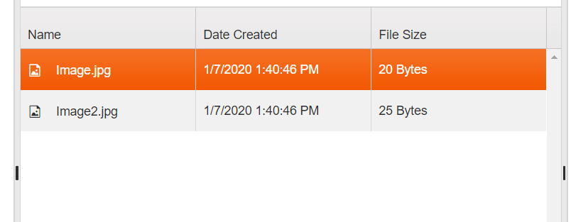
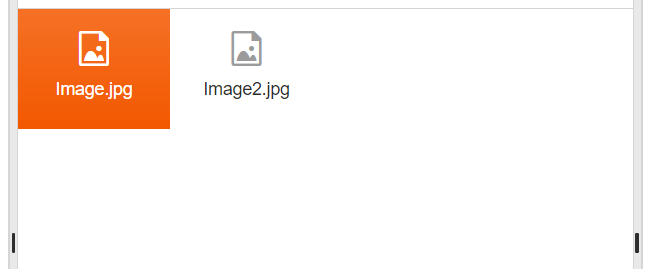

# Views Overview

The {{ site.product }} FileManager provides two inbuilt views for content visualization: `Grid` and `List` Views.  

You can switch between views from the Toolbar button group.

## Grid View
This view is achieved with the {{ site.product }} Grid and in renders the files in a tabular manner (see Image1 below). That said, you can control the configuration of this view trough the `views.grid` object of the FileManager (see example below). 

        
        @(Html.Kendo().FileManager()
            .Name("filemanager")
            .Views(v => v.Grid(grid => grid.Columns(cols => cols.Add().Field(....))))
        
        )
        

**Image1: GridView type in FileManager:**

## List View (Thumbnails)

The List view is implemented with the help of the {{ site.product }} ListView component. The content in this view is rendered as a list of thumbnails, representing the files. You can control the configuration of this view trough the `views.list` object of the FileManager. 

        
        @(Html.Kendo().FileManager()
            .Name("filemanager")
            .Views(v=>v.List(list=>list.TemplateId("...")))
        
        )
        
**Image2: ListView type in FileManager:** 

## See Also

* [ContextMenu in {{ site.product }} FileManager]()
* [Drag and Drop in {{ site.product }} FileManager]()
