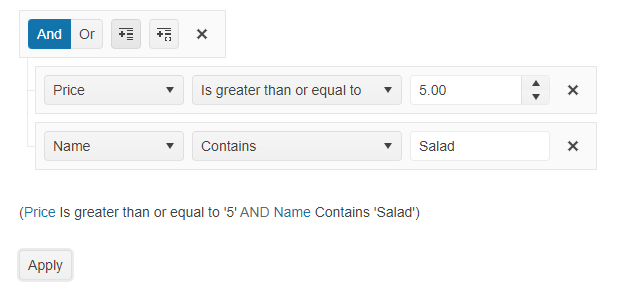

# Getting Started with the Filter

This tutorial explains how to set up a basic Telerik UI for {{ site.framework }} Filter and highlights the major steps in the configuration of the component.

 

@[template](/_contentTemplates/core/getting-started-prerequisites.md#repl-component-gs-prerequisites)

## 1. Prepare the CSHTML File

@[template](/_contentTemplates/core/getting-started-directives.md#gs-adding-directives)

Optionally, you can structure the document by adding the desired HTML elements like headings, divs, paragraphs, and others.

```HtmlHelper
@using Kendo.Mvc
<h4>Telerik UI Filter Component</h4>
<p>
</p>
```

```TagHelper
@addTagHelper *, Kendo.Mvc
<h4>Filter with event handler</h4>
<p>
</p>
``` 


## 2. Initialize the Filter

Use the Calendar HtmlHelper or TagHelper to add the component to a page:

* The `Name()` configuration method is mandatory as its value is used for the `id` and the `name` attributes of the Filter element.
* The `MainLogic()` configuration method defines the value of the logical operator at the root level of the filter expression.
* The `ApplyButton` will display a button which when clicked will apply filtering over the datasource.
* The `Fields` is an array of JavaScript objects that hold information about the filter field, it's editor, default values used for filter and etc.
* The `FilterExpression` is An object which represents a filter expression which the [`kendo.data.DataSource`](/api/javascript/data/datasource) can use to filter the data.

```HtmlHelper
@using Kendo.Mvc
<h4>Telerik UI Filter Component</h4>
<p>
@(Html.Kendo().DataSource<TelerikAspNetCoreApp1.Models.Sushi>()
        .Name("dataSource1")
        .Custom(c => c.Transport(transport =>
        {
            transport.Read(read =>
               read.Url("https://demos.telerik.com/kendo-ui/content/spa/websushi/menu.json")
                   .DataType("json")
            );
        })
        .PageSize(4))
    )

@(Html.Kendo().Filter<TelerikAspNetCoreApp1.Models.Sushi>()
        .Name("filter")
        .MainLogic(FilterCompositionLogicalOperator.Or)
        .ApplyButton()
        .Fields(f =>
        {
            f.Add(p => p.name).Label("Name");
            f.Add(p => p.price).Label("Price");
            f.Add(p => p.description).Label("Description");
        })
        .FilterExpression(f =>
        {
            f.Add(p => p.price).IsGreaterThanOrEqualTo(5);
            f.Add(p => p.name).Contains("Salad");
        })
        .DataSource("dataSource1")
    )
</p>
```

```TagHelper
@addTagHelper *, Kendo.Mvc
<h4>Telerik UI Filter Component</h4>
<p>
    <kendo-datasource name="dataSource1" type="DataSourceTagHelperType.Custom" page-size="4">
        <transport>
            <read url="https://demos.telerik.com/kendo-ui/content/spa/websushi/menu.json")" datatype="json" />
        </transport>
    </kendo-datasource>

	<kendo-filter apply-button="true"  main-logic="Or" name="filter" expression="InitialExpression" datasource-id="dataSource1">
		<fields>
	 		<filter-field name="name" type="string" label="Name">
	 		</filter-field>
	 		<filter-field name="price" type="number" label="Price">
	 		</filter-field>
	 		<filter-field name="description" type="string" label="Description">
	 		</filter-field>
		</fields>
	</kendo-filter>
</p>
```


## 3. Enable The Preview of the Expression

The next step is to configure the Filter to visualize the filter expression that will be applied to the datasource.

```HtmlHelper
@using Kendo.Mvc

<h4>Telerik UI Filter Component</h4>
<p>
    @(Html.Kendo().DataSource<TelerikAspNetCoreApp1.Models.Sushi>()
        .Name("dataSource1")
        .Custom(c => c.Transport(transport =>
        {
            transport.Read(read =>
            read.Url("https://demos.telerik.com/kendo-ui/content/spa/websushi/menu.json")
            .DataType("json")
            );
        })
        .PageSize(4))
    )

    @(Html.Kendo().Filter<TelerikAspNetCoreApp1.Models.Sushi>()
        .Name("filter")
        .MainLogic(FilterCompositionLogicalOperator.Or)
        .ApplyButton()
        .ExpressionPreview()
        .Fields(f =>
        {
            f.Add(p => p.name).Label("Name");
            f.Add(p => p.price).Label("Price");
            f.Add(p => p.description).Label("Description");
        })
        .FilterExpression(f =>
        {
            f.Add(p => p.price).IsGreaterThanOrEqualTo(5);
            f.Add(p => p.name).Contains("Salad");
        })
        .DataSource("dataSource1")
     )
</p>
```

```TagHelper
@addTagHelper *, Kendo.Mvc
<h4>Calendar with event handler</h4>
<p>
    <kendo-datasource name="dataSource1" type="DataSourceTagHelperType.Custom" page-size="4">
        <transport>
            <read url="https://demos.telerik.com/kendo-ui/content/spa/websushi/menu.json")" datatype="json" />
        </transport>
    </kendo-datasource>

	<kendo-filter apply-button="true" expression-preview="true" main-logic="Or" name="filter" expression="InitialExpression" datasource-id="dataSource1">
		<fields>
	 		<filter-field name="name" type="string" label="Name">
	 		</filter-field>
	 		<filter-field name="price" type="number" label="Price">
	 		</filter-field>
	 		<filter-field name="description" type="string" label="Description">
	 		</filter-field>
		</fields>
	</kendo-filter>
</p>
```


## 4. Handle a Filter Event

The Filter exposes a `Change()` event that you can handle and assign specific functions to the component. In this tutorial, you will use the `Change()` event to display a message when the user modifies the Filter.

```HtmlHelper
@using Kendo.Mvc.UI
<script>
    function onChange(){
        console.log("change");
    }
</script>
<h4>Filter with event handler</h4>
<p>
    @(Html.Kendo().DataSource<Kendo.Mvc.Examples.Models.Sushi>()
        .Name("dataSource1")
        .Custom(c => c.Transport(transport =>
        {
            transport.Read(read =>
               read.Url("https://demos.telerik.com/kendo-ui/content/spa/websushi/menu.json")
                   .DataType("json")
            );
        })
        .PageSize(4))
    )

    @(Html.Kendo().Filter<Kendo.Mvc.Examples.Models.Sushi>()
        .Name("filter")
        .MainLogic(FilterCompositionLogicalOperator.Or)
        .ApplyButton()
        .ExpressionPreview()
        .Fields(f =>
        {
            f.Add(p => p.name).Label("Name");
            f.Add(p => p.price).Label("Price");
            f.Add(p => p.description).Label("Description");
        })
        .FilterExpression(f =>
        {
            f.Add(p => p.price).IsGreaterThanOrEqualTo(5);
            f.Add(p => p.name).Contains("Salad");
        })
        .Events(e => e.Change("onChange"))
        .DataSource("dataSource1")
    )
</p>
```

```TagHelper
@addTagHelper *, Kendo.Mvc
<script>
    function onChange(){
        console.log("change");
    }
</script>
<h4>Filter with event handler</h4>
<p>
    <kendo-datasource name="dataSource1" type="DataSourceTagHelperType.Custom" page-size="4">
        <transport>
            <read url="https://demos.telerik.com/kendo-ui/content/spa/websushi/menu.json")" datatype="json" />
        </transport>
    </kendo-datasource>

	<kendo-filter apply-button="true" expression-preview="true" main-logic="Or" name="filter" expression="InitialExpression" datasource-id="dataSource1" on-change="onChange">
		<fields>
	 		<filter-field name="name" type="string" label="Name">
	 		</filter-field>
	 		<filter-field name="price" type="number" label="Price">
	 		</filter-field>
	 		<filter-field name="description" type="string" label="Description">
	 		</filter-field>
		</fields>
	</kendo-filter>
</p>
```


## 5. (Optional) Reference Existing Calendar Instances

You can reference the Filter instances that you have created and build on top of their existing configuration:

1. Use the `id` attribute of the component instance to get a reference.

    ```script
    <script>
        var filterInstance = $("#filter").data("kendoFilter"); // filterInstance is a reference to the existing Filter instance of the helper.
    </script>
    ```
1. Use the [Filter client-side API](https://docs.telerik.com/kendo-ui/api/javascript/ui/filter#methods) to control the behavior of the widget. In this example, you will use the `applyFilter` method to apply the generated filter to the dataSource.
    ```script
    <script>
        var filterInstance = $("#filter").data("kendoFilter"); // filterInstance is a reference to the existing Filter instance of the helper.
        filterInstance.applyFilter();
    </script>
    ```
For more information on referencing specific helper instances, see the [Methods and Events]() article.

## Explore this Tutorial in REPL
You can continue experimenting with the code sample above by running it in the Telerik REPL server playground:
* [Sample code with the Filter HtmlHelper](https://netcorerepl.telerik.com/QnblmVbf38OvpRWw50)

* [Sample code with the Filter TagHelper](https://netcorerepl.telerik.com/mxFPwBbp3960d4Wo07)

## Next Steps
* [Setting the Operators of the Filter]()
* [Persisting the State of the Filter]()
## See Also
* [Using the API of the Filter for {{ site.framework }} (Demo)](https://demos.telerik.com/{{ site.platform }}/filter/api)
* [Client-Side API of the Calendar](https://docs.telerik.com/kendo-ui/api/javascript/ui/filter)
* [Server-Side API of the Calendar](/api/filter)
* [Knowledge Base Section](/knowledge-base)