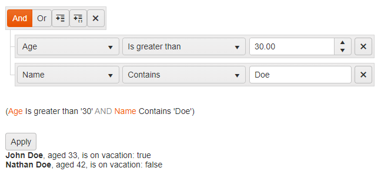

# Filter Component Overview


The Telerik UI Filter TagHelper and HtmlHelper for {{ site.framework }} are server-side wrappers for the Kendo UI Filter widget. To add the component to your ASP.NET Core app, you can use either.

The Telerik UI Filter HtmlHelper for {{ site.framework }} is a server-side wrapper for the Kendo UI Filter widget.


The Filter is a unified control for filtering data-bound components that have a [data source](). The user interface of the Filter is useful for data-bound components that do not have a built-in UI for filtering but are required to provide filter options&mdash;for example, the ListView, Chart, and Scheduler.

You can add or remove the fields by which the data will be filtered and select the global logic of the filters (for example, `AND` or `OR`) and the filter operator for each field (for example, `contains` or `equals`). You can apply the filtering through a built-in button or through an API call. You can also select the name by which the fields will be displayed to the user and [localize]() the filter operators and messages.

* [Demo page for the Filter HtmlHelper](https://demos.telerik.com/{{ site.platform }}/filter/index)


* [Demo page for the Filter TagHelper](https://demos.telerik.com/aspnet-core/filter/tag-helper)




## Initializing the Filter

To use the Filter, you have to define a standalone data source and pass it by name to the filter and to the data-bound control that will use it.

The following example demonstrates how to:
* Tie a filter to a data source.
* Display the filtered data in a list view.
* Use human-readable names for the fields.
* Set an initial filter expression.

> * Providing the fields is not required because the Filter can extract them from the data source. If you do not set the fields in the filter settings, the actual field names, and not the human-readable `label`, will be displayed to the user. If you set the fields in the filter settings, they must match the schema of the data source.
> * Providing an initial filter expression is not required. This feature is useful for [restoring previous states]().

```HtmlHelper
    <script type="text/x-kendo-template" id="itemTemplate">
        <li>
            <strong>#= Name #</strong>, aged #= Age #, is on vacation: #= IsOnLeave #
        </li>
    </script>

    @(Html.Kendo().DataSource<SampleData>()
        .Name("dataSource1")
        .Ajax(d=>d.Read(r => r.Action("GetPeople", "Filter")))
    )

    @(Html.Kendo().Filter<SampleData>()
        .Name("filter")
        .MainLogic(FilterCompositionLogicalOperator.And)
        .ExpressionPreview() // Shows a text preview of the filter expression.
        .ApplyButton() // Shows the built-in Apply button.
        .Fields(f => // Defining the fields is not mandatory. Otherwise, they will be taken from the data source schema.
                        // If you define the fields, their names and types must match the data source definition.
        {
            f.Add(p=>p.Name).Label("Name");
            f.Add(p=>p.Age).Label("Age");
            f.Add(p=>p.IsOnLeave).Label("On Vacation");
        })
        .FilterExpression(f => { // Defining an initial filter expression is not required.
            f.Add(p => p.Age).IsGreaterThanOrEqualTo(30);
            f.Add(p => p.Name).Contains("Doe");
        })
        .DataSource("dataSource1")
    )

    @(Html.Kendo().ListView<SampleData>()
        .Name("listView")
        .TagName("ul")
        .DataSource("dataSource1")
        .ClientTemplateId("itemTemplate")
    )

    <script>
        $(document).ready(function () {
            // Apply filtering immediately after the helper initialization because an initial filter is set.
            $("#filter").getKendoFilter().applyFilter();
        });
    </script>
```

```TagHelper
    <kendo-datasource type="DataSourceTagHelperType.Ajax" name="dataSource1" server-operation="false">
        <transport>
            <read url="@Url.Action("GetPeople", "Filter")" />
        </transport>
    </kendo-datasource>

    @{
        @using Kendo.Mvc
        var InitialExpression = new CompositeFilterDescriptor
        {
            LogicalOperator = FilterCompositionLogicalOperator.And
        };
        InitialExpression.FilterDescriptors.Add(new FilterDescriptor { Member = "Age", Value = 30, Operator = FilterOperator.IsGreaterThanOrEqualTo });
        InitialExpression.FilterDescriptors.Add(new FilterDescriptor { Member = "Name", Value = "Doe", Operator = FilterOperator.Contains });
    }

    <kendo-filter name="filter" apply-button="true" expression-preview="true" datasource-id="dataSource1" expression="@InitialExpression">
        <fields>
            <filter-field name="Name" type="string" label="Name"></filter-field>
            <filter-field name="Age" type="number" label="Age"></filter-field>
            <filter-field name="IsOnLeave" type="boolean" label="On Vacation"></filter-field>
        </fields>
    </kendo-filter>

    <kendo-grid name="grid" datasource-id="dataSource1">
        <columns>
            <column field="Name" title="Employee Name" />
            <column field="Age" title="Employee Age" />
            <column field="IsOnLeave" title="On Vacation" />
        </columns>
    </kendo-grid>

    <script>
        $(document).ready(function () {
            // Apply filtering immediately after the widget initialization because an initial filter is set.
            $("#filter").getKendoFilter().applyFilter();
        });
    </script>
```

```Controller
using Kendo.Mvc.Extensions;
using Kendo.Mvc.UI;

public class FilterController : BaseController
{
    public ActionResult GetPeople([DataSourceRequest]DataSourceRequest request)
    {
        var people = new List<SampleData>() {
             new SampleData()  { Name = "Jane Doe", Age = 25, IsOnLeave = false },
             new SampleData() { Name = "John Doe", Age = 33, IsOnLeave = true },
             new SampleData() { Name = "John Smith", Age = 37, IsOnLeave = true },
             new SampleData() { Name = "Nathan Doe", Age = 42, IsOnLeave = false }
        };
        return Json(people.ToDataSourceResult(request));
    }

    public ActionResult Index()
    {
        return View();
    }
}
```
```Model
public class SampleData
{
    public int Age { get; set; }
    public string Name { get; set; }
    public bool IsOnLeave { get; set; }
}
```

## Functionality and Features

* [Setting the operators]()&mdash;You can defining which filter operators will be displayed in the filtering drop-down.
* [Persisting the state]()&mdash;The Filter enables you to store its filter expression and restore its state for the user.
* [Globalization]()&mdash;The globalization process combines the translation of component messages (localization) with adapting them to specific cultures.

## Referencing Existing Instances

To refer to an existing Filter instance use the `jQuery.data()` method. Once a reference is established, use the [Filter client-side API](https://docs.telerik.com/kendo-ui/api/javascript/ui/filter#methods) to control its behavior.

```
<script>
    $(function() {
        // The Name() of the Filter is used to get its client-side instance.
        var filter = $("#theFilter").data("kendoFilter");
    });
</script>
```

## See Also

* [Basic Usage of the Filter HtmlHelper for {{ site.framework }} (Demo)](https://demos.telerik.com/{{ site.platform }}/filter/index)
* [Getting Started with the Filter]()

* [Basic Usage of the Filter TagHelper for ASP.NET Core (Demo)](https://demos.telerik.com/aspnet-core/filter/tag-helper)
* [Filter in Razor Pages]()

* [Filter Client-Side API](https://docs.telerik.com/kendo-ui/api/javascript/ui/filter)
* [Filter Server-Side API](/api/filter)
