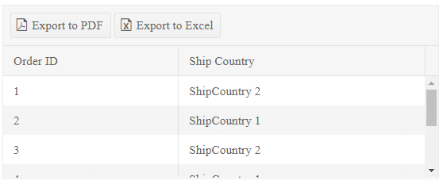

# Height

By default, the Grid has no set height and expands to fit all table rows.

## Getting Started

> Set the height to the Grid only when its scrolling is enabled. For more information on the supported scroll modes by the Grid, refer to the [article on scrolling]().  

To set the height of the Grid, use any of the following approaches:
* Apply an inline height style to the `
` from which the Grid is initialized.
* Use the `height` property of the Grid which will apply an inline style to the Grid wrapper&mdash;the same as the previous option.
* Use external CSS. For example, use the ID or the `.k-grid` CSS class to apply a height style.

When the height of the Grid is set, it calculates the appropriate height of its scrollable data area, so that the sum of the header rows, filter row, data, footer, and pager is equal to the expected height of the Grid. That is why if you change the height of the Grid through JavaScript after you create the Grid, you have to call the [`resize` method](https://docs.telerik.com/kendo-ui/api/javascript/kendo/methods/resize) afterwards. In this way the Grid recalculates the height of its data area.

        var gridWidget = $("#GridID").data("kendoGrid");

        // Apply the new height and trigger the layout readjustment.
        gridWidget.wrapper.height(800);
        gridWidget.resize();

        // Force the layout readjustment without setting a new height.
        gridWidget.resize(true);

In specific scenarios you can set a height style to the scrollable data area either by using JavaScript or external CSS which is a `div.k-grid-content` element. In such cases avoid setting a height to the Grid.

    

        @(Html.Kendo().Grid<OrderViewModel>()
            .Scrollable()
            .HtmlAttributes(new { style = "height: 200px;" })
            /* other configurations */
        )
    

## Setting a Minimum Height

> Setting a minimum height is not applicable when virtual scrolling is enabled. For more information on the supported scroll modes by the Grid, refer to the [article on scrolling]().

You can make the Grid expand and shrink vertically according to the number of its rows and yet within certain limits. To achieve this, apply a minimum and/or maximum height style to the scrollable data area and do not set any height of the Grid by [removing the default data area height](#scrolling-overview). Instead of the `GridID`, you can also use the `.k-grid` class to target all Grid instances.

    #GridID .k-grid-content
    {
        min-height: 100px;
        max-height: 400px;
    }

## Enabling Auto-Resizing

> Enabling the auto-resize feature is applicable to scrollable Grids only. For more information on the supported scroll modes by the Grid, refer to the [article on scrolling]().

1. To allow the Grid to resize together with its parent, apply a 100% height style to its `
` wrapper. According to the web standards, elements which have their height set in percentage require that the height of their parent is also explicitly set. This requirement applies recursively until either an element with a pixel height or the `html` element is reached. Elements that are 100% high cannot have margins, paddings, borders, or sibling elements. That is why you have to remove the default border of the Grid as well.
1. Make sure that the inner layout of the Grid adapts to changes in the height of the `
` wrapper. If these changes are triggered by the resizing of the browser window, subscribe to the window `resize` event of the browser and execute the [`resize()`](https://docs.telerik.com/kendo-ui/api/javascript/kendo/methods/resize) method of the Grid. The `resize` method measures the height of the Grid `
` and adjusts the height of the scrollable data area.
  * If the Grid is placed inside a Kendo UI Splitter or Kendo UI Window, you do not need to call the `resize` method because these widgets will execute it automatically. Also, it is not necessary to apply the method if you use locked columns.
  * If the vertical space that is available for the Grid depends on a custom resizing of the layout, which is controlled by the user, use a suitable event or method related to the layout changes to execute the `resize` method of the Grid. In this case, call the `resize` method even if you use locked columns.

    $(window).resize(function (e) {
        var grid = $("#GridID").data("kendoGrid");
        grid.resize();
    });

## Configuring the Loading Indicator

Internally, the Grid uses the [`kendo.ui.progress`](https://docs.telerik.com/kendo-ui/api/javascript/ui/ui/methods/progress) method to display a loading overlay during remote `read` requests. If scrolling is disabled, the overlay is displayed over the whole Grid. If scrolling is enabled, the overlay is displayed over the scrollable data area. If scrolling is enabled and the Grid has no set height, the data area will initially have a zero height, which will make the loading overlay invisible during the first remote request. To visualize the loading overlay, use either of the following approaches:
* [Set the height of the Grid](#getting-started), or
* [Apply the `min-height` style](#setting-a-minimum-height) to the `div.k-grid-content` element.

## See Also

* [Scrolling by the Grid HtmlHelper for {{ site.framework }} (Demos)](https://demos.telerik.com/{{ site.platform }}/grid/virtualization-remote-data)
* [Scroll Modes of the Grid HtmlHelper for {{ site.framework }}]()
* [Server-Side API](/api/grid)
