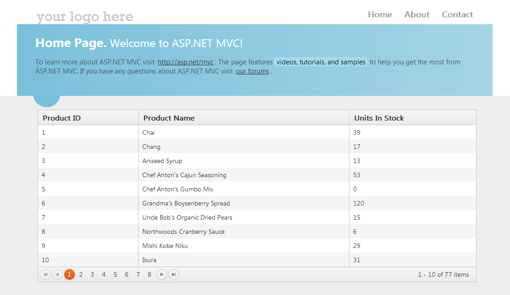

# Ajax Binding

You can configure the Grid component extension for Ajax binding.

When configured for Ajax binding, the Grid for {{ site.framework }} makes Ajax requests when doing paging, sorting, filtering, grouping, or when saving data. For a runnable example, refer to the [demo on Ajax binding of the Grid](https://demos.telerik.com/{{ site.platform }}/grid/remote-data-binding).  

The Ajax-bound mode has the following features:
- The Grid retrieves only the data (in JSON format) representing the current page. As a result, only the Grid is updated.
- All Grid templates (column, detail) are executed client-side. They follow the [Kendo UI for jQuery template](https://docs.telerik.com/kendo-ui/framework/templates/overview) definition rules and may contain embedded JavaScript code.


@[template](/_contentTemplates/core/json-serialization-note.md#json-serialization-note)


To configure the Grid for {{ site.framework }} to do Ajax binding to the **Products** table of the Northwind database:

1. Create a new {{ site.framework }} web application. Follow the steps from the [introductory article]() to add {{ site.product }} to the application. 

1. Install the EntityFrameworkCore NuGet package.
1. Install Microsoft.EntityFrameworkCore.SqlServer package.
1. Run the following command in the Package Management Console. It will generate models from the tables in a database called 'Sample'. For more information on scaffolding a model from an existing database refer to [this Microsoft article](https://docs.microsoft.com/en-us/ef/core/get-started/aspnetcore/existing-db#reverse-engineer-your-model).

    Scaffold-DbContext "Server=.\SQLSERVER;Database=Sample;Trusted_Connection=True;" Microsoft.EntityFrameworkCore.SqlServer -OutputDir Models
    

 If you have installed the [Telerik UI for ASP.NET MVC Visual Studio Extensions](), create a Telerik UI for ASP.NET MVC application. 

 1. Add a new `Entity Framework Data Model`. Right-click the `~/Models` folder in the solution explorer and pick **Add new item**. Choose **Data** > **ADO.NET Entity Data Model** in the **Add New Item** dialog. Name the model `Northwind.edmx` and click **Next**. This starts the **Entity Data Model Wizard**.

    

1.  Pick the **Generate from database** option and click **Next**. Configure a connection to the Northwind database. Click **Next**.

    

1. Choose the **Products** table from the **Which database objects do you want to include in your model?**. Leave all other options as they are set by default. Click **Finish**.

    



1. Open the `HomeController.cs` and add a new action method which will return the Products as JSON. The Grid makes Ajax requests to this action.

        public IActionResult Products_Read()
        {
        }

1. Add a new parameter of type `Kendo.Mvc.UI.DataSourceRequest` to the action. It will contain the current Grid request information&mdash;page, sort, group, and filter. Decorate that parameter with the `Kendo.Mvc.UI.DataSourceRequestAttribute`. This attribute will populate the `DataSourceRequest` object from the posted data. Now import the `Kendo.Mvc.UI` namespace.

        public IActionResult Products_Read([DataSourceRequest]DataSourceRequest request)
        {
        }

1. Use the `ToDataSourceResult` extension method to convert the Products to a `Kendo.Mvc.UI.DataSourceResult` object. This extension method will page, filter, sort, or group your data using the information provided by the `DataSourceRequest` object. To use the `ToDataSourceResult` extension method, import the `Kendo.Mvc.Extensions` namespace.

        public ActionResult Products_Read([DataSourceRequest]DataSourceRequest request)
        {
            using (var northwind = new SampleContext())
            {
                IQueryable<Product> products = northwind.Products;
                DataSourceResult result = products.ToDataSourceResult(request);
                return Json(result);
            }
        }

1. Return the `DataSourceResult` as JSON. Configure the Kendo UI Grid for Ajax binding.

        public ActionResult Products_Read([DataSourceRequest]DataSourceRequest request)
        {
            using (var northwind = new SampleContext())
            {
                IEnumerable<Customers> customers = northwind.Customers;
                DataSourceResult result = customers.ToDataSourceResult(request);
                return Json(result);
            }
        }

        The same thing applies when you use the asynchronous `ToDataSourceResultAsync` counterpart.

        public async Task<ActionResult> Products_Read([DataSourceRequest]DataSourceRequest request)
        {
            using (var northwind = new NorthwindEntities())
            {
                IQueryable<Product> products = northwind.Products;
                DataSourceResult result = await products.ToDataSourceResultAsync(request);
                return Json(result);
            }
        }

1. In the view, configure the Grid to use the action method created in the previous steps.

```HtmlHelper
    @(Html.Kendo().Grid<KendoGridAjaxBinding.Models.Products>()
          .Name("grid")
          .DataSource(dataSource => dataSource //Configure the Grid data source.
              .Ajax() //Specify that Ajax binding is used.
              .Read(read => read.Action("Products_Read", "Home")) // Set the action method which will return the data in JSON format.
              .Events(ev => ev.Error("onError"))
           )
          .Columns(columns =>
          {
              //Create a column bound to the ProductID property.
              columns.Bound(product => product.ProductID);
              //Create a column bound to the ProductName property.
              columns.Bound(product => product.ProductName);
              //Create a column bound to the UnitsInStock property.
              columns.Bound(product => product.UnitsInStock);
          })
          .Pageable() // Enable paging
             .Sortable() // Enable sorting
    )
```

```TagHelper
<div style="width:500px">
    <kendo-grid name="grid">
        <datasource type="DataSourceTagHelperType.Ajax"
                    on-error="onError">
            <transport>
                <read url="@Url.Action("Products_Read", "Home")" />
            </transport>
        </datasource>
        <pageable enabled="true">
        </pageable>
        <sortable enabled="true"/>
        <columns>
            <column field="ProductID"/>
            <column field="ProductName"/>
            <column field="UnitsInStock"/>
        </columns>
    </kendo-grid>
</div>
```

```script
    <script>
        function onError(e) {
            console.log(e.status);
        }
    </script>
```

1. Build and run the application.



To download a Visual Studio Project, refer to [this GitHub repository]( https://github.com/telerik/ui-for-aspnet-mvc-examples/tree/master/grid/ajax-bindinghttps://github.com/telerik/ui-for-aspnet-core-examples/blob/master/Telerik.Examples.Mvc/Telerik.Examples.Mvc/Views/Grid/AjaxBinding.cshtml).


## See Also

* [DataSource Overview]()
* [Grid FAQs]()
* [Custom Ajax Binding by the Grid HtmlHelper for {{ site.framework }} (Demo)](https://demos.telerik.com/{{ site.platform }}/grid/customajaxbinding)
* [Knowledge Base Section](/knowledge-base)
* [Server-Side API](/api/grid)
