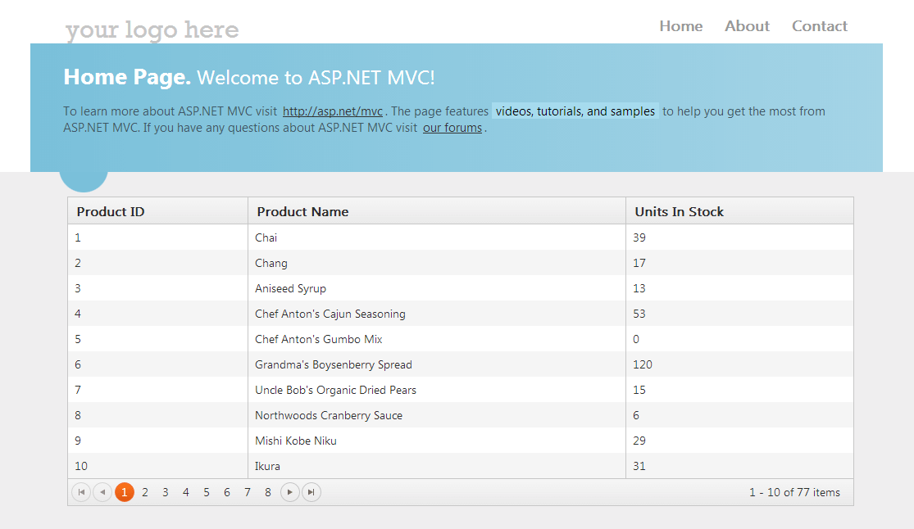


# Local Binding

When configured for local binding, the Grid for {{ site.framework }} will serialize the data as part of its data source and will perform all data operations, such as paging, sorting, filtering, grouping, and aggregating, on the client.

For a runnable example, refer to the [demo on local binding of the Grid](https://demos.telerik.com/{{ site.platform }}/grid/local-data-binding).  

To configure the Grid for {{ site.framework }} to do local binding:

1. Define a model class or use an existing one from your application.

        public class OrderViewModel
        {

            public int OrderID
            {
                get;
                set;
            }

            public string ShipCountry
            {
                get;
                set;
            }
        }

1. Open the `HomeController.cs` and return an `IEnumerable` of the model type with the View. This is the `View()` which holds the Grid definition.

        public IActionResult Index()
        {
            // Returns a collection of OrderViewModels.
            var model = orderService.Read();

             /* For a quick test, you can mock the data, and copy and paste this snippet.
            var model = Enumerable.Range(1, 20).Select(i => new OrderViewModel
            {
                OrderID = i,
                ShipCountry = i % 2 == 0 ? "ShipCountry 1" : "ShipCountry 2"
            });
            */

            return View(model);
        }

1. In the `Index.cshtml` view, configure the Grid to accept the model in its constructor and set `ServerOperations(false)`.

        @model IEnumerable<AspNetCoreGrid.Models.OrderViewModel>
        @(Html.Kendo().Grid(Model)
            .Name("grid")
            .DataSource(dataSource => dataSource
                .Ajax()
                .PageSize(2)
                .ServerOperation(false)
             )
            .ToolBar(tools =>
            {
                tools.Pdf().Text("Custom PDF button text");
                tools.Excel().Text("Custom Excel button text");
            })
            .Pageable()
            .Sortable()
            .Groupable()
            .Columns(columns =>
            {
                columns.Bound(f => f.OrderID);
                columns.Bound(f => f.ShipCountry);
            })
        )

1. Build and run the application.

## See Also

* [Custom Ajax Binding by the Grid HtmlHelper for {{ site.framework }} (Demo)](https://demos.telerik.com/{{ site.platform }}/grid/customajaxbinding)
* [Knowledge Base Section](/knowledge-base)
* [Server-Side API](/api/grid)



# Server Binding

By default, the Telerik UI Grid for ASP.NET MVC performs server-side requests (`HTTP` and `GET`) when doing paging, sorting, and filtering.

## Supported Client-Side Events

The Grid supports the following client-side events when it is in server binding mode:

- `Change`
- `ColumnHide`
- `ColumnMenuInit`
- `ColumnReorder`
- `ColumnResize`
- `ColumnShow`
- `DetailCollapse`
- `DetailExpand`
- `ExcelExport`
- `FilterMenuInit`
- `PdfExport`
- `GroupExpand`&mdash;The group object that is associated with group row will be empty in server binding scenario.
- `GroupCollapse`&mdash;The group object that is associated with group row will be empty in server binding scenario.

> * The other client-side events, which are related to data-binding and CRUD data operations, will not be raised when the Grid is configured for server binding.
> * Locked columns are not supported. To support locked columns, use [Ajax binding]() instead.
> * Showing or hiding of columns and reordering with the `GroupHeaderColumnTemplate` in server-binding scenarios is not supported. The reason is that in server-binding scenarios the Kendo UI for jQuery DataSource instance does not have groups and aggregates information. Therefore, the templates for the group rows cannot be compiled on the client side. If your project requires such a scenario, use [Ajax binding]().

## Getting Started

To bind the Grid to data, set its data source and render the view by using any of the following approaches:

* [Bind to the view model](#binding-to-the-view-model)
* [Bind to items from `ViewData` or `ViewBag`](#using-the-viewdata-or-viewbag-items-binding)
* [Use the `BindTo` method](#applying-the-bindto-method)
* [Pass additional data to an action method](#passing-additional-data-to-action-methods)

## Binding to the View Model

To download the Visual Studio Project, refer to [this GitHub repository](https://github.com/telerik/ui-for-aspnet-mvc-examples/tree/master/grid/server-binding).

```Controller
    public ActionResult Index()
    {
        var northwind = new NorthwindEntities();
        var products = northwind.Products;
        return View(products);
    }
```
```Razor
    @model IEnumerable<KendoGridServerBinding.Models.Product>

    @(Html.Kendo().Grid(Model) //Bind the Grid to the Model property of the view.
        .Name("Grid")
        .Columns(columns =>
        {
            columns.Bound(p => p.ProductID);   // Create a column bound to the "ProductID" property
            columns.Bound(p => p.ProductName); // Create a column bound to the "ProductName" property
            columns.Bound(p => p.UnitPrice);   // Create a column bound to the "UnitPrice" property
            columns.Bound(p => p.UnitsInStock);// Create a column bound to the "UnitsInStock" property
        })
        .Pageable() //Enable paging.
    )
```

## Using the ViewData or ViewBag Items Binding

The following example demonstrate how to apply data binding with `ViewData` or `ViewBag`.

```Controller
    public ActionResult Index()
    {
        var products = new NorthwindDataContext().Products;

        ViewData["products"] = products;

        return View();
    }
```
```Razor
    @(Html.Kendo().Grid((IEnumerable<MvcApplication1.Models.Product>)ViewData["products"])
        .Name("Grid")
        .Columns(columns =>
        {
            columns.Bound(p => p.ProductID);
            columns.Bound(p => p.ProductName);
            columns.Bound(p => p.UnitPrice);
            columns.Bound(p => p.UnitsInStock);
        })
    )
```

## Applying the BindTo Method

The following example demonstrates how to bind the Grid to data by using the `BindTo` method.

```Controller
    public ActionResult Index()
    {
        var products = new NorthwindDataContext().Products;

        ViewBag.Products = products;

        return View();
    }
```
```Razor
    @(Html.Kendo().Grid<MvcApplication1.Models.Product>() // Specify the type of the grid
        .Name("Grid")
        .BindTo((IEnumerable<MvcApplication1.Models.Product>)ViewBag.Products)
        .Columns(columns =>
        {
            columns.Bound(p => p.ProductID);
            columns.Bound(p => p.ProductName);
            columns.Bound(p => p.UnitPrice);
            columns.Bound(p => p.UnitsInStock);
        })
    )
```

The Grid makes `HTTP GET` requests to the action method which initially renders the view. The Grid page, sort, filter, and group information is passed as query string parameters.

For more information on how a typical URL looks like, refer to [this location](http://localhost:4939/?Grid-sort=ProductName-asc&amp;Grid-page=2\). The `Name` of the Grid will be used as a prefix of the query string parameters. In this way, more than one server-bound Grid can coexist in the same view. The prefix can be disabled through the `PrefixUrlParameters` method.

    <%: Html.Kendo().Grid(Model)
        .Name("Grid")
        .PrefixUrlParameters(false)
    %>

## Passing Additional Data to Action Methods

The action method which renders the view that contains the Grid may need additional data.

```Controller
    public ActionResult Index(string firstName, string lastName)
    {
        var products = new NorthwindDataContext().Products;

        return View(products);
    }
```
```Razor
    @(Html.Kendo().Grid(Model)
        .Name("Grid")
        .DataSource(dataSource => dataSource
            .Server() // Specify server type
            .Read(read => read.Action("Index", "Home", new { firstName = "John", lastName = "Doe } ))
        )
    )
```

## Setting Up the Sample Project

1. Create a new ASP.NET MVC 5 application. If you have installed the [Telerik UI for ASP.NET MVC Visual Studio Extensions](), create a Telerik UI for ASP.NET MVC application. Name the application `KendoGridServerBinding`. If you decided not to use the Telerik UI for ASP.NET MVC Visual Studio Extensions, follow the steps from the [First Steps article]() to add Telerik UI for ASP.NET MVC to the application.
1. Add a new `Entity Framework Data Model`. Right-click the `~/Models` folder in the solution explorer and pick **Add new item**. Choose **Data** > **ADO.NET Entity Data Model** in the **Add New Item** dialog. Name the model `Northwind.edmx` and click **Next**. This starts the **Entity Data Model Wizard**.

    

1.  Pick the **Generate from database** option and click **Next**. Configure a connection to the Northwind database. Click **Next**.

    

1. Choose the **Products** table from the `Which database objects do you want to include in your model?`. Leave all other options as they are set by default. Click **Finish**.

    

1. Open **HomeController.cs** and modify the `Index` action method.

        public ActionResult Index()
        {
            ViewBag.Message = "Welcome to ASP.NET MVC!";
            var northwind = new NorthwindEntities();
            // Get the Products entities and add them to the ViewBag.
            ViewBag.Products = northwind.Products;
            return View();
        }

1. Add a Kendo UI Grid to the `Index` view.

    ```Razor
        @(Html.Kendo().Grid((IEnumerable<KendoGridServerBinding.Models.Product>)ViewBag.Products) //Bind the grid to ViewBag.Products
            .Name("grid")
            .Columns(columns =>
            {
                // Create a column bound to the ProductID property.
                columns.Bound(product => product.ProductID);
                // Create a column bound to the ProductName property.
                columns.Bound(product => product.ProductName);
                // Create a column bound to the UnitsInStock property.
                columns.Bound(product => product.UnitsInStock);
            })
            .Pageable() //Enable the paging.
            .Sortable() //Enable the sorting.
        )
    ```

1. Build and run the application.

    

## See Also

* [Binding the Grid HtmlHelper for ASP.NET MVC to Data (Demos)](https://demos.telerik.com/aspnet-mvc/grid/local-data-binding)
* [Ajax Binding by the Grid HtmlHelper for ASP.NET MVC]()
* [Server-Side API](/api/grid)


