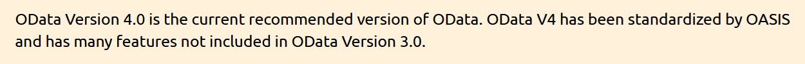

# OData Binding

The Grid component supports the newer OData-v4 data binding capability, so you can use it in your new projects:
[Grid OData-v4 Binding](https://docs.telerik.com/{{ site.platform }}/html-helpers/data-management/grid/binding/odatav4-binding)



If you want to use the older OData-v3 implementation, this article will give you the basic information.

## What is API?

An application programming interface (API) is a language for short commands between computers and computer programs. It is a type of software interface, offering a service to other pieces of software.

It provides a way of connection for a computer or system to retrieve information or perform a function and to communicate with that system so it can understand and fulfill the request.

## What is Web API?

A Web API or Web Service API is an application processing interface between a web server and web browser. All web services are APIs but not all APIs are web services.

A Web API is a set of definitions and protocols for building and integrating communication between a browser and a web server. It’s represents a contract between the information provider and the information user—establishing the content required from the consumer (the browser client) and the content required by the producer (the web server response).

## What is REST?

REpresentational State Transfer (REST), is an architectural style for providing standards between computer systems on the web, making it easier for systems to communicate with each other. REST-compliant systems, often called RESTful systems, are characterized by how they are stateless and separate the concerns of client and server, where two computer systems use to exchange information securely over the internet.

REST defines a set of functions like GET, PUT, DELETE, etc. that clients can use to access server data. Clients and servers exchange data using web protocols. Its main feature is statelessness—servers do not save client data between requests. Client requests to the server are similar to URLs you type in your browser to visit a website. The response from the server is plain data, without the typical graphical rendering of a web page.

## What is OData?

The OData Protocol is an application-level protocol for interacting with data via RESTful web services. The protocol supports the description of data models and the editing and querying of data according to those models. It provides facilities for:

* Metadata: a machine-readable description of the data model exposed by a particular data provider.
* Data: sets of data entities and the relationships between them.
* Querying: requesting that the service perform a set of filtering and other transformations to its data, then return the results.
* Editing: creating, editing, and deleting data.
* Operations: invoking custom logic
* Vocabularies: attaching custom semantics

The OData Protocol is different from other REST-based web service approaches in that it provides a uniform way to describe both the data and the data model. This improves semantic interoperability between systems and allows an ecosystem to emerge.

## Creating the Web Service

First, you will need to create a live service with the help of a special content file with the extention ".svc" and add it to your service deployment project:
[Deploying an Internet Information Services-Hosted WCF Service](https://learn.microsoft.com/en-us/dotnet/framework/wcf/feature-details/deploying-an-internet-information-services-hosted-wcf-service?redirectedfrom=MSDN#create-an-svc-file-for-the-wcf-service)

You can see the Kendo and Telerik Services implementation provided in this public repository:
[Kendo UI Demos Service demos-and-odata-v3](https://github.com/telerik/kendo-ui-demos-service/tree/master/demos-and-odata-v3)

You will also have to add this configuration in your Web.config file:
```HTML
  <system.serviceModel>
    <serviceHostingEnvironment aspNetCompatibilityEnabled="true" multipleSiteBindingsEnabled="true" />
  </system.serviceModel>
```

## Binding the Grid

Once the Web service is up and running, you define the Grid's DataSource instance and can apply its settings to point to the RESTful API URL:
```C#
    .DataSource(dataSource => dataSource
        .Custom()
        .Type("odata")
        .Transport(transport =>
           transport.Read(read => read.Url("https://demos.telerik.com/kendo-ui/service/Northwind.svc/Orders"))
        ) 
        .PageSize(20)
        .ServerPaging(true)
        .ServerSorting(true)
        .ServerFiltering(true)
    )
```

```HTML
    <datasource type="DataSourceTagHelperType.Custom" custom-type="odata" page-size="20"
        server-paging="true"
        server-sorting="true"
        server-filtering="true">
        <transport>
            <read url="https://demos.telerik.com/kendo-ui/service/Northwind.svc/Orders"/>
        </transport>
    </datasource>
```


## See Also


* [ASP.NET Core DataGrid Homepage](https://www.telerik.com/aspnet-core-ui/grid)

* [OData Binding by the Grid HtmlHelper for {{ site.framework }} (Demo)](https://demos.telerik.com/{{ site.platform }}/grid/odata)

* [Official Microsoft Documentation on Getting Started with {{ site.framework }} OData](https://learn.microsoft.com/en-us/odata/webapi-8/getting-started?tabs=net60%2Cvisual-studio-2022%2Cvisual-studio)

* [Official Microsoft Documentation on Getting Started with {{ site.framework }} OData](https://learn.microsoft.com/en-us/aspnet/web-api/overview/odata-support-in-aspnet-web-api/odata-v4/create-an-odata-v4-endpoint)

* [OData-v4 Binding by the Grid HtmlHelper for {{ site.framework }} ](https://docs.telerik.com/{{ site.platform }}/html-helpers/data-management/grid/binding/odatav4-binding)
* [Server-Side API](/api/grid)