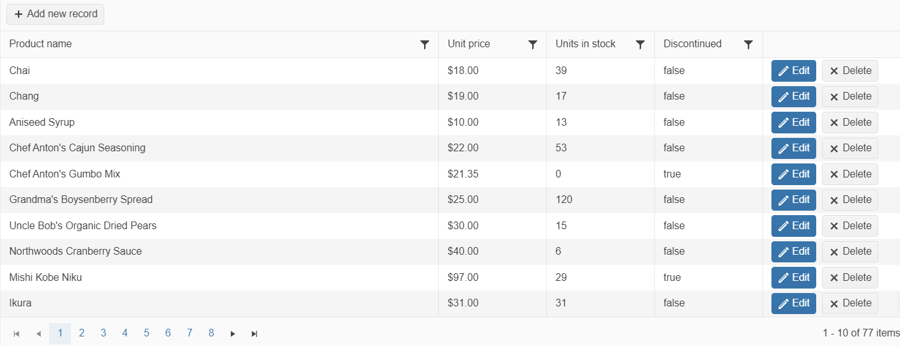

# WebAPI Binding

Web API is an application programming interface for a web application or server which utilizes the [HTTP protocol](https://developer.mozilla.org/en-US/docs/Web/HTTP/Overview) for communication. It enables you to make the server-side of the application more monolithic when it comes to establishing communication between clients and websites to have data access.

For runnable examples, refer to the [demos on WebAPI binding of the Grid component](https://demos.telerik.com/{{ site.platform }}/grid/webapi).

> Defining a Schema.Model.Id is mandatory for the proper execution of the Update, Create and Destroy of the Grid.


## Setting up the application for WebAPI Binding

To ensure that the application is configured for both Web API binding capabilities: 

1. Configure Web API by calling `GlobalConfiguration.Configure` in the `Application_Start` method.
    ```
          public class MvcApplication : System.Web.HttpApplication
          {
              protected void Application_Start()
              {
                  GlobalConfiguration.Configure(WebApiConfig.Register);
                  RouteConfig.RegisterRoutes(RouteTable.Routes);
              }
          }
    ```

1. Create a file named `WebApiConfig.cs` inside the `App_Start` folder and configure the default WebAPI routing convention.
    ```
        public static class WebApiConfig
        {
            public static void Register(HttpConfiguration config)
            {
                // Web API configuration and services.
                // Web API routes.
                config.MapHttpAttributeRoutes();
                config.Routes.MapHttpRoute(
                    name: "DefaultApi",
                    routeTemplate: "api/{controller}/{id}",
                    defaults: new { id = RouteParameter.Optional }
                );
            }
        }
    ```


## Adding a Web API Controller


To support writing and reading data using WebAPI endpoints, the `ApiController` base class needs to be inherited for a given controller instance.

```
    public class TaskController : System.Web.Http.ApiController
    {
    }
```

To support writing and reading data using WebAPI endpoints, the ControllerBase base class needs to be inherited for a given controller instance.

```
    [ApiController()]
    [Route("api/[controller]")]
    public class TaskController : BaseController
    {
    }
```

## Configuring the CRUD Operations


1. Create a new ASP.NET MVC 5 application. If you have installed the [Telerik UI for ASP.NET MVC Visual Studio Extensions](), create a Telerik UI for ASP.NET MVC Web application. Name the application `KendoGridWebApiCRUD`. If you decided not to use the Telerik UI for ASP.NET MVC Visual Studio Extensions, follow the steps from the [introductory article]() to add Telerik UI for ASP.NET MVC to the application.
1. Add a new `Entity Framework Data Model`. Right-click the `~/Models` folder in the solution explorer and pick **Add** > **New Item**. Choose **Data** > **ADO.NET Entity Data Model** in the **Add New Item** dialog. Name the model `Northwind.edmx` and click **Next**. This starts the **Entity Data Model Wizard**.

    

1. Select **Generate from database** and click **Next**. Configure a connection to the Northwind database. Click **Next**.
1. Select the **Products** table. Leave all other options as they are set by default. Click **Finish** to create the Entity Framework model.

    

1. Right click the `Controllers` folder in Visual Studio solution explorer. Select **Add** > **Controller**.
1. Set **ProductsController** as **Controller name**. Select **API controller with read/write actions, using Entity Framework** as **Template**. Select **Product (KendoGridWebApiCRUD.Models)** as **Model class** and **NorthwindEntities (KendoGridWebApiCRUD.Models)** as **Data context class**. Click **Add** to create the WebAPI controller.

    

1. Add a new class to the `~/Models` folder. The following example uses the `ProductViewModel` name.
    ```
        public class ProductViewModel
        {
            public int ProductID { get; set; }
            // The ProductName property is required.
            [Required]
            public string ProductName { get; set; }
            // Use the Integer editor template for the UnitsInStock property.
            [UIHint("Integer")]
            public short? UnitsInStock { get; set; }
        }
    ```


1. Update the `Get` method as demonstrated by The following example.
   
    
    ```
        public DataSourceResult Get([System.Web.Http.ModelBinding.ModelBinder(typeof    (WebApiDataSourceRequestModelBinder))DataSourceRequest request)
        {
            return db.Products.ToDataSourceResult(request);
        }
    ```
    
    ```
        [HttpGet]
        public DataSourceResult Get([DataSourceRequest]DataSourceRequest request)
        {
            return db.Products.ToDataSourceResult(request);
        }
    ```
    

1. Update the `Post` method as demonstrated in The following example.

   
   ```
        public HttpResponseMessage Post(Product product)
        {
            if (ModelState.IsValid)
            {
                db.Products.Add(product);
                db.SaveChanges();

                DataSourceResult result = new DataSourceResult
                {
                    Data = new[] { product },
                    Total = 1
                };
                HttpResponseMessage response = Request.CreateResponse(HttpStatusCode.Created, result);
                response.Headers.Location = new Uri(Url.Link("DefaultApi", new { id = product.ProductID }));
                return response;
            }
            else
            {
                return Request.CreateErrorResponse(HttpStatusCode.BadRequest, ModelState);
            }
        }
   ```
   
   ```
        [HttpPost]
        public IActionResult Post([FromForm] ProductViewModel product)
        {
	    	if (!ModelState.IsValid)
	    	{
	    		return BadRequest(ModelState.Values.SelectMany(v => v.Errors).Select(error => error.ErrorMessage));
           }

	    	service.Create(product);

	    	return new ObjectResult(new DataSourceResult { Data = new[] { product }, Total = 1 });
	    }
    ```
    

1. Update the `Put` method as demonstrated in The following example.
    
    
    ```
        public HttpResponseMessage Put(int id, TaskViewModel task)
        {
            if (ModelState.IsValid && id == task.TaskID)
            {
                try
                {
                    service.Update(task, null);
                }
                catch (DbUpdateConcurrencyException)
                {
                    return Request.CreateResponse(HttpStatusCode.NotFound);
                }

                return Request.CreateResponse(HttpStatusCode.OK);
            }
            else
            {
                var errors = ModelState.Values.SelectMany(v => v.Errors).Select(error => error.ErrorMessage);
                return Request.CreateResponse(HttpStatusCode.BadRequest, errors);
            }
        }
    ```
    
    ```
         [HttpPut("{id}")]
         public IActionResult Put(int id, [FromForm] ProductViewModel product)
         {
	        	if (ModelState.IsValid && id == product.ProductID)
	        	{
	        		try
	        		{
	        			service.Update(product);
	        		}
	        		catch (DbUpdateConcurrencyException)
	        		{
	        			return new NotFoundResult();
	        		}
	        		return new StatusCodeResult(200);
             }
	        	else
	        	{
	        		return BadRequest(ModelState.Values.SelectMany(v => v.Errors).Select(error => error.ErrorMessage));
	        	}
	        } 
     ```
     

1. Update the `Delete` method as demonstrated in the following example.
     
     
     ```
        public HttpResponseMessage Delete(int id)
        {
            ProductViewModel product = service.Read().FirstOrDefault(p => p.ProductID == id);
    
            if (product == null)
            {
                return Request.CreateResponse(HttpStatusCode.NotFound);
            }
    
            try
            {
                service.Destroy(product);
            }
            catch (DbUpdateConcurrencyException)
            {
                return Request.CreateResponse(HttpStatusCode.NotFound);
            }
    
            return Request.CreateResponse(HttpStatusCode.OK, product);
        }
       ```
       
       ```
        [HttpDelete("{id}")]
        public IActionResult Delete(int id)
        {	
			try
			{
				service.Destroy(new ProductViewModel { ProductID = id } );
			}
			catch (DbUpdateConcurrencyException)
			{
				return new NotFoundResult();
			}
			return new StatusCodeResult(200);
		}
       ```
       

1. In the view, configure the Grid to use the Products WebAPI controller.

```HtmlHelper
    @(Html.Kendo().Grid<KendoGridWebApiCRUD.Models.Product>()
        .Name("grid")
        .Columns(columns =>
        {
            columns.Bound(product => product.ProductID).Width(100);
            columns.Bound(product => product.ProductName);
            columns.Bound(product => product.UnitsInStock).Width(250);
            columns.Command(commands =>
            {
                commands.Edit(); // The "edit" command will edit and update data items.
                commands.Destroy(); // The "destroy" command removes data items.
            }).Title("Commands").Width(200);
        })
        .ToolBar(toolbar => toolbar.Create()) // The "create" command adds new data items.
        .Editable(editable => editable.Mode(GridEditMode.InLine)) // Use inline edit mode.
        .DataSource(dataSource => dataSource
            .WebApi()
            .Model(model =>
            {
                model.Id(product => product.ProductID); // Specify the property which is the    unique identifier of the model.
                model.Field(product => product.ProductID).Editable(false); // Make the  ProductID property not editable.
            })
            
            .Read(read => read.Url(Url.HttpRouteUrl("DefaultApi", new { controller = "Product" }    )))
            .Create(create => create.Url(Url.HttpRouteUrl("DefaultApi", new { controller =  "Product" })))
            .Update(update => update.Url(Url.HttpRouteUrl("DefaultApi", new { controller =  "Product", id = "{0}" })))
            .Destroy(destroy => destroy.Url(Url.HttpRouteUrl("DefaultApi", new { controller =   "Product", id = "{0}" })))
            
            .Read(read => read.Action("Get", "Product"))
            .Create(create => create.Action("Post", "Product"))
            .Update(update => update.Action("Put", "Product", new { id = "{0}"} ))
            .Destroy(destroy => destroy.Action("DELETE", "Product", new { id = "{0}" }))	
            
        )
    )
```

```TagHelper
@{  var Id = new { id = "{0}" }; }

<kendo-grid name="grid" height="430">
    <columns>
        <column field="ProductID" />
        <column field="ProductName" />
        <column field="UnitsInStock" />
        <column title="Commands" width="200">
            <commands>
                <column-command text="Edit" name="edit"></column-command>
                <column-command text="Delete" name="destroy"></column-command>
            </commands>
        </column>
    </columns>
    <toolbar>
        <toolbar-button name="create"></toolbar-button>
    </toolbar>
    <editable mode="inline" />
    <datasource type="DataSourceTagHelperType.WebApi">
        <schema>
            <model id="ProductID">
                <fields>
                    <field name="ProductID" editable="false"></field>
                </fields>
            </model>
        </schema>
        <transport>
            <read url="@Url.Action("Get", "Product")"/>
            <create url="@Url.Action("Post", "Product")"/>
            <update url="@Url.Action("Put", "Product")" data ="@Id"/>
            <destroy url="@Url.Action("Delete", "Product")" data="@Id"/>
        </transport>
    </datasource>
</kendo-grid>
```


## Building the application


The final result is a Grid with configured editing

## See Also

* [WebApi Binding for the Grid HtmlHelper for {{ site.product }} (Demos)](https://demos.telerik.com/{{ site.platform }}/grid/webapi)
* [Server-Side API](/api/grid)
