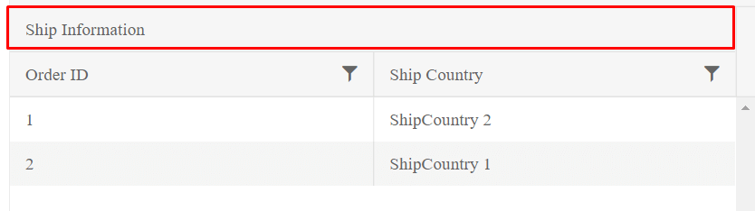

# Multi-Column Headers

The multicolumn headers of the Grid represent a tree-like structure where the user can group one or more columns together by a common header.

For a runnable example, refer to the [demo on implementing multi-column headers in the Grid](https://demos.telerik.com/{{ site.platform }}/grid/multicolumnheaders).

That common header in turn can be a child of another upper `MultiColumn` header which can also span both columns and other headers.

```HtmlHelper
    .Columns(columns =>
    {
        columns.Group(colGroup =>
        {
            colGroup.Title("Ship Information");
            colGroup.Columns(cols =>
            {
                cols.Bound(f => f.OrderID).Width(200);
                cols.Bound(f => f.ShipCountry).Width(200);
            });
        });
    })
```

```TagHelper
    <columns>
        <column field="ContactName" title="Contact Name" width="240" />
        <column title="Contact Info" >
            <columns>
                <column field="ContactTitle" title="Contact Title" width="200" />
                <column field="ContactName" title="Contact Name" width="200" />
                <column title="Location">
                    <columns>
                        <column field="Country" width="200" />
                        <column field="City" width="200" />
                    </columns>
                </column>
                <column field="Phone" />
            </columns>
        </column>
    </columns>
```


The previous example results in the following output.



A full Grid with Multi-column headers would look like below

```HtmlHelper
    @(Html.Kendo().Grid<Kendo.Mvc.Examples.Models.CustomerViewModel>()
    .Name("grid")
    .Columns(columns =>
    {
        columns.Bound(c => c.CompanyName).Width(420);
        columns.Group(group => group
            .Title("Contact Info")
            .Columns(info => {
                info.Bound(x => x.ContactTitle).Width(200);
                info.Bound(x => x.ContactName).Width(200);
                info.Group(g => g.Title("Location")
                    .Columns(location =>
                    {
                        location.Bound(c => c.Country).Width(200);
                        location.Bound(c => c.City).Width(200);
                    })
                );
                info.Bound(x => x.Phone);
            })
        );
    })
    .ColumnMenu()
    .Resizable(resizable => resizable.Columns(true))
    .Reorderable(reorderable => reorderable.Columns(true))
    .HtmlAttributes(new { style = "height: 550px;" })
    .Scrollable()
    .Groupable()
    .Sortable()
    .Pageable()
    .DataSource(dataSource => dataSource
        .Ajax()
        .PageSize(20)
        .Read(read => read.Action("MultiColumn_Customers_Read", "Grid"))
    )
)
```

```TagHelper
    <kendo-grid name="grid" reorderable="true"resizable="true" height="550">
    <datasource type="DataSourceTagHelperType.Custom" custom-type="odata" page-size="20">
        <transport>
            <read url="https://demos.telerik.com/kendo-ui/service/Northwind.svc/Customers" />
        </transport>
    </datasource>
    <groupable enabled="true" />
    <sortable enabled="true" />
    <pageable button-count="5" refresh="true" page-sizes="new int[] { 5, 10, 20 }">
    </pageable>
    <filterable enabled="true" />
    <column-menu enabled="true"/>
    <columns>
        <column field="ContactName" title="Contact Name" width="240" />
        <column title="Contact Info" >
            <columns>
                <column field="ContactTitle" title="Contact Title" width="200" />
                <column field="ContactName" title="Contact Name" width="200" />
                <column title="Location">
                    <columns>
                        <column field="Country" width="200" />
                        <column field="City" width="200" />
                    </columns>
                </column>
                <column field="Phone" />
            </columns>
        </column>
    </columns>
</kendo-grid>
```


## See Also

* [Implementing Multi-Column Headers in the Grid (Demo)](https://demos.telerik.com/{{ site.platform }}/grid/multicolumnheaders)
* [Server-Side API](/api/grid)
